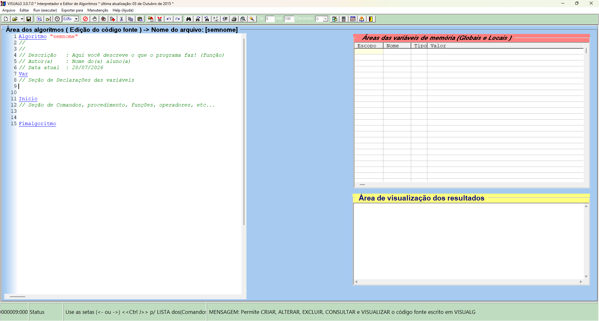

# Introdução à Lógica e Programação

> **Data** 27, 28 e 29 de julho de 2026

Visão inicial sobre lógica e início na programação.

---

## Lógica

Lógica é a capacidade de organizar o raciocínio de forma coerente para chegar a uma solução.

Na programação, a lógica é utilizada para desenvolver soluções para problemas por meio de uma sequência organizada de instruções.

---

## Algoritmo

Um algoritmo é uma sequência de ações executadas em uma ordem lógica para resolver um problema ou realizar uma determinada tarefa.

Antes de escrever um programa em uma linguagem de programação, normalmente é elaborado um algoritmo para planejar sua solução.

### Refinamento de ações

Durante a construção de um algoritmo, as ações podem ser refinadas em dois níveis:

- Primitivas: ações simples que podem ser executadas diretamente.
- Não primitivas: ações mais complexas que podem ser divididas em outras ações menores.

Esse processo facilita a organização e o entendimento da solução.

### Formas de representar um algoritmo

Existem diferentes maneiras de representar um algoritmo antes de sua implementação.

As principais são:

- Pseudocódigo;
- Fluxograma;
- Diagrama de Chapin.

Cada representação possui características próprias, mas todas têm o mesmo objetivo: descrever a lógica da solução de um problema.

---

## Variáveis

Uma variável é um espaço reservado na memória do computador utilizado para armazenar informações durante a execução de um programa.

Uma forma simples de imaginar uma variável é compará-la a uma estante: cada espaço pode armazenar um determinado conteúdo.

### Declaração de variáveis

Antes de utilizar uma variável, ela deve ser declarada no algoritmo.

A declaração informa ao programa:

- o nome da variável;
- o tipo de dado que ela armazenará.

Além disso, o nome da variável deve seguir regras de identificação definidas pela linguagem utilizada.

### Tipos de dados

Os principais tipos apresentados foram:

|Tipo|Descrição|
|-|-|
|Inteiro|Armazena números inteiros.|
|Real|Armazena números com casas decimais.|
|Caractere|Armazena textos ou caracteres entre aspas, como "Olá Mundo".|
|Lógico|Armazena apenas dois valores: Verdadeiro ou Falso.|

---

## Estrutura básica de um algoritmo

Durante a aula foi utilizada a ferramenta VisualG, que possui uma estrutura padrão para criação de algoritmos.



`Algoritmo` → nome do programa.  
`Var` → local onde as variáveis são declaradas.  
`Inicio` → início da execução do algoritmo.  
`Fimalgoritmo` → final da execução do algoritmo.

---

## Atividades feitas no VisualG

### Olá Mundo
```
Algoritmo "Olá Mundo"


Var
  msg: caractere
  estudante: caractere


Inicio
    EscrevaL("Senac Tatuapé")
    msg <- "Seja bem vindo(a) "
    EscrevaL(msg)
    EscrevaL("")
    Escreva("Qual seu nome: ")
    Leia(estudante)
    EscrevaL("Muito prazer!: estudante")


Fimalgoritmo
```

### Soma
```
Algoritmo "SOMA"
// Solicitar dois números para o usuário e mostrar
// a SOMA entre eles


Var
   n1: inteiro
   n2: inteiro
   soma: inteiro


Inicio
      Escreva("Digite um valor inteiro: ")
      Leia(n1)
      Escreva("Digite outro valor inteiro: ")
      Leia(n2)
      
      soma <- n1 + n2
      
      Escreva("O resultado dos valores é: ", soma)


Fimalgoritmo
```

### Média
```
Algoritmo "Média"
// Solicitar dois números para o usuário e calcular
// a média entre eles


Var
   n1, n2: inteiro
   media: real


Inicio
      Escreva("Digite o primeiro valor: ")
      Leia(n1)
      Escreva("Digite o segundo valor: ")
      Leia(n2)
      
      media <- (n1 + n2) / 2
      
      EscrevaL("A média dos valores é:", media)


Fimalgoritmo
```

### Soma e média
```
Algoritmo "Idade da mae e pai"
// A soma e média da idade da mãe e do pai


Var
   idade_mae: inteiro
   idade_pai: inteiro
   soma: inteiro
   media: real


Inicio
     Escreva("Digite a idade da sua mãe: ")
     Leia(idade_mae)
     Escreva("Digite a idade do seu pai: ")
     Leia(idade_pai)

     soma <- idade_mae + idade_pai

     Escreval("A soma da idade dos seus pais é: ", soma)

     media <- (idade_mae + idade_pai) / 2

     Escreval("A média da idade dos seus pais é: ", media)


Fimalgoritmo
```

### Dobro
```
Algoritmo "Dobro"
// Calcular e exibir o dobro


Var
   valor: real
   dobro: real


Inicio
      Escreva("Digite o valor: ")
      Leia(valor)
      
      dobro <- valor + valor
      
      EscrevaL("O dobro do valor é: ",dobro)


Fimalgoritmo
```

### Índice de Massa Corporal
```
Algoritmo "Calcular o IMC"
// Solicitar o peso e a altura do usuário e calcular
// o seu Índice de Massa Corporal (IMC)


Var
   peso: real
   altura: real
   imc: real


Inicio
      Escreva("Digite o seu peso em kg (ex: 70.5): ")
      Leia(peso)
      Escreva("Digite a sua altura em metros (ex: 1.75): ")
      Leia(altura)
      
      imc <- peso / (altura * altura)
      
      EscrevaL("")
      EscrevaL("Seu IMC atual é: ",imc)


Fimalgoritmo
```

---

## Operadores Condicionais

### Operadores Relacionais

Eles comparam dois valores. O resultado é sempre verdadeiro ou falso.

Igual a (`=`)  
Diferente de (`<>` ou `!=`)  
Maior que (`>`)  
Menor que (`<`)  
Maior ou igual a (`>=`)  
Menor ou igual a (`<=`)

```
Algoritmo "Operadores Relacionais"


Var
   a, b, c: inteiro


Inicio
      a <- 2
      b <- 3
      c <- 5

      EscrevaL(a=b)      //F
      EscrevaL(a>b)      //F
      EscrevaL(a<c)      //V
      EscrevaL(c=a+b)    //V
      Escreva(b<>c)      //V
      

Fimalgoritmo
```

### Operadores Lógicos

Eles unem ou invertem expressões lógicas. O resultado também é verdadeiro ou falso.

`E` → todas as condições precisam ser verdadeiras  
`OU` → apenas uma condição para ser verdadeiro

```
Algoritmo "Triângulo"
// Triângulo


Var
   L1, L2, L3: real
   triangulo: logico


Inicio
      Escreva("Digite o primeiro lado do triângulo: ")
      Leia(L1)
      Escreva("Digite o segundo lado do triângulo: ")
      Leia(L2)
      Escreva("Digite o terceiro lado do triângulo: ")
      Leia(L3)
      
      triangulo <- (L1<L2+L3) E (L2<L1+L3) E (L3<L1+L2)
      
      Escreva("É um triângulo:",triangulo)


Fimalgoritmo
```
