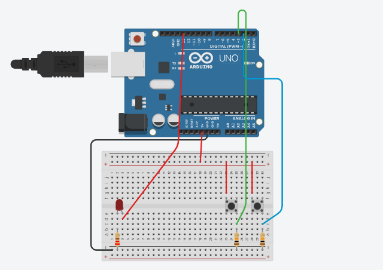

# Leitura digital de um LED com 2 botões

> **Data:** 11 de setembro de 2025

---

## Código

```ino
/**
  Leitura digital - acionamento de um LED com 2 botões
  @author Anderson Wilmer
*/

int botao1; //variável que faz a leitura do botão (0 ou 1), que pode ser 0 ou 1
int botao2;

void setup() {
  pinMode(13, OUTPUT);
  pinMode(3, INPUT); //Configurar o pino 3 como entrada
  pinMode(2, INPUT);
  Serial.begin(9600);

}

void loop() {
  botao1 = digitalRead(3); //Leitura digital do pino 3 (0 ou 1)
  Serial.println(botao1); //teste do botão (0 não pressionado e 1 pressionado)
  if (botao1 == 1) {
    digitalWrite(13, HIGH);
  }//se o botão 1 for pressionado acender o LED
  
  botao2 = digitalRead(2);
  Serial.println(botao2);
  if (botao2 == 1){
    digitalWrite(13, LOW);
  }

}
```

---

## Imagem do Arduino

Feito no tinkercad:


