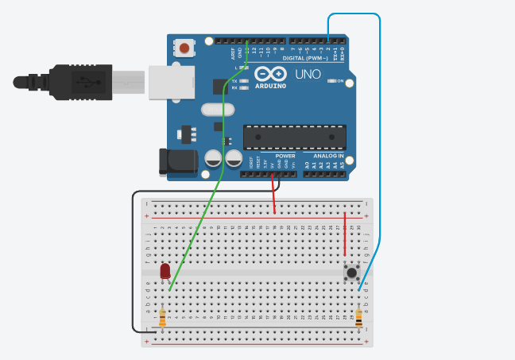

# Leitura digital de um LED com 1 botão

> **Data:** 12 de setembro de 2025

---

## Código

```ino
/**
  Leitura Digital - ligar e desligar o LED com apenas um botão
  @author Anderson Wilmer
*/

// C++ code
//

int botao;

void setup()
{
  pinMode(13, OUTPUT);
  pinMode(2, INPUT);
  Serial.begin(9600);
}

void loop()
{
  botao = digitalRead(2);
  Serial.println(botao);
  if (botao == 1){
    digitalWrite(13, HIGH);
  }
  
  else {
    digitalWrite(13, LOW);
  }
}
```

---

## Imagem do Arduino

Feito no tinkercad:


