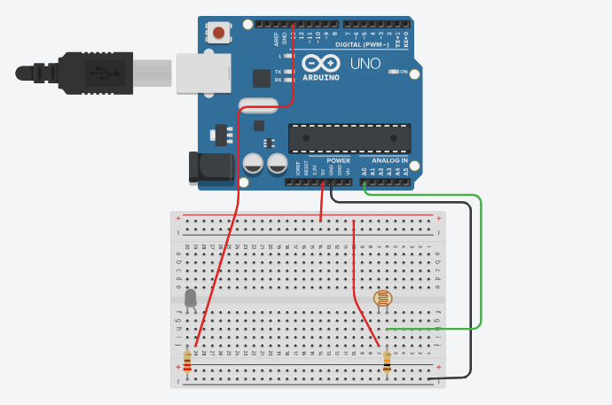

# Leitura Analógica

> **Data:** 16 de setembro de 2025

---

## Código

```ino
/**
  Leitura analógica - Luz de cortesia
  @author Anderson Wilmer
*/

void setup() {
  pinMode(13, OUTPUT);
  Serial.begin(9600);

}

void loop() {
  int sensor = analogRead(A0);
  Serial.println(sensor);

}
```

---

## Imagem do Arduino

Feito no tinkercad:


