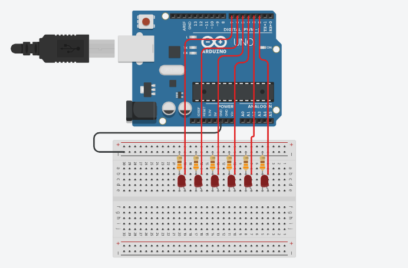

# Efeito Luminoso usando estrutura FOR

> **Data:** 17 de setembro de 2025

---

## Código

```ino
/**
  Efeito Luminoso usando estrutura FOR
  @author Anderson Wilmer
*/

void setup()
{
  for(int pino = 2; pino <= 7; pino++){
    pinMode(pino, OUTPUT);
  }
}

void loop()
{
  for(int pino = 7; pino >= 2; pino--){
    
    // apaga todos os LEDs
    for(int i = 2; i <= 7; i++){
      digitalWrite(i, LOW);
    }

    // acende apenas o LED atual
    digitalWrite(pino, HIGH);

    delay(500);
  }
}
```

---

## Imagem do Arduino

Feito no tinkercad:


