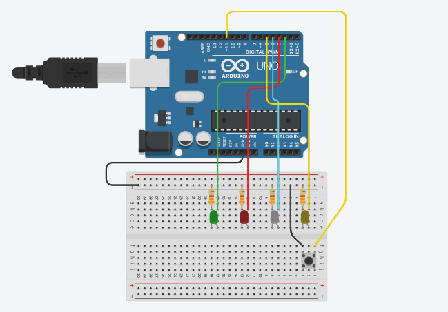

# Estudo das Funções

> **Data:** 18 de setembro de 2025

---

## Código

```ino
/**
  Estudo das funções
  @author Anderson Wilmer
*/

void setup() {
  pinMode(2, OUTPUT);
  pinMode(3, OUTPUT);
  pinMode(4, OUTPUT);
  pinMode(5, OUTPUT);
  pinMode(11, INPUT_PULLUP);
  Serial.begin(9600);
  randomSeed(analogRead(A0));  //iniciar o random (gerador de números aleatórios)
}

void loop() {
  int botao1 = digitalRead(11);
  if (botao1 == 0) {
    //Executar uma função que retorna um valor
    //"Invocar a função pelo nome"
    int valor = sortear();
    Serial.println(valor);
    //Acender o LED correspondente
    acenderLED(valor);
    delay(5000);
    //Apagar os LEDs
    apagarLED();
  }
  delay(150);  //prevenir o efeito mecânico do botão
}

// Função que retorna um valor
// Na linaguem C usamos um tipo de variável para retornar um valor em uma função *Ex: int float char
// Escolher um nome baseado em verbos que tenham relação com o problema a ser resolvido (clean code)
int sortear() {
  return random(4);  //0, 1, 2 ou 3
}

//Função que recebe parâmetros(valores)
//Neste caso usamos a palavra void e dentro de parênteses iniciamos uma variável do tipo int de nome valor
void acenderLED(int valor) {
  //Uso da estrutura switch case para executar uma ação dependendo do valor
  switch (valor) {
    case 0:
      digitalWrite(2, HIGH);
      break;
    case 1:
      digitalWrite(3, HIGH);
      break;
    case 2:
      digitalWrite(4, HIGH);
      break;
    case 3:
      digitalWrite(5, HIGH);
      break;
    default:
      //código caso nenhuma opção tratada
      break;
  }
}

//Função simples
void apagarLED() {
  digitalWrite(2, LOW);
  digitalWrite(3, LOW);
  digitalWrite(4, LOW);
  digitalWrite(5, LOW);
}
```

---

## Imagem do Arduino

Feito no tinkercad:


