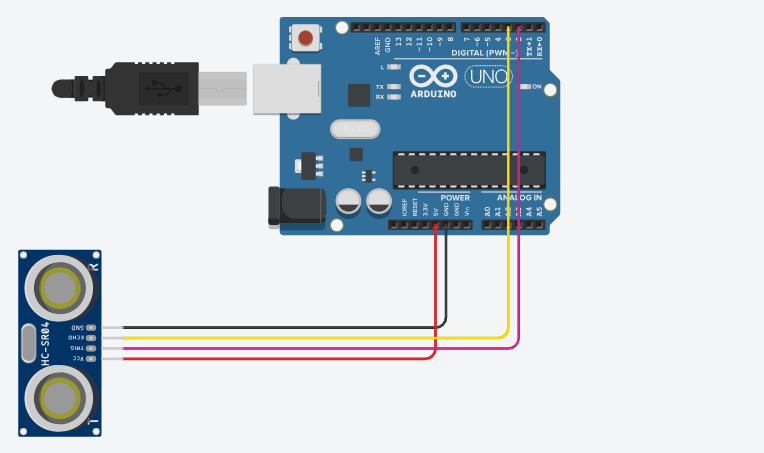

# Leitura do Sensor ultrassônico HC-SR04

> **Data:** 26 de setembro de 2025

---

## Código

```ino
// Distance sensor

#pragma once

//#include <Arduino.h>

// A very stateful non-blocking implementation for an HC-SR04
template <uint8_t TrigPin, uint8_t EchoPin>
class DistanceSensor
{
public:
  inline DistanceSensor() : nextTick(0), phase(1) {}

  inline void begin()
  {
    pinMode(TrigPin, OUTPUT);
    pinMode(EchoPin, INPUT);
  }

  constexpr static int NREADY = -1;
  constexpr static int ERR = -2;

  /**
  * Ticks the HC-SR04
  * Returns a value when ready, NREADY when not ready
  * or ERR on error
  * Call as fast as possible
  */
  int tick()
  {
    if (micros() < nextTick) return NREADY;

    switch(phase)
    {
    case 1:
      phase1();
      return NREADY;
    case 2:
      phase2();
      return NREADY;
    case 3:
      if (!phase3())
        return ERR;
      return NREADY;
    case 4:
      return phase4();
    default:
      // How?
      phase = 1;
      return ERR;
    }
  }
private:
  unsigned long nextTick;
  uint16_t phase;

  void phase1()
  {
    digitalWrite(TrigPin, HIGH);
    phase = 2;
    nextTick = micros() + 10;
  }

  void phase2()
  {
    digitalWrite(TrigPin, LOW);
    phase = 3;
    nextTick = micros();
  }

  bool phase3()
  {
    // Wait for pin to go high
    if (digitalRead(EchoPin) != HIGH)
    {
      // 1 second
      if (micros() - 1000000 > nextTick)
      {
        phase = 1;
        // timed out
        return false;
      }

      // true bc didn't error
      return true;
    }

    // Pin is high
    // Save time in nextTick

    nextTick = micros();
    phase = 4;

    return true;
  }

  int phase4()
  {
    // Wait for pin to go low
    if (digitalRead(EchoPin)) return NREADY;

    // Pin is low
    // Get time

    unsigned long time = micros() - nextTick;

    phase = 1;

    int cm = time/29/2;

    if (cm > 1900)
    {
      return ERR;
    }
    return cm;
  }
};


/**
  Sensor de ré
  Exemplo de uso do sensor ultrassônico HC-SR04 e biblioteca
  @author Artur correiaa
*/

// ATENÇÃO !!! Antes de tudo instalar a biblioteca:
//"Distance-Sensor by tin Dao"
// Iniciar a biblioteca sempre no início do código
// #include (inclui uma biblioteca instalada)
// <DistanceSensor.h> (nome da biblioteca instalada)
// Não usar ; no final
//#include <DistanceSensor.h>

// Instruções da documentação da biblioteca
constexpr int TrigPin = 2;  //Pino Trig do sensor
constexpr int EchoPin = 3;  //Pino Echo do sensor

// Criar um objeto (segundo a documentação)
DistanceSensor<TrigPin, EchoPin> sensor;

void setup() {
  Serial.begin(9600);
  sensor.begin();  //iniciar o objeto sensor(documentação)
}

void loop() {
  // sensor.tick() dispara o sonar (biblioteca)
  //distancia é uma variável que armazena a distância em cm
  int distancia = sensor.tick();
  // se não tiver erro retornar a distancia
  if (distancia == sensor.NREADY) {
    return;
  }
  Serial.println(distancia);
  
}
```

OBS: Aqui foi necessário incluir a biblioteca inteira no código, mas no Arduino IDE só é preciso colocar o nome da biblioteca.

Exemplo: `#include <DistanceSensor.h>`

---

## Imagem do Arduino

Feito no tinkercad:


