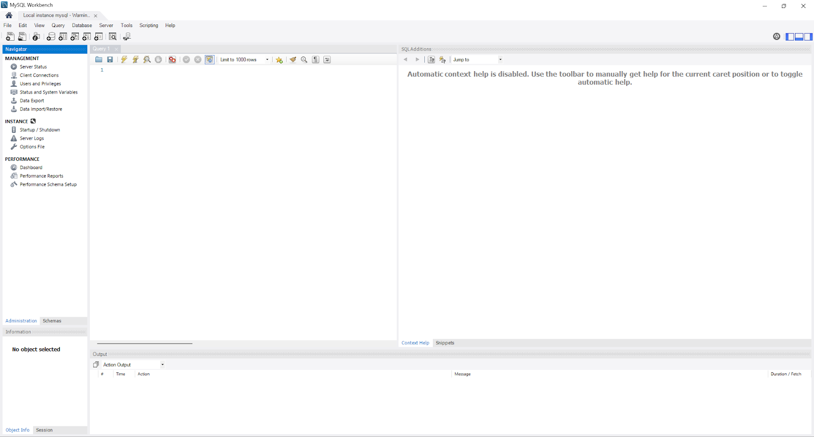

# Introdução ao Banco de Dados

> **Data:** 04, 05, 06 e 07 de agosto de 2026

Banco de Dados podem ser vistos em diversos lugares.

---

## O que é um Banco de Dados?

Um Banco de Dados é um sistema utilizado para armazenar, organizar e gerenciar informações de forma estruturada, permitindo consultas, inserções, alterações e exclusões de dados.

Atualmente, bancos de dados estão presentes em diversos sistemas, como:

- Aplicativos;
- Sites;
- Redes sociais;
- Sistemas empresariais;
- Hospitais;
- Bancos;
- Lojas virtuais.

### 🐬 MySQL Workbench

O MySQL Workbench é uma ferramenta gráfica utilizada para criar, administrar e consultar bancos de dados MySQL.



Durante a aula, foi utilizado para executar comandos SQL, criar bancos de dados, tabelas e inserir registros.

---

## Comandos utilizados

Comando básicos que foram usado no MySQL Workbench:

```sql
SHOW DATABASES;
```
↳ Exibe todos os bancos de dados existentes no servidor.

```sql
CREATE DATABASE pizzaria;
```
↳ Cria um novo banco de dados.

```sql
USE pizzaria;
```
↳ Define qual banco será utilizado.

Atalho: `CTRL + ENTER` → executa apenas o comando onde o cursor está posicionado.

```sql
CREATE TABLE clientes (
  id INT AUTO_INCREMENT PRIMARY KEY,
  nome VARCHAR(100),
  telefone VARCHAR(20),
  endereco VARCHAR(200)
);
```
↳ `CREATE TABLE` → cria uma nova tabela.  
↳ `id` → identificador único do cliente.  
↳ `INT` → número inteiro.  
↳ `AUTO_INCREMENT` → gera automaticamente o próximo ID.  
↳ `PRIMARY KEY` → chave primária da tabela.  
↳ `VARCHAR` → campo de texto com tamanho definido.  

```sql
SHOW TABLES;
```
↳ Mostra todas as tabelas existentes no banco selecionado.

```sql
DESCRIBE clientes;
```
↳ Exibe a estrutura da tabela.

```sql
INSERT INTO clientes (nome, telefone, endereco)
VALUES
('João', '11999999999', 'Rua A'),
('Maria', '11888888888', 'Rua B');
```
↳ Para adicionar registros no banco.

```sql
SELECT*FROM clientes;
```
↳ Exibe todos os registros armazenados na tabela.

```sql
CREATE TABLE pizzas (
  id INT AUTO_INCREMENT PRIMARY KEY,
  sabor VARCHAR(100),
  tamanho VARCHAR(20),
  preco DECIMAL(10,2)
); 
```
↳ `DECIMAL(10,2)` → utilizado para armazenar valores monetários com duas casas decimais.

```sql
DROP DATABASE IF EXISTS pizzaria;
```
↳ `DROP DATABASE` → exclui um banco de dados.  
↳ `IF EXISTS` → verifica se o banco existe antes de tentar excluí-lo, evitando uma mensagem de erro caso ele não seja encontrado.

No MySQL, esse comando não possui `CTRL + Z`. Após sua execução, os dados são perdidos, a menos que exista um backup previamente realizado.

```sql
CREATE TABLE pedidos (
  id INT AUTO_INCREMENT PRIMARY KEY,
  sabor VARCHAR(100),
  tamanho VARCHAR(100),
  preco DECIMAL(10,2),
  data_pedido DATETIME
);
```
↳ `DATETIME` → utilizado para armazenar data e horário.

```sql
ALTER TABLE pedidos
ADD COLUMN id_cliente INT;
```
↳ `ALTER TABLE` → é utilizado para alterar a estrutura de uma tabela que já foi criada.  
↳ `ADD COLUMN` → indica que uma nova coluna será adicionada.

```sql
ALTER TABLE pedidos
ADD CONSTRAINT fk_cliente
FOREIGN KEY (id_cliente)
REFERENCES clientes(id);
```
↳ `ALTER TABLE pedidos` → altera a tabela pedidos.  
↳ `ADD CONSTRAINT fk_cliente` → adiciona uma regra chamada fk_cliente.  
↳ `FOREIGN KEY (id_cliente)` → define id_cliente como chave estrangeira.  
↳ `REFERENCES clientes(id)` → estabelece que id_cliente faz referência ao id da tabela clientes.

Dessa forma, um pedido pode ser associado a um cliente existente.

```sql
SHOW CREATE TABLE pedidos;
```
↳ Permite visualizar como a tabela foi criada, incluindo suas definições e restrições.

```sql
INSERT INTO pedidos (id_cliente, sabor, tamanho, preco, data_pedido)
VALUES
(1, 'Calabresa', 'Médio', 45.00, NOW());
```
↳ O valor `1` em `id_cliente` indica que esse pedido está relacionado ao cliente que possui `id = 1`.  
↳ `NOW()` → essa retorna a data e o horário atuais do sistema.

```sql
SELECT * FROM clientes WHERE id = 1;
```
↳ O `WHERE` permite estabelecer uma condição para filtrar os registros que serão retornados pela consulta.  
↳ Isso significa que serão mostrados somente os registros cujo `id` seja igual a `1`.

```sql
SELECT
  clientes.nome,
  clientes.endereco,
  clientes.telefone,
  pedidos.sabor,
  pedidos.preco
FROM pedidos
INNER JOIN clientes
ON pedidos.id_cliente = clientes.id;
```
↳ `SELECT` → define quais informações serão exibidas.  
↳ `FROM pedidos` → define a tabela principal da consulta.  
↳ `INNER JOIN` → permite combinar registros de duas tabelas quando existe uma correspondência entre elas.  
↳ `ON pedidos.id_cliente = clientes.id` → define a condição utilizada para relacionar as duas tabelas.
