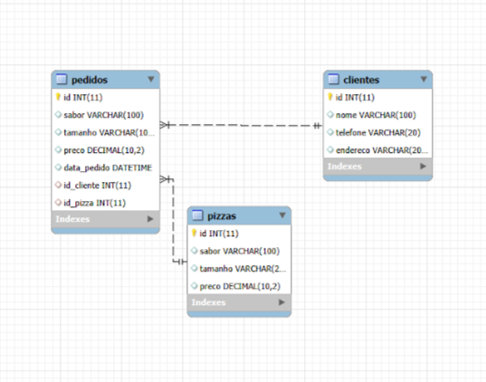

# Relacionando tabelas do banco

> **Data:** 18 de agosto de 2026

Nesta etapa, continuamos trabalhando com o banco de dados `pizzaria`.

---

## Segunda chave estrangeira

A tabela `pedidos` já possuía uma relação com a tabela `clientes` por meio da coluna `id_cliente`.

Nesta aula, adicionamos uma nova relação com a tabela `pizzas`, utilizando a coluna `id_pizza`.

```sql
ALTER TABLE pedidos
ADD COLUMN id_pizza INT;

ALTER TABLE pedidos
ADD CONSTRAINT fk_pizza
FOREIGN KEY (id_pizza)
REFERENCES pizzas(id);
```

---

## Relacionando tabelas

### Inserindo um pedido relacionado a cliente e pizza

Depois de criar a nova relação, inserimos um pedido informando tanto o cliente quanto a pizza.

```sql
INSERT INTO pedidos(id_pizza, id_cliente, sabor, tamanho, preco, data_pedido)
VALUES
(1, 1, 'Calabresa', 'Broto', 30.00, NOW());
```
↳ `id_pizza` = 1 → relaciona o pedido à pizza de ID 1.  
↳ `id_cliente` = 1 → relaciona o pedido ao cliente de ID 1.

### Relacionando três tabelas

Anteriormente, utilizamos `INNER JOIN` para relacionar as tabelas pedidos e clientes.

Agora podemos adicionar outro `INNER JOIN` para relacionar também a tabela pizzas.

```sql
SELECT
    pedidos.id,
    clientes.nome,
    pizzas.sabor,
    pedidos.preco
FROM pedidos
INNER JOIN clientes ON pedidos.id_cliente = clientes.id
INNER JOIN pizzas ON pedidos.id_pizza = pizzas.id;
```
↳ `ON pedidos.id_cliente` = clientes.id → relaciona os pedidos aos clientes.  
↳ `ON pedidos.id_pizza` = pizzas.id → relaciona os pedidos às pizzas.

Assim, uma única consulta consegue reunir informações provenientes de três tabelas relacionadas.

Para visualizar os pedidos cadastrados: `SELECT * FROM pedidos;`.

---

## Diagrama do banco de dados

O MySQL Workbench também permite visualizar graficamente a estrutura e os relacionamentos entre as tabelas por meio de um diagrama.

O diagrama ajuda a visualizar as relações entre: 
- `clientes`
- `pedidos`
- `pizzas`

A tabela pedidos possui chaves estrangeiras que estabelecem seus relacionamentos com as outras tabelas.

Caminho:  
Database → Reverse Engineer → conexão local → Next → selecionar `pizzaria` → Next → Execute → Finish


