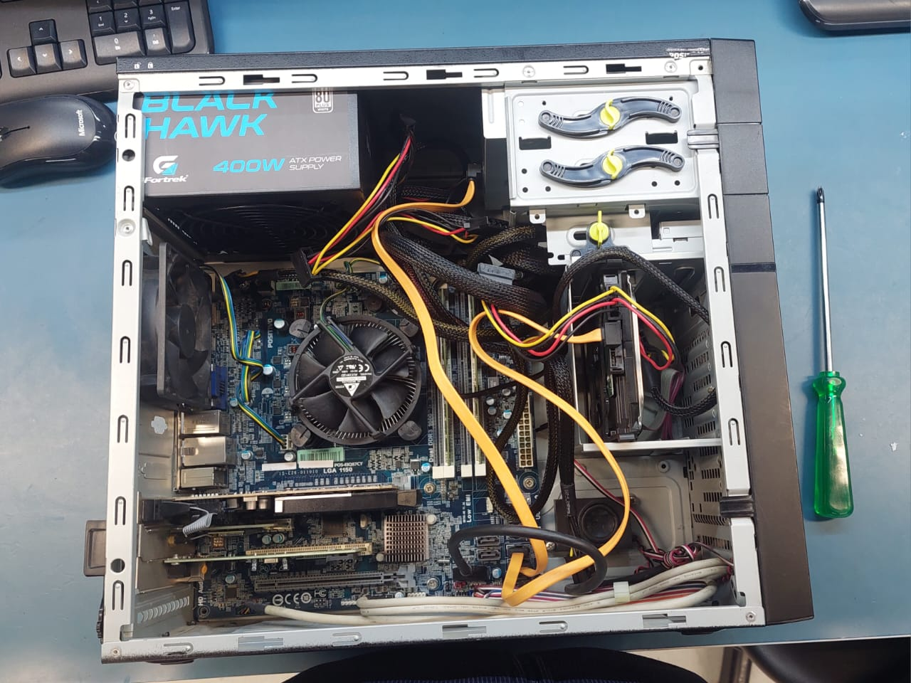
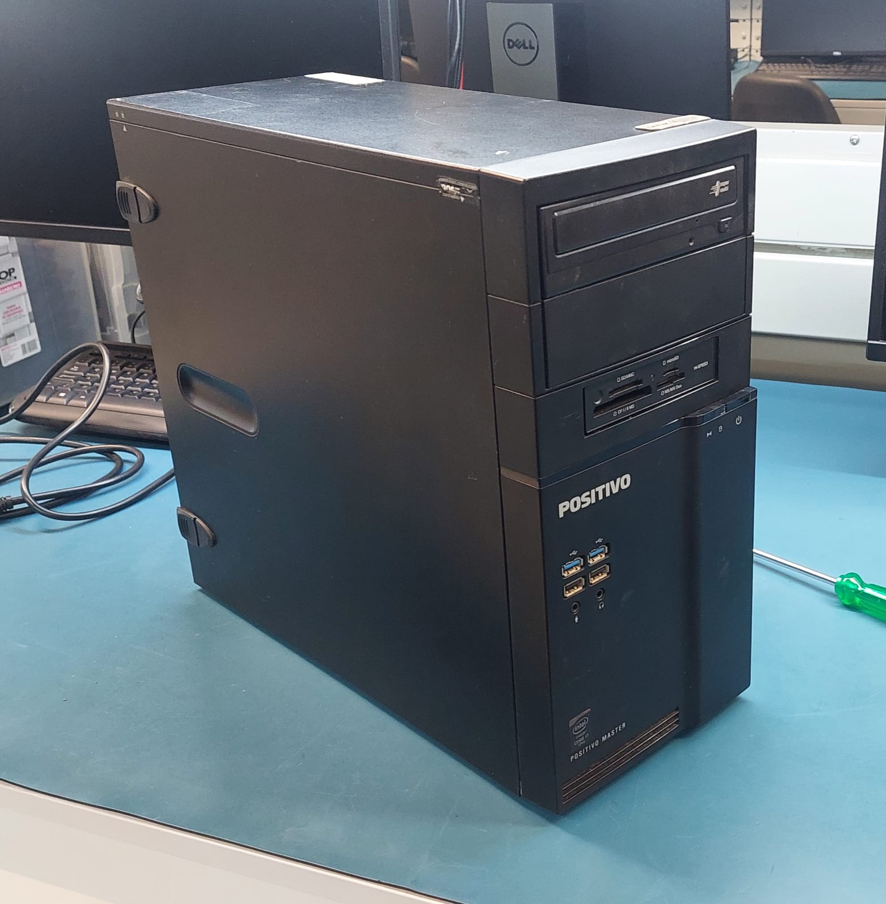
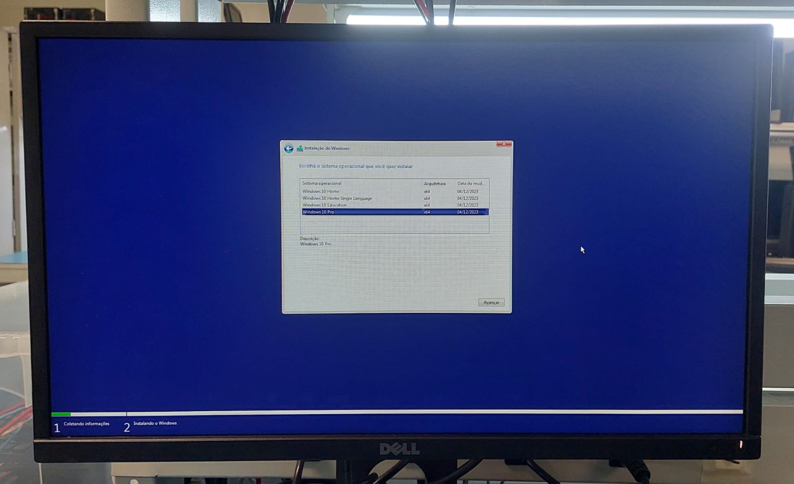
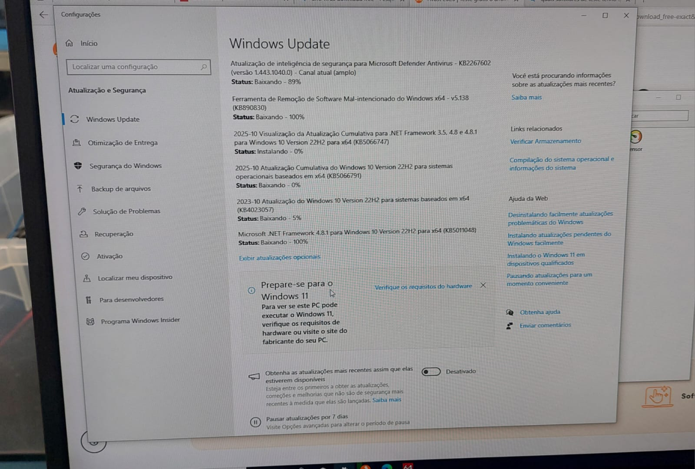
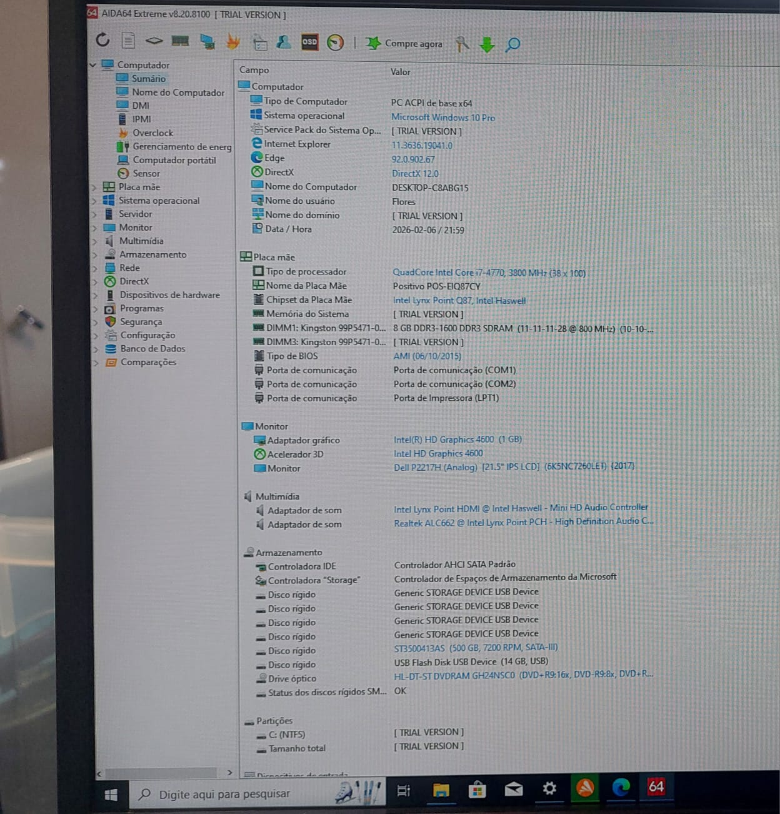
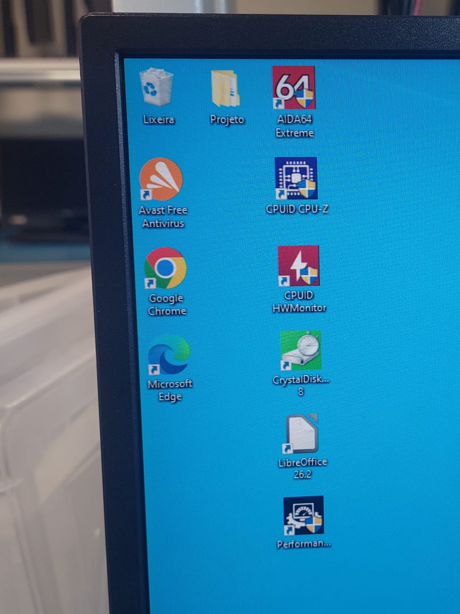
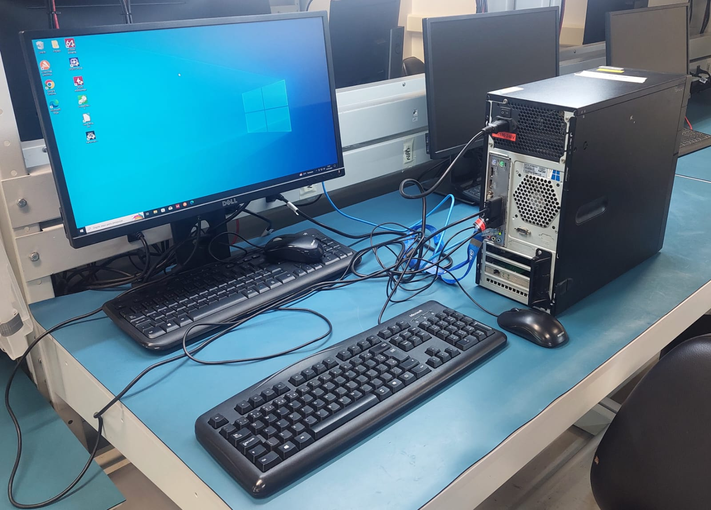

# 🖥 Projeto – Montagem e Configuração de Computador

**Data:** 06 e 10 de fevereiro de 2026

Este projeto consiste na montagem completa de um computador desktop, seguida da instalação e configuração do sistema operacional e softwares essenciais para uso.

O objetivo foi aplicar na prática os conhecimentos adquiridos em aula, realizando desde a montagem física até a entrega da máquina pronta para uso.

---

## 🔧 1. Montagem e Testes de Hardware

### 🔹 Montagem em bancada (teste inicial)

Antes da fixação no gabinete, foi realizada a montagem inicial fora da estrutura para teste de funcionamento dos componentes (placa-mãe, processador, memória RAM e fonte).

Esse procedimento permite verificar o POST antes da instalação definitiva.

---

### 🔹 Componentes organizados para montagem

---

### 🔹 Componentes instalados no gabinete

---

### 🔹 Teste de POST (acesso à BIOS)

---

### 🔹 Gabinete finalizado

---

## 💻 2. Instalação e Configuração do Sistema

### 🔹 Instalação do Windows 10 Pro

Foi realizada a instalação limpa do sistema operacional Windows 10 Pro.

---

### 🔹 Atualizações do sistema (Windows Update)

Após a instalação, foram aplicadas todas as atualizações necessárias para garantir segurança e desempenho.

---

### 🔹 Inventário da máquina

Verificação das especificações e reconhecimento correto do hardware instalado.

---

### 🔹 Instalação de softwares essenciais

Foram instalados softwares básicos para uso diário e produtividade.

- Navegador
- Pacote Office
- Leitor de PDF
- Compactador de arquivos
- Drivers atualizados

---

## ✅ 3. Máquina pronta para uso

Após montagem, testes e configurações, o computador foi entregue totalmente funcional.

---

## 📌 Atividades Realizadas

- Montagem de hardware
- Teste de POST
- Instalação de sistema operacional
- Atualização de drivers
- Configuração de rede
- Instalação de softwares
- Organização do ambiente

---

## 🎯 Resultado

Projeto concluído com sucesso, aplicando na prática os conhecimentos de montagem e preparação de computadores.
