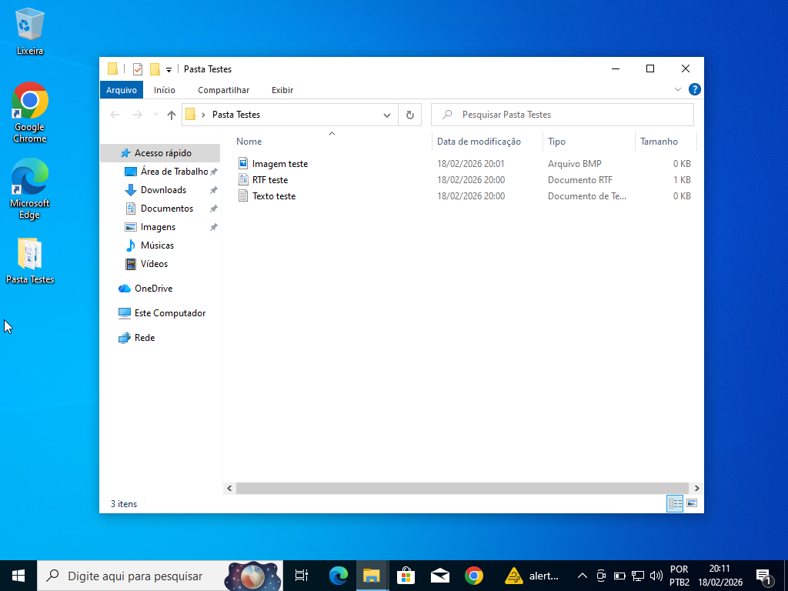
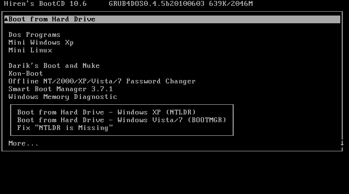
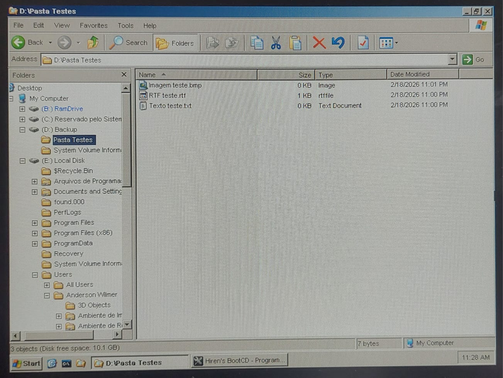
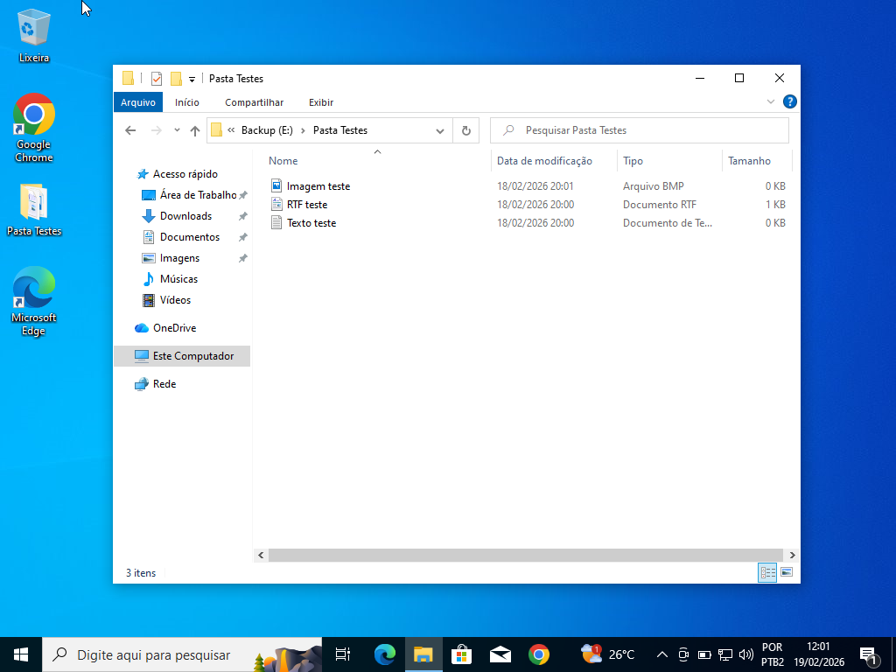

# Criação de Partição e Backup com Hiren’s Boot CD

**Data:** 12 de fevereiro de 2026

---

## Objetivo
Criar uma partição de 10GB utilizando o Hiren’s Boot CD e realizar o backup de arquivos do Windows 10 para essa nova partição.

---

## 1. Ambiente Inicial – Windows 10

Área de trabalho do Windows 10 contendo a pasta com os arquivos de teste:

---

## 2. Inicialização pelo Hiren’s Boot CD

Menu inicial do Hiren’s:

O procedimento será feito no **Mini Windows XP do Hiren's.**

---

## 3. Criação do Disco Virtual

Desligue a máquina virtual > Vá até o ícone da engrenagem > Entre em Armazenamento > Crie um novo disco

---

## 4. Criação da Partição "Backup"

Criação da partição utilizando 100% do espaço disponível, lhe foi dado o nome **Backup**:

---

## 5. Processo de Backup

Pasta de teste localizada no Desktop:

Passagem da pasta de teste para dentro da partição Backup:

---

## 6. Confirmação no Windows 10

Confirmação da partição e dos arquivos após reinicialização no Windows 10:

---

## Resultado

A partição foi criada com sucesso através do Hiren’s Boot CD e os arquivos foram copiados corretamente para o novo volume "Backup", sendo posteriormente confirmados no Windows 10.

---

## Competências Praticadas

- Criação de disco virtual no VirtualBox  
- Gerenciamento de partições  
- Uso do Hiren’s Boot CD  
- Backup manual de arquivos  
- Verificação de integridade dos dados  
