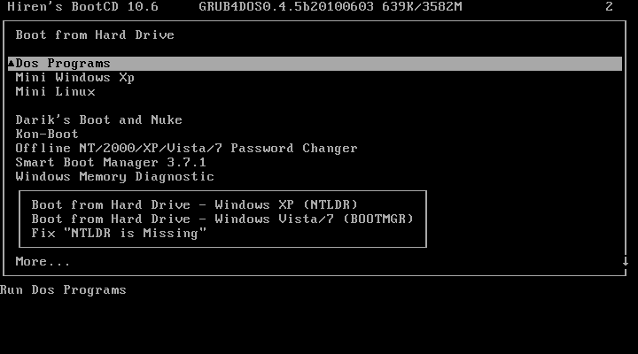

# Recuperação de Senha com Hiren’s BootCD
## Utilizando Active Password Changer

> **Data:** 12 de fevereiro de 2026

## 🎯 Objetivo

Simular um cenário onde o usuário esqueceu a senha do Windows 10 e realizar a recuperação de acesso utilizando o Hiren’s BootCD através da ferramenta **Active Password Changer**.

---

## 1. Situação Inicial – Sistema Bloqueado

Foi definida uma senha na máquina virtual e simulada a situação de esquecimento da senha pelo usuário.

O sistema impedia o acesso ao Windows.

---

## 2. Inicialização pelo Hiren’s BootCD

A máquina foi iniciada pelo Hiren’s BootCD, acessando o menu principal (tela preta).

---

## 3. Acesso às Ferramentas de Recuperação

No menu principal foram seguidos os seguintes passos:

- **Dos Programs**
- **3. Password & Registry Tools...**
- **6. Active Password Changer 3.0.420 (NT/2000/XP/2003/Vista)**
- Em seguida dê um **Yes** para prosseguir

---

## 4. Seleção do Usuário

Dentro do Active Password Changer, foi exibida a lista de usuários do sistema.

Selecionamos o usuário correspondente ao sistema e confirmamos a operação.

---

## 5. Confirmação do Reset

Após confirmar a operação, o sistema exibiu uma barra azul indicando que o reset da senha foi realizado com sucesso.

---

## 6. Acesso Restaurado

Após reiniciar a máquina virtual, o Windows 10 iniciou normalmente sem solicitar senha, confirmando que a recuperação foi concluída com sucesso.

---

# Conclusão

O Hiren’s BootCD, através da ferramenta **Active Password Changer**, permite realizar a redefinição de senha em ambiente autorizado, sendo uma solução eficiente para recuperação de acesso em situações de emergência.

---

## Competências Desenvolvidas

- Uso de ferramenta de recuperação de senha  
- Navegação em ambiente de boot alternativo  
- Manipulação de contas locais do Windows  
- Procedimento técnico de suporte em ambiente controlado  
