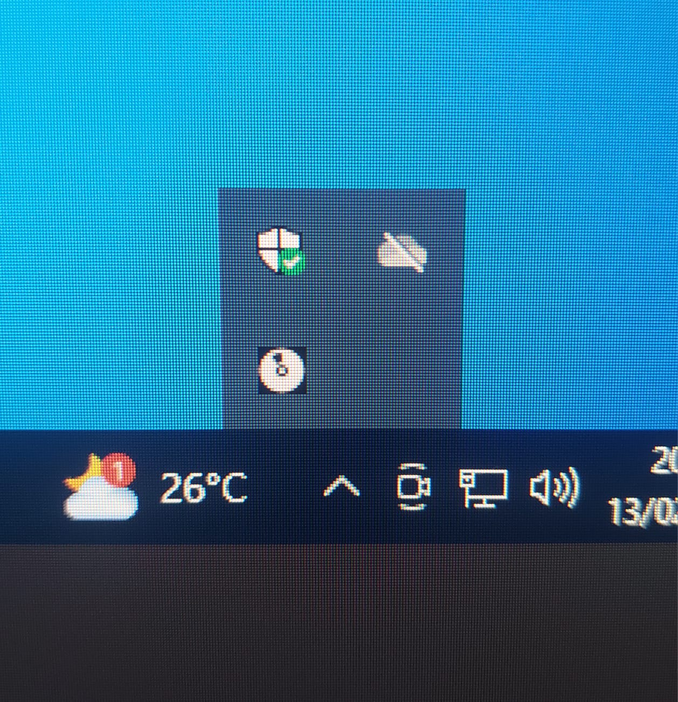
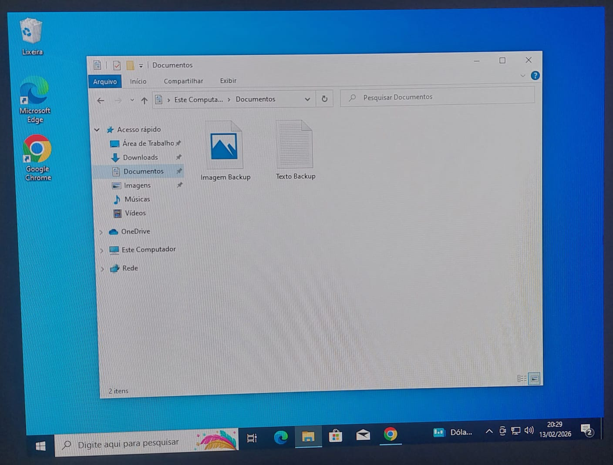
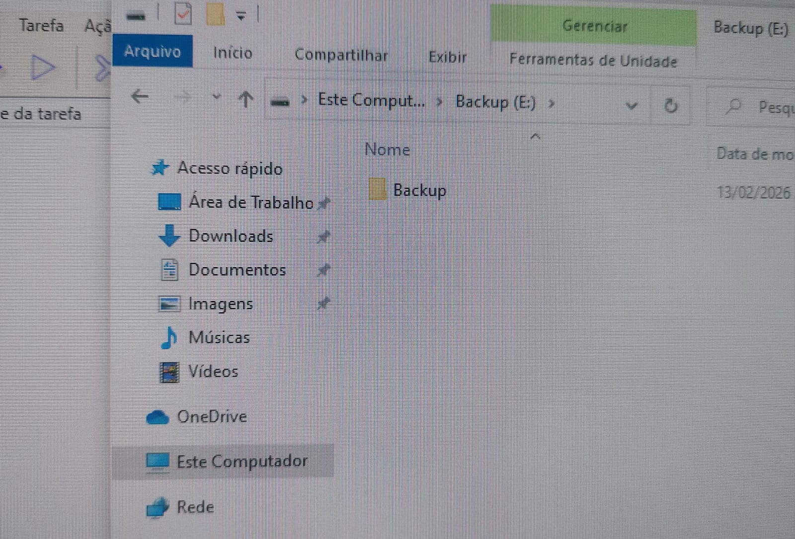
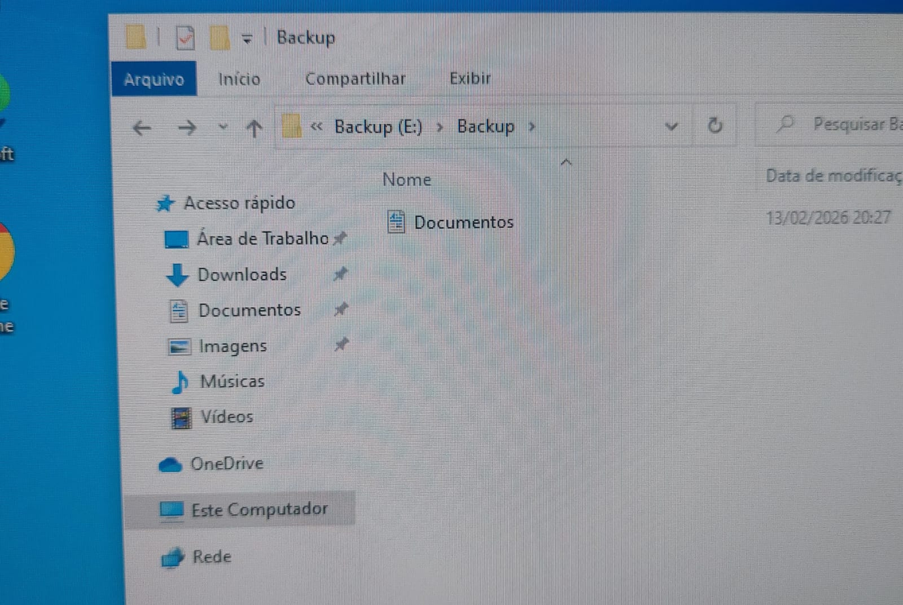

# Backup Manual com Cobian Reflector

**Data:** 13 de fevereiro de 2026

## 🎯 Objetivo

Realizar um backup manual utilizando o software Cobian Reflector, configurando origem, destino e personalizações da tarefa.

---

## 1. Download do Cobian Reflector

Nesta etapa foi realizado o download do instalador diretamente do site oficial do Cobian Reflector.

Link:
**[https://www.cobiansoft.com/cobianbackup.html](https://www.cobiansoft.com/cobianbackup.html)**

Vá até **Cobian Reflector 2.7.20** e clique em cima para realizar o donwload

---

## 2. Cobian em Execução (Ícones Ocultos)

Após a instalação, o Cobian Reflector é executado em segundo plano e pode ser acessado pelos ícones ocultos próximos ao relógio do Windows.

---

## 3. Tela Inicial do Programa

Ao abrir o Cobian Reflector, visualizamos a interface principal onde é possível criar e gerenciar tarefas de backup.

---

## 4. Pasta de Origem e Destino

Selecionamos a pasta que será utilizada como exemplo para o backup.

No caso, utilizamos arquivos de teste dentro da pasta **Documentos**.

Definimos o local onde os arquivos do backup serão armazenados.

---

## 5. Criando uma Nova Tarefa

Ao entrarmos no programa selecionamos a opção para adicionar/criar uma nova tarefa de backup.

É o símbolo do **+** (está entre o botão do pause e do monitor).

---

## 6. Tela Inicial de Configuração

Após criar a tarefa, é exibida a tela de configuração inicial.

Nesta etapa podemos definir o nome da tarefa e configurações básicas.

---

## 7. Abas de Personalização

O Cobian permite personalizar diversas configurações através das abas:

- Geral  
- Arquivos  
- Agenda  
- Dinâmica  
- Arquivo
- Filtro 
- Eventos
- Avançado

---

## 8. Configuração de Origem e Destino

Na aba **Arquivos**, adicionamos:

- Origem (pasta Documentos)
- Destino (pasta de Backup)

---

## 9. Finalizando a Configuração

Após revisar todas as configurações, finalizamos a criação da tarefa clicando em **Ok**.

---

## 10. Tarefa Criada

A tarefa aparece listada na tela principal do programa, pronta para execução manual ou automática (caso tenha sido configurado agendamento).

---

## 11. Verificação do Backup

Por fim, verificamos que os arquivos da pasta **Documentos** foram copiados corretamente para a pasta de destino.

Isso confirma que o backup foi realizado com sucesso.

---

# ✅ Conclusão

O Cobian Reflect permite realizar backups manuais ou automáticos de forma prática, possibilitando personalização completa da tarefa e garantindo maior segurança dos dados.
