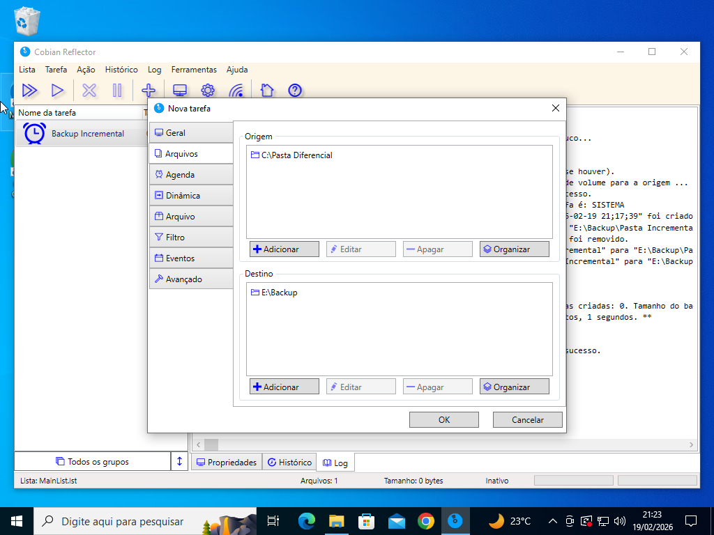
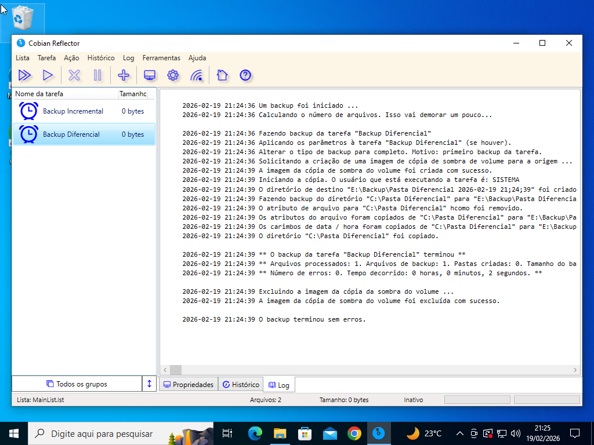
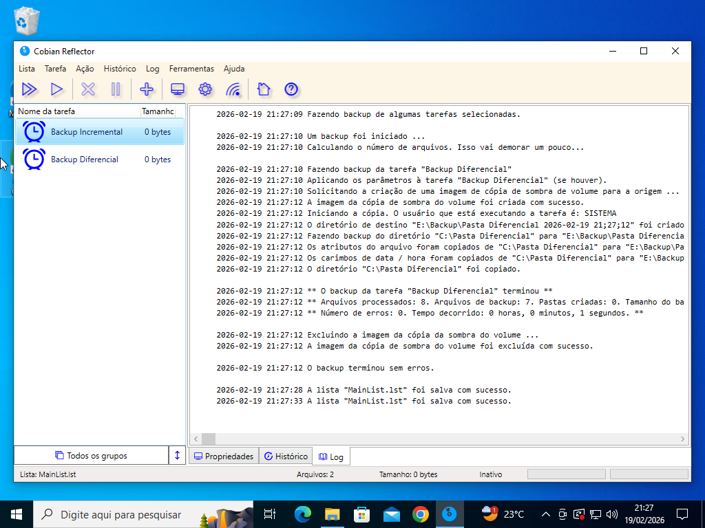

# Backup Diferencial no Cobian Reflector

**Data:** 20 de fevereiro de 2026

---

## 🎯 Objetivo

Compreender o funcionamento do **Backup Diferencial**, aplicando na prática através do Cobian Reflector e analisando seu comportamento após modificações nos arquivos.

---

## 1. Preparação do Ambiente

Foi criada uma pasta de teste contendo arquivos para simular um ambiente real de trabalho.

Essa pasta seria utilizada como base para:

- Backup completo inicial  
- Execuções diferenciais posteriores  
- Testes de alteração e acúmulo de dados  

---

## 2. Configuração da Tarefa no Cobian

No Cobian Backup foi criada uma nova tarefa selecionando o tipo:

- **Diferencial**

Foram configurados:

- Origem → Pasta de testes  
- Destino → Pasta de backup  

---

## 3. Execução do Backup Base

Antes de utilizar o modelo diferencial, foi necessário executar um **Backup Completo inicial**, que serve como referência para os diferenciais.

Esse backup cria a base que será usada como comparação.

---

## 4. Primeira Alteração e Execução Diferencial

Após modificar arquivos na pasta original:

- O backup diferencial foi executado.
- Ele copiou **todos os arquivos alterados desde o último backup completo**.

---

## 5. Nova Alteração e Crescimento do Backup

Uma nova modificação foi realizada na pasta original.

Ao executar novamente o backup diferencial:

- Ele NÃO copiou apenas a última alteração.
- Ele copiou novamente **todas as alterações feitas desde o backup completo inicial**.

Isso demonstra que o diferencial sempre usa o **backup completo como referência**, e não o último diferencial.

---

# Entendendo o Funcionamento

### 📌 Como o Backup Diferencial funciona:

1. Exige um backup completo inicial.
2. Cada execução copia tudo que foi alterado desde o último completo.
3. O tamanho do diferencial aumenta até que um novo backup completo seja feito.

---

# ⚖️ Comparação com o Backup Incremental

| Característica | Incremental | Diferencial |
|---------------|-------------|-------------|
| Referência | Último backup realizado | Último backup completo |
| Crescimento | Pequeno e contínuo | Cresce até novo completo |
| Restauração | Mais complexa | Mais simples |

---

# Conclusão

O Backup Diferencial é uma estratégia intermediária entre o Completo e o Incremental.

Ele oferece:

- Maior segurança na restauração  
- Processo mais simples que o incremental  
- Maior consumo de armazenamento ao longo do tempo  

A prática permitiu visualizar claramente seu comportamento e entender sua aplicação em ambientes reais de suporte técnico.

---

## Competências Desenvolvidas

- Configuração de tarefa no Cobian Backup  
- Diferença prática entre backup completo, incremental e diferencial  
- Análise de crescimento de backup  
- Procedimento técnico de proteção de dados em ambiente controlado  
