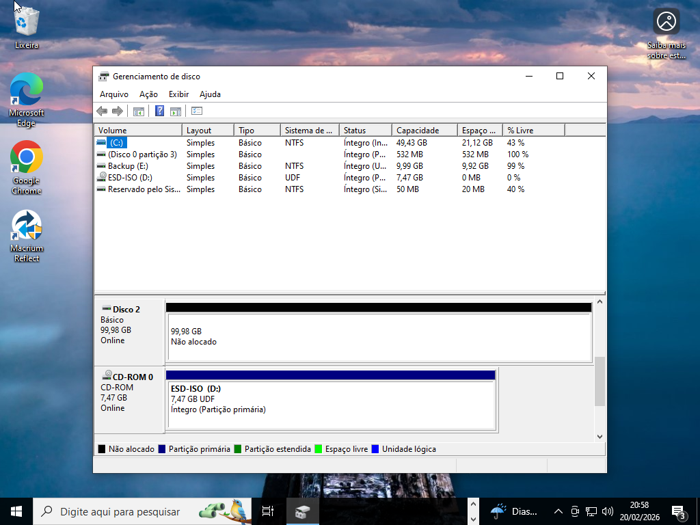
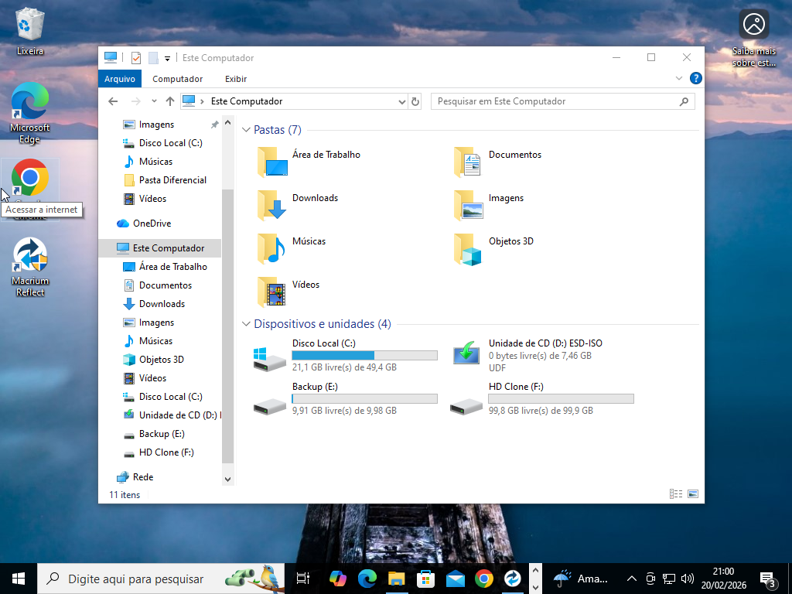
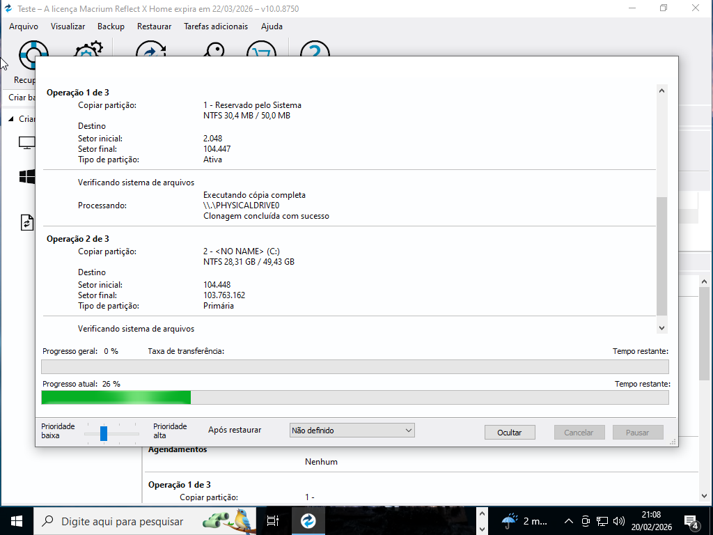
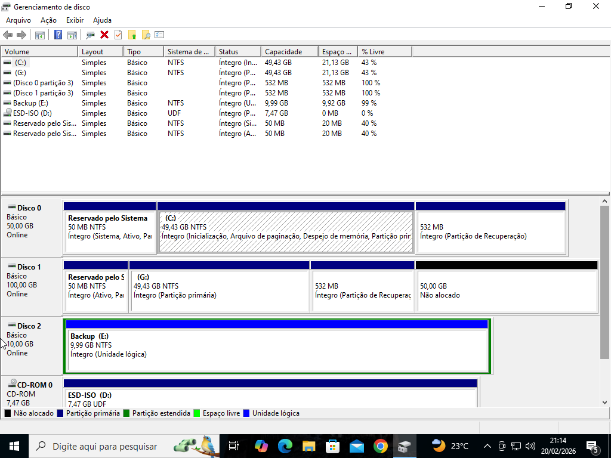
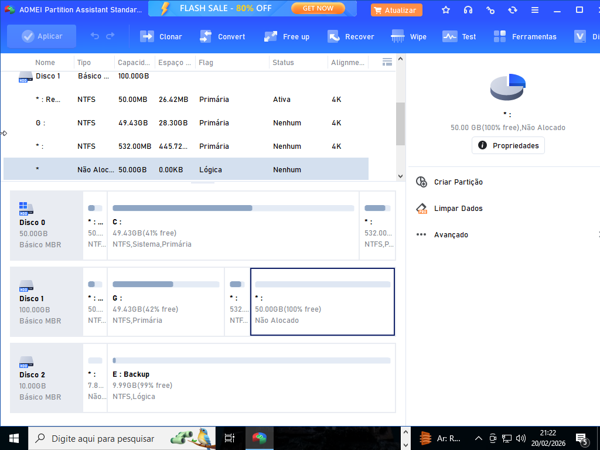
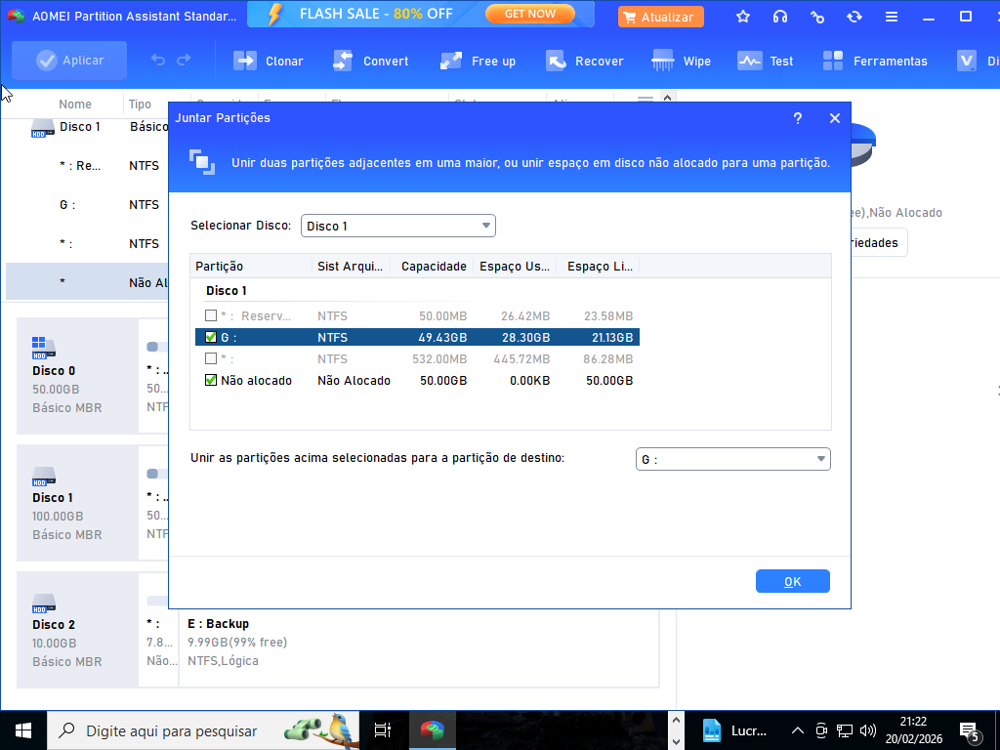
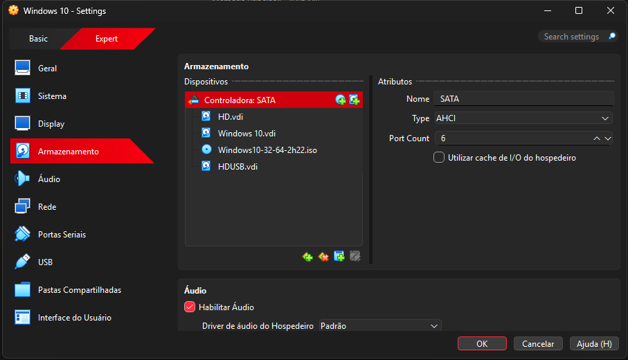

# 💾 Clonagem de Disco e Expansão de Partição
## Simulação Prática no VirtualBox

---

## 🎯 Objetivo

Realizar a clonagem de um disco de 50GB para um novo disco de 100GB utilizando o Macrium Reflect e, posteriormente, expandir a partição principal utilizando o AOMEI Partition Assistant.

A atividade foi realizada em ambiente virtual (VirtualBox).

---

# 🧩 1️⃣ Criação do Novo Disco (100GB)

Inicialmente, foi criado um novo disco virtual de 100GB no VirtualBox.

No Gerenciamento de Disco do Windows:

- O disco foi inicializado como **GPT (GUID Partition Table)**  
- Foi criado o volume  
- O disco apareceu inicialmente como **não alocado**

GPT foi escolhido por ser o padrão mais moderno, suportando maior capacidade e mais partições que o MBR.

Após a criação e formatação, o disco passou a aparecer no sistema como **HD Clone**.

---

# 💽 2️⃣ Clonagem com Macrium Reflect

Software utilizado:

**:contentReference[oaicite:0]{index=0}**  
Versão gratuita (teste de 30 dias)

Foi realizada a clonagem:

- 🔹 Disco de origem → Disco Local (50GB)  
- 🔹 Disco de destino → HD Clone (100GB)

O processo foi iniciado selecionando o disco de origem e arrastando para o disco de destino dentro do software.

O Macrium realiza clonagem inteligente, copiando:

- Estrutura de partições  
- Setor de boot  
- Sistema operacional  
- Dados existentes  

Após a conclusão, o Gerenciamento de Disco mostrou:

- Disco original (50GB)
- Disco clone (100GB)
- 50GB restantes como **espaço não alocado**

---

# 📈 3️⃣ Expansão de Partição com AOMEI

Software utilizado:

**:contentReference[oaicite:1]{index=1}**  
Versão gratuita (30 dias)

Como o disco clone era maior, ficou um espaço não alocado de 50GB.

No AOMEI:

- Foi selecionado o Disco 1 (HD Clone)
- O espaço não alocado foi marcado
- Foi escolhida a opção **Juntar Partições**
- A partição G: foi selecionada para receber o espaço adicional
- Após confirmação, clicado em **Aplicar**

O software executou a operação e expandiu a partição principal utilizando todo o espaço disponível.

---

# 🔄 4️⃣ Troca da Ordem de Boot no VirtualBox

Para validar a clonagem, foi realizada a troca da ordem de boot.

Com a máquina virtual desligada:

- Acessado: Configurações → Armazenamento
- O disco **HD Clone** foi movido para **SATA 0**
- O disco antigo passou para SATA 1

SATA 0 representa a primeira prioridade de inicialização.

---

# ✅ 5️⃣ Validação Final

Após iniciar a máquina virtual:

- O sistema operacional iniciou normalmente
- O disco clonado funcionou como principal
- A partição estava expandida corretamente

No Gerenciamento de Disco foi possível visualizar:

- Disco clonado como principal
- Capacidade total aproveitada (100GB)

---

# 🧠 Conceitos Técnicos Aplicados

- Inicialização de disco em GPT  
- Clonagem inteligente de disco  
- Replicação de setor de boot  
- Gerenciamento de espaço não alocado  
- Extensão de volume  
- Prioridade de boot em ambiente virtual  

---

# 📌 Conclusão

A atividade demonstrou na prática:

- Como migrar um sistema operacional para um disco maior  
- Como evitar perda de dados durante clonagem  
- Como aproveitar espaço excedente após clonagem  
- Como validar o funcionamento através da alteração de boot  

A simulação em ambiente virtual permitiu realizar testes seguros, reforçando conhecimentos de infraestrutura e armazenamento.

---

# 📚 Competências Desenvolvidas

- Clonagem de disco em ambiente controlado  
- Manipulação de partições  
- Gerenciamento de armazenamento  
- Configuração de boot no VirtualBox  
- Documentação técnica estruturada  
