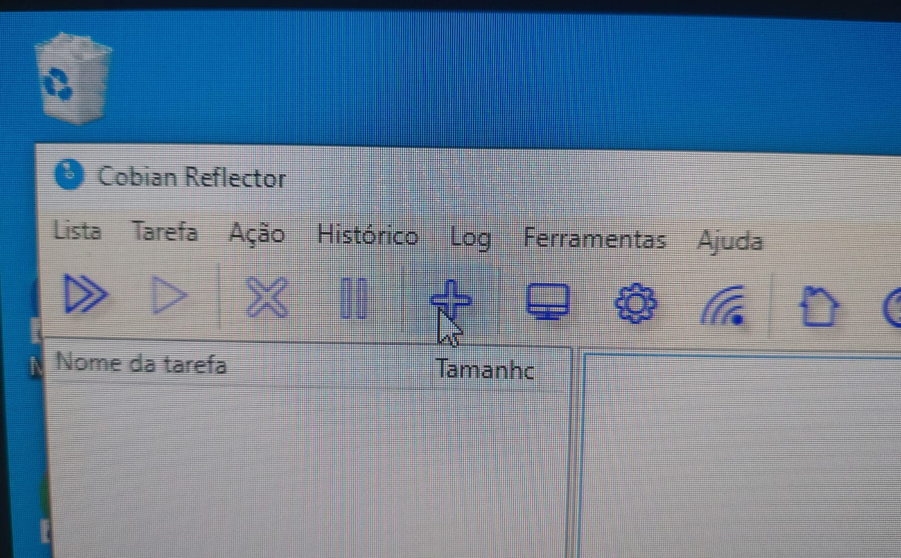
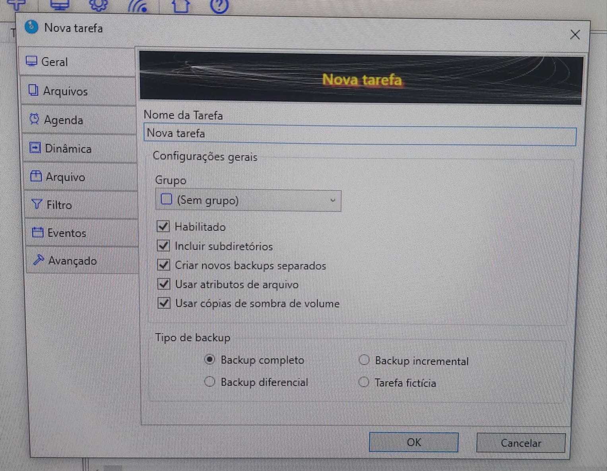
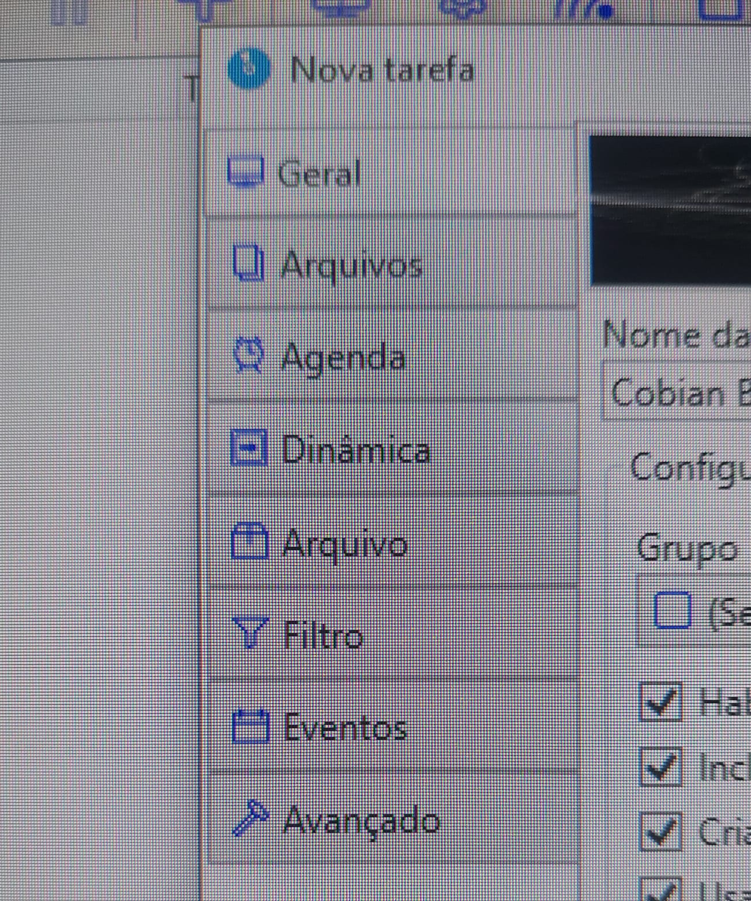
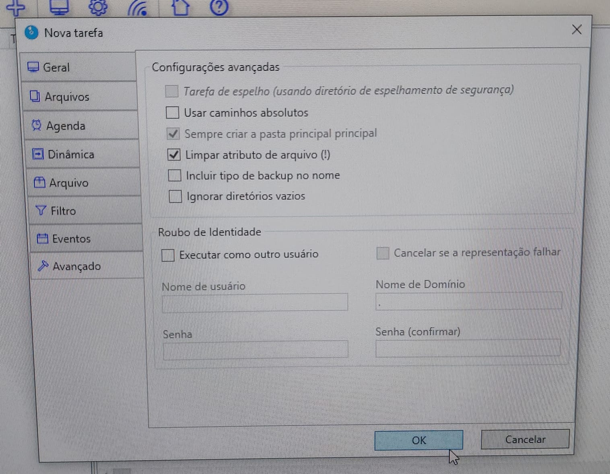
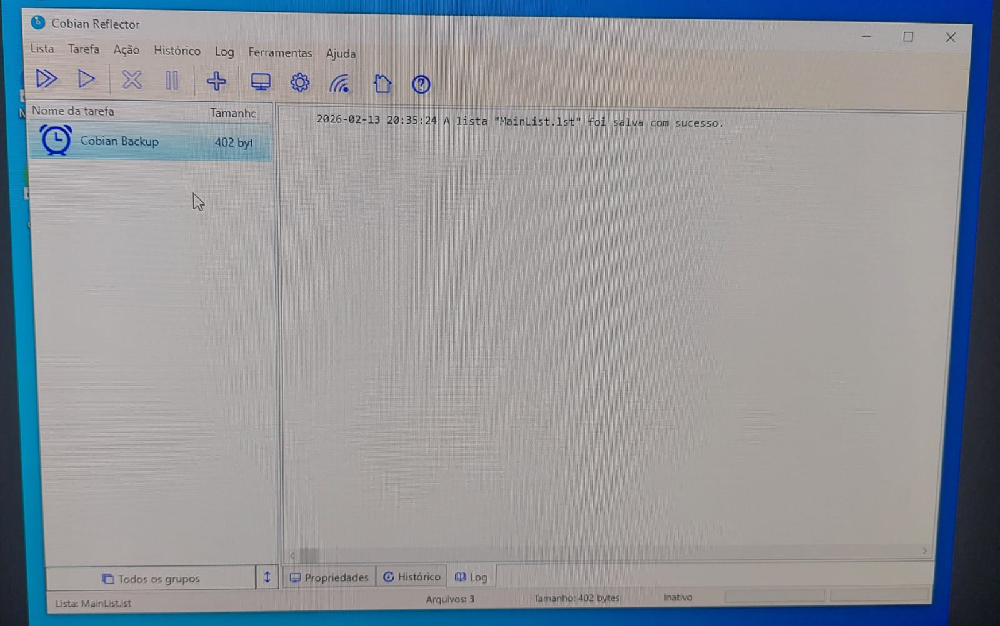

# Backup Manual com Cobian Reflect

**Data:** 13 de fevereiro de 2026

## 🎯 Objetivo

Realizar um backup manual utilizando o software Cobian Reflect, configurando origem, destino e personalizações da tarefa.

---

## 1️⃣ Download do Cobian Reflect

Nesta etapa foi realizado o download do instalador diretamente do site oficial do Cobian Reflect.

---

## 2️⃣ Cobian em Execução (Ícones Ocultos)

Após a instalação, o Cobian Reflect é executado em segundo plano e pode ser acessado pelos ícones ocultos próximos ao relógio do Windows.

---

## 3️⃣ Tela Inicial do Programa

Ao abrir o Cobian Reflect, visualizamos a interface principal onde é possível criar e gerenciar tarefas de backup.

---

## 4️⃣ Pasta de Origem

Selecionamos a pasta que será utilizada como exemplo para o backup.

No caso, utilizamos arquivos de teste dentro da pasta **Documentos**.

---

## 5️⃣ Pasta de Destino

Definimos o local onde os arquivos do backup serão armazenados.

---

## 6️⃣ Criando uma Nova Tarefa

Selecionamos a opção para adicionar/criar uma nova tarefa de backup.

---

## 7️⃣ Tela Inicial de Configuração

Após criar a tarefa, é exibida a tela de configuração inicial.

Nesta etapa podemos definir o nome da tarefa e configurações básicas.

---

## 8️⃣ Abas de Personalização

O Cobian permite personalizar diversas configurações através das abas:

- Geral  
- Arquivos  
- Agenda  
- Dinâmica  
- Arquivo  
- Eventos  

---

## 9️⃣ Configuração de Origem e Destino

Na aba **Arquivos**, adicionamos:

- 📂 Origem (pasta Documentos)
- 💾 Destino (pasta de backup)

---

## 🔟 Finalizando a Configuração

Após revisar todas as configurações, finalizamos a criação da tarefa.

---

## 1️⃣1️⃣ Tarefa Criada

A tarefa aparece listada na tela principal do programa, pronta para execução manual ou automática (caso tenha sido configurado agendamento).

---

## 1️⃣2️⃣ Verificação do Backup

Por fim, verificamos que os arquivos da pasta **Documentos** foram copiados corretamente para a pasta de destino.

Isso confirma que o backup foi realizado com sucesso.

---

# ✅ Conclusão

O Cobian Reflect permite realizar backups manuais ou automáticos de forma prática, possibilitando personalização completa da tarefa e garantindo maior segurança dos dados.
