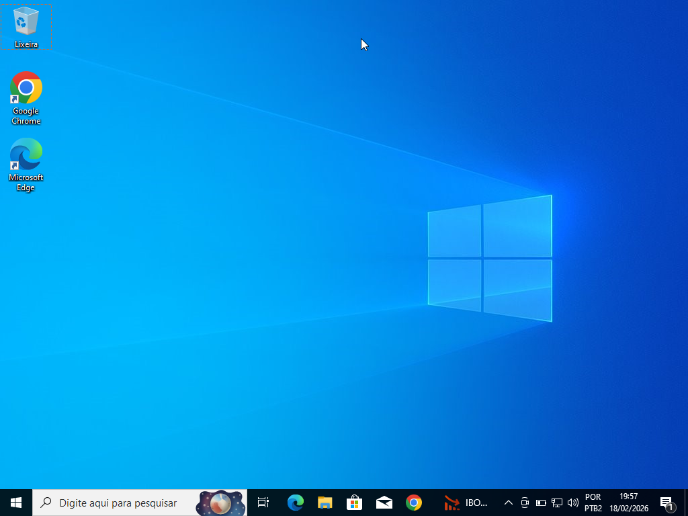
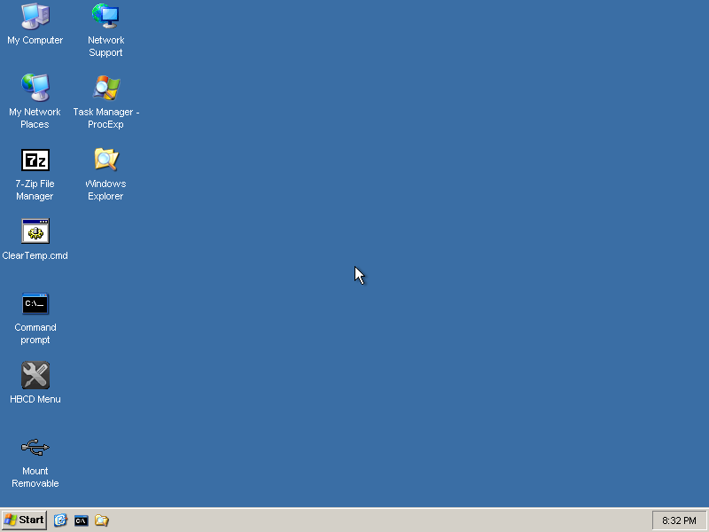
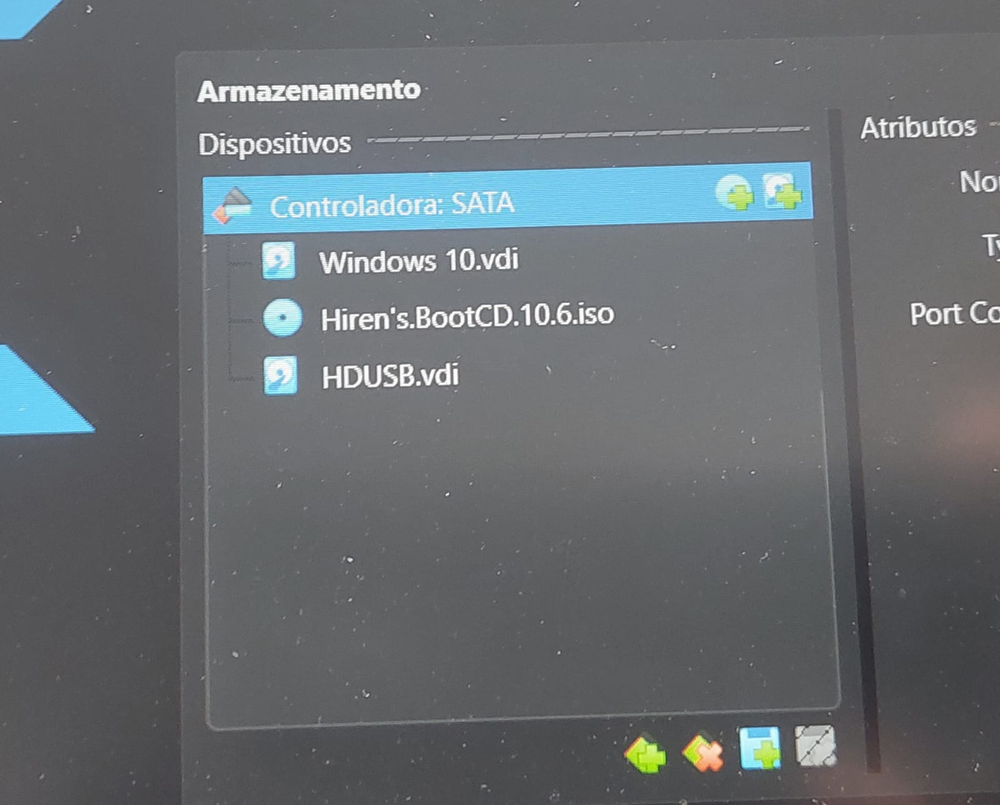
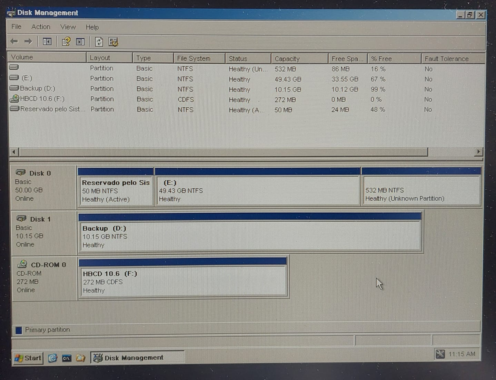
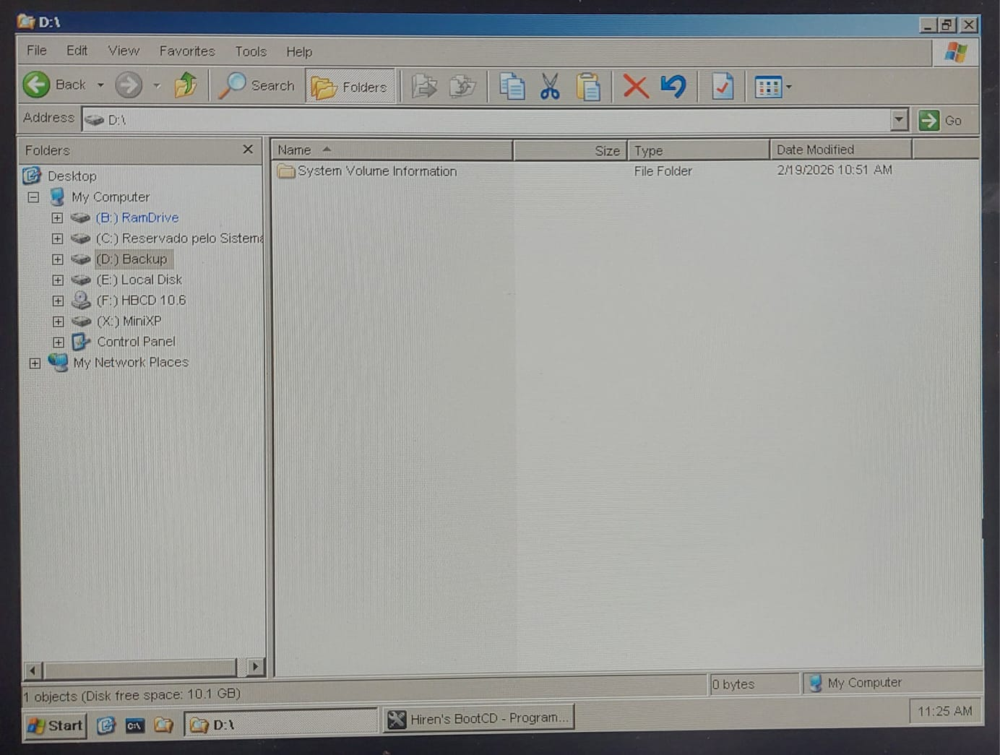
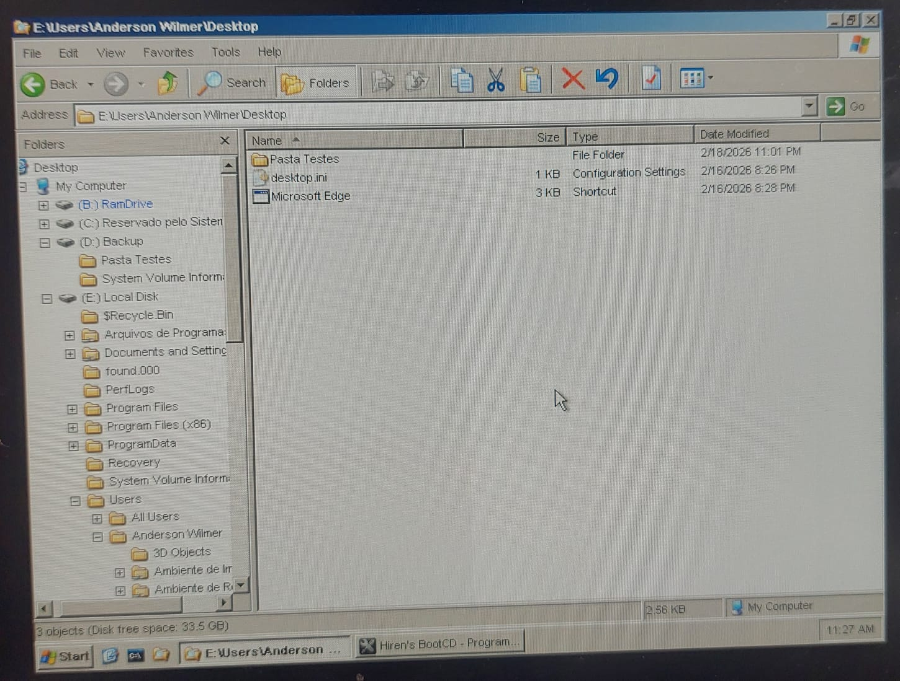

# Criação de Partição e Backup com Hiren’s Boot CD

**Data:** 12 de fevereiro de 2026

## 📌 Objetivo
Criar uma partição de 10GB utilizando o Hiren’s Boot CD e realizar o backup de arquivos do Windows 10 para essa nova partição.

---

## 1️⃣ Ambiente Inicial – Windows 10

Área de trabalho do Windows 10:

Pasta contendo os arquivos de teste:

---

## 2️⃣ Inicialização pelo Hiren’s Boot CD

Menu inicial do Hiren’s:

Mini Windows XP carregado:

---

## 3️⃣ Criação do Disco Virtual de 10GB

Disco criado nas configurações de armazenamento do VirtualBox:

---

## 4️⃣ Criação da Partição "Backup"

Criação da partição utilizando 100% do espaço disponível:

Partição criada com o nome "Backup":

---

## 5️⃣ Processo de Backup

Pasta original localizada no Desktop:

Processo de cópia para a partição Backup:

Arquivos dentro da partição Backup:

---

## 6️⃣ Confirmação no Windows 10

Confirmação da partição e dos arquivos após reinicialização no Windows 10:

---

## 🎯 Resultado

A partição foi criada com sucesso através do Hiren’s Boot CD e os arquivos foram copiados corretamente para o novo volume "Backup", sendo posteriormente confirmados no Windows 10.

---

## 📚 Competências Praticadas

- Criação de disco virtual no VirtualBox  
- Gerenciamento de partições  
- Uso do Hiren’s Boot CD  
- Backup manual de arquivos  
- Verificação de integridade dos dados  
