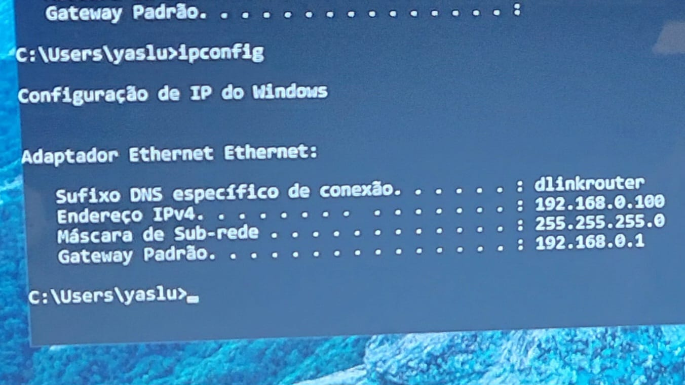
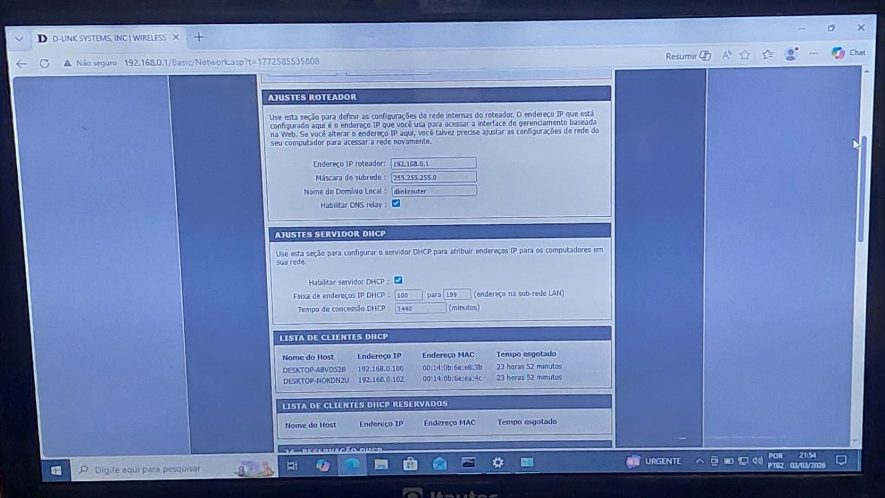
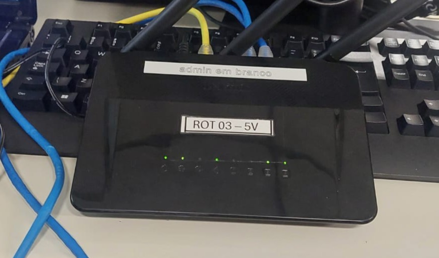

# Redes Domésticas

> **Data:** 03 de março de 2026

Simulação e prática de uma pequena rede doméstica.

---

## ✉️ Simulação no Cisco Packet Tracer

Neste cenário utilizamos as 3 imagens novamente, agora com novos materiais:  
- **1 rack**
- **1 nuvem** → PT-Cloud
- 2 mesas
- **1 roteador** → WRT300N
- 2 notebooks
- **1 celular**
- **Cabos Diretos (para conexão dos dispositivos)**

Durante a atividade, colocamos a nuvem (nosso provedor de internet) no rack, em seguida fizemos a conexão da nuvem para o roteador e do roteador para os notebooks.
A nuvem entrou na porta WAN do roteador, os notebooks nas portas LAN e o celular foi via Wi-Fi.

Contudo, foram realizados simulações de envio de carta entre os dispositivos conectados à rede.

---

## DNS (Domain Name System)

É o sistema que traduz nomes de domínio legíveis (ex: google.com) em endereços IP numéricos (ex: 192.0.2.1) que os computadores usam para localizar sites.

---

## Ações do Switch

Switch quando ligado armazena os endereços físicos (MAC Address) de todos os hosts da rede.
- Identificação do dispositivo
- Atribuir um IP fixo a um dispositivo da rede

---

## 🌐 Configuração de Roteador e Reserva de IP

Configurar o roteador e realizar reserva de IP (DHCP Reservation) para os notebooks.

### Reset e Inicialização

- Ligar o roteador
- Aguardar inicialização completa
- Realizar reset para padrão de fábrica
- Aguardar reinicialização total

⚠ Importante:  
Conectar os dispositivos **somente após o reset completo**, garantindo que o DHCP esteja ativo e estável.

### Acesso ao Roteador

- Conectar o notebook ao roteador
- Executar no Prompt de Comando: ```ipconfig```
- Identificar o **Gateway Padrão**



- Inserir o IP do gateway no navegador
- Acessar a **interface web de configuração do roteador**
  


### Reserva de IP (DHCP Reservation)

- Acessar a lista de dispositivos conectados
- Selecionar os notebooks
- Ativar reserva de IP

Resultado:
Os dispositivos passam a receber sempre o mesmo IP automaticamente.

📌 Nesta prática, duas duplas utilizaram o mesmo roteador, reservando dois notebooks.

### Verificação

- Executar novamente: ```ipconfig```
- Confirmar IP, gateway e funcionamento da rede


