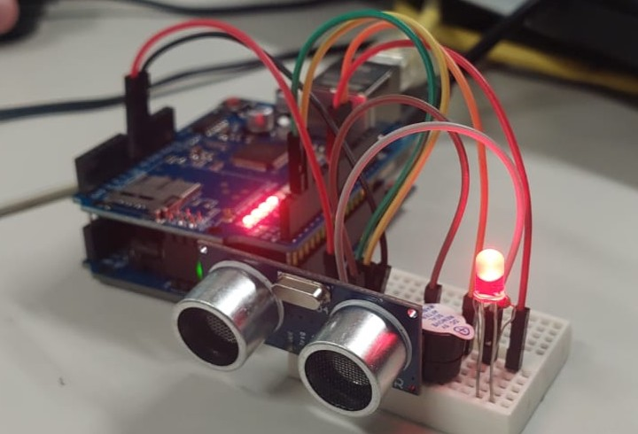
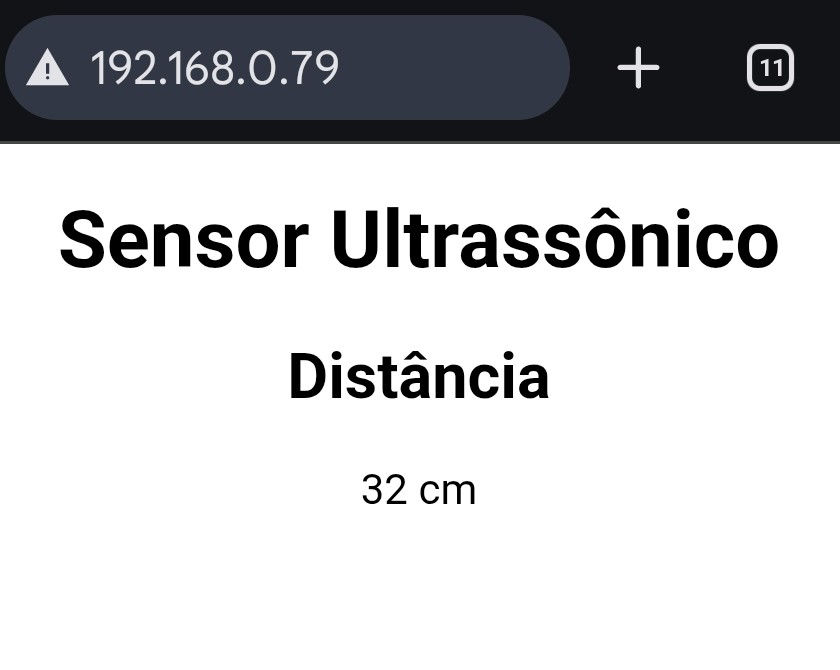
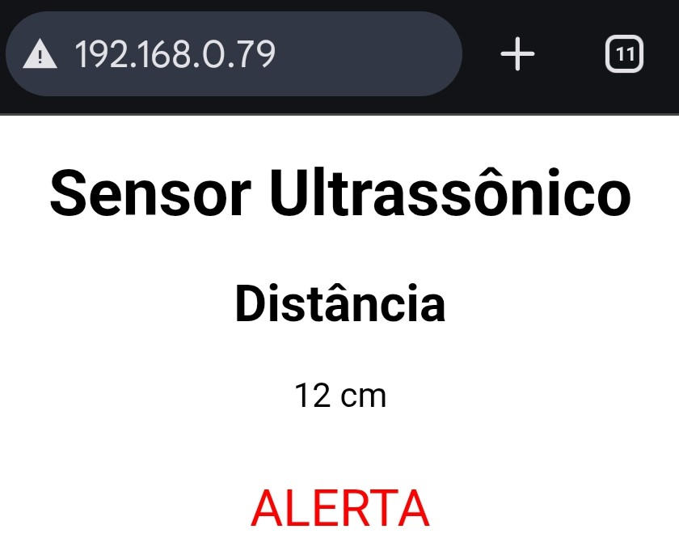
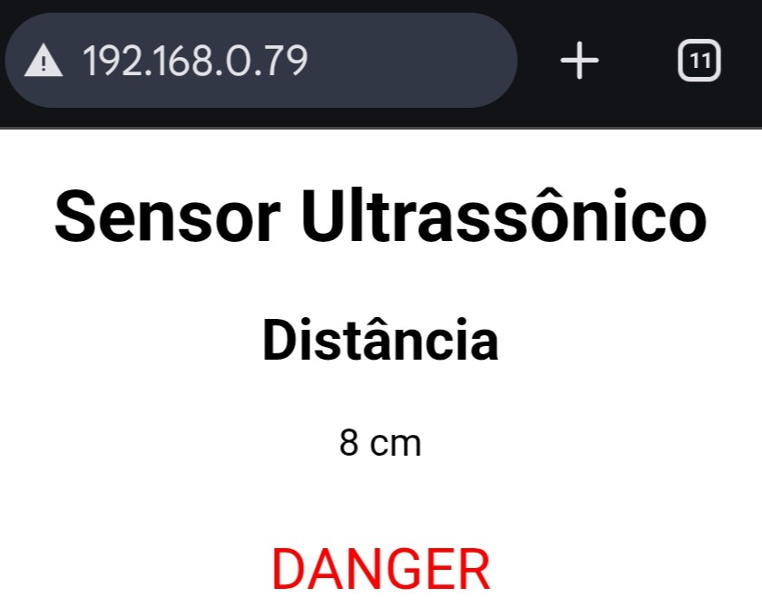

# Arduino com Sensor de Distância

> **Data:** 26 e 27 de março de 2026

Configurando um arduino com sensor de distância e integrando eles na página web do arduino.



---

## Código HTML

```html
<!DOCTYPE html>
<html lang="pt-br">
<head>
    <meta charset="UTF-8">
    <meta name="viewport" content="width=device-width, initial-scale=1.0">
    <title>Sensor Ultrassônico</title>
    <style>
        body {
            font-family: sans-serif;
            text-align: center;
        }

        h1 {
            font-size: 1.9rem;
            color: rgb(0, 0, 0);
        }

        #alerta {
            color: #ff0000;
            font-size: 1.5rem;
            margin-top: 30px;
        }
    </style>
</head>
<body>
    <h1>Sensor Ultrassônico</h1>
    <h2>Distância</h2>
    <div id="sensor">--</div>
    <div id="alerta"></div>

    <script>
        function atualizar() {
            fetch("/json")
            .then(res => res.json())
            .then(dados => {
                let distancia = dados.distancia;

                document.getElementById("sensor").innerHTML = distancia + " cm"

                let alerta = document.getElementById("alerta") 
                if (distancia > 10 && distancia < 30) {
                    alerta.innerHTML = "ALERTA"
                } else if (distancia > 2 && distancia <= 10) {
                    alerta.innerHTML = "DANGER"
                } else {
                    alerta.innerHTML = ""
                }
            })
        }
        setInterval(atualizar, 200)
    </script>

    
</body>
</html>
```

---

## Arduino IDE

```ino
/**
  Leitura de sensor
  @author Anderson Wilmer
*/

#include <SPI.h>
#include <Ethernet.h>
#include <DistanceSensor.h>

#define red 8

constexpr int TrigPin = 2;  //Pino Trig do sensor
constexpr int EchoPin = 3;  //Pino Echo do sensor
DistanceSensor<TrigPin, EchoPin> sensor;


// Gerar o MAC ADDRESS (https://ssl.crox.net/arduinomac)
byte mac[6] = { 0x90, 0xA2, 0xDA, 0x49, 0xDE, 0x76 };
EthernetServer server(80);

const char pagina[] PROGMEM = R"HTML(
<!DOCTYPE html>
<html lang="pt-br">
<head>
    <meta charset="UTF-8">
    <meta name="viewport" content="width=device-width, initial-scale=1.0">
    <title>Sensor Ultrassônico</title>
    <style>
        body {
            font-family: sans-serif;
            text-align: center;
        }

        h1 {
            font-size: 1.9rem;
            color: rgb(0, 0, 0);
        }

        #alerta {
            color: #ff0000;
            font-size: 1.5rem;
            margin-top: 30px;
        }
    </style>
</head>
<body>
    <h1>Sensor Ultrassônico</h1>
    <h2>Distância</h2>
    <div id="sensor">--</div>
    <div id="alerta"></div>

    <script>
        function atualizar() {
            fetch("/json")
            .then(res => res.json())
            .then(dados => {
                let distancia = dados.distancia;

                document.getElementById("sensor").innerHTML = distancia + " cm"

                let alerta = document.getElementById("alerta") 
                if (distancia > 10 && distancia < 30) {
                    alerta.innerHTML = "ALERTA"
                } else if (distancia > 2 && distancia <= 10) {
                    alerta.innerHTML = "DANGER"
                } else {
                    alerta.innerHTML = ""
                }
            })
        }
        setInterval(atualizar, 200)
    </script>

    
</body>
</html>
)HTML";

void setup() {
  
  Serial.begin(9600);
  Ethernet.begin(mac);
  server.begin();
  Serial.println("Servidor WEB");
  Serial.print("IP do Servidor: ");
  Serial.println(Ethernet.localIP());
  pinMode(8, OUTPUT);
  pinMode(9, OUTPUT);
  //Incialização do sensor HC-SR04
  sensor.begin();
}

void loop() {
  // Uso do sensor
  int distancia = sensor.tick();  // faz a leitura do sensor
  if (distancia == sensor.NREADY) {
    return;
  }

  Serial.print("Distância: ");
  Serial.print(distancia);
  Serial.println("cm");


  if (distancia > 10 && distancia < 30) {
    digitalWrite(8, HIGH);
  } else {
    digitalWrite(8, LOW);
  }

  if (distancia > 2 && distancia <= 10) {
    digitalWrite(9, HIGH);
    digitalWrite(red, HIGH);
    tone(12, 700);
    delay(distancia * 50);
    digitalWrite(9, LOW);
    digitalWrite(red, LOW);
    delay(distancia * 50);
    noTone(12);

    //digitalWrite(12, LOW); //buzzer
  } else {
    digitalWrite(9, LOW);
    noTone(12);
    //digitalWrite(12, LOW);
  }
  EthernetClient client = server.available();

  if (client) {

    String request = "";

    while (client.available()) {
      char c = client.read();
      request += c;
    }

    // endpoint JSON
    if (request.indexOf("GET /json") >= 0) {

      client.println(F("HTTP/1.1 200 OK"));
      client.println(F("Content-Type: application/json"));
      client.println(F("Connection: close"));
      client.println();

      client.print("{\"distancia\":");
      client.print(distancia);
      client.print("}");

      delay(1);
      client.stop();
      return;
    }

    // página principal
    client.println(F("HTTP/1.1 200 OK"));
    client.println(F("Content-Type: text/html"));
    client.println(F("Connection: close"));
    client.println();

    client.print((__FlashStringHelper*)pagina);

    delay(100);

    client.stop();
  }
}
```

---

## Div id="ALERTA"

O alcance de um sensor ultrassônico é de 2 cm a 4 metros. Então na div do alerta ele aparece assim:

### Dê 31cm pra cima

Ele só mede a distância.



### Entre 11cm e 30cm

Ele marca distância, aparece uma mensagem "ALERTA" na web, e o LED liga.



### Entre 2cm e 10cm

Ele marca distância, aparece uma mensagem "DANGER" na web, o LED pisca e o sensor dispara quando o LED liga.



---

## Conclusão

- Código HTML e do Arduino IDE feitos
- Montagem do arduino com o sensor
  - Sensor Ultrassônico (HC-SR04), Piezo Buzzer, 1 LED, resistores e jumpers
- Integração do arduino e do sensor na rede
