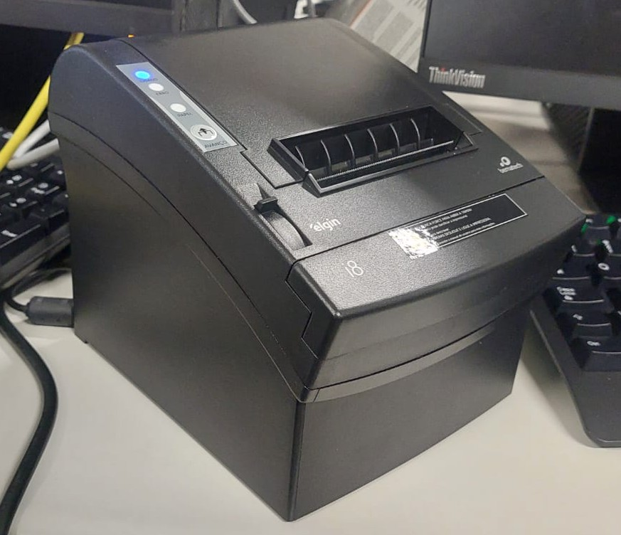
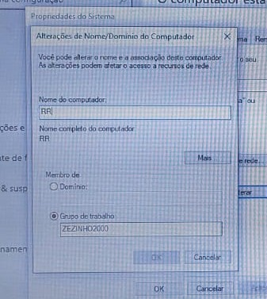
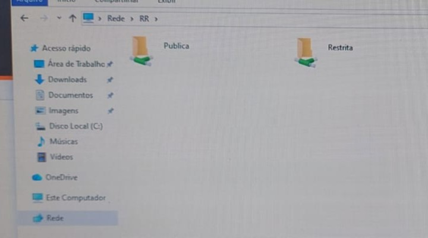
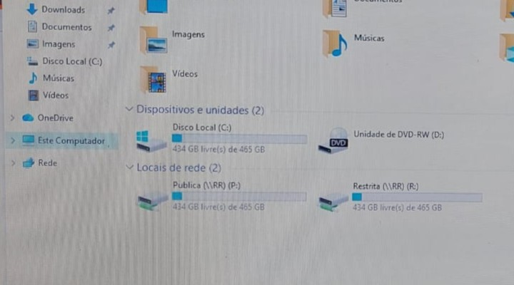
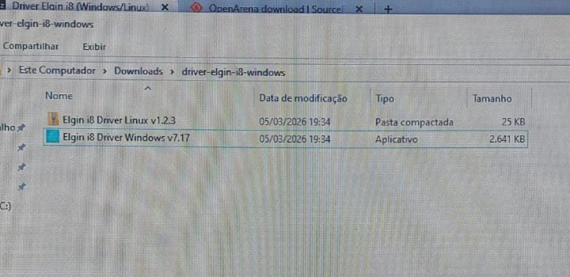
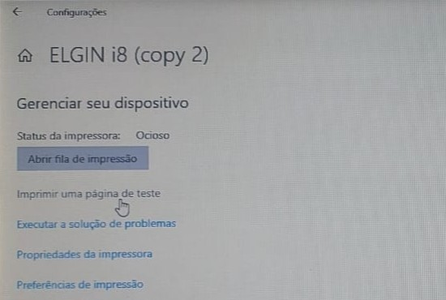
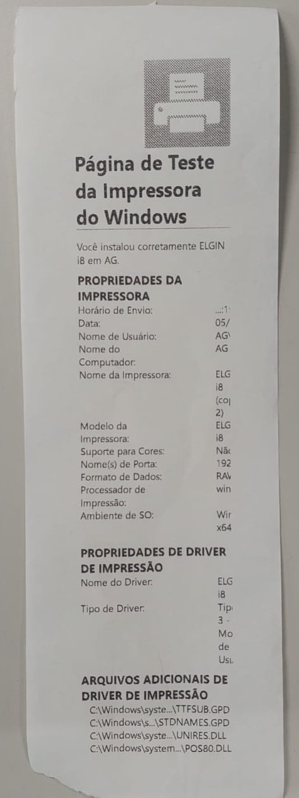
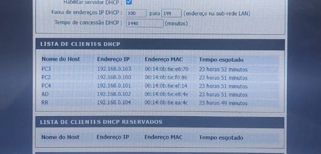

# 🖨️ Impressora na Rede

> **Data:** 04 e 05 de março de 2026

Realização das tarefas anteriores com 3 notebooks conectados em 1 roteador, acrescentendo a instalação da impressora e outros.



---

## Reservar o IP da impressora

- Conecte a impressora ao roteador
- Pegue o IP da impressora

### Passo a passo 
1 - Desligue a impressora na chave lateral.  
2 - Mantenha o botão FEED (o botão de avançar papel) pressionado.  
3 - Com o botão ainda apertado, ligue a impressora.  
4 - Aguarde 4 ou 5 segundos até ela começar a imprimir e solte o botão.  
5 - No papel busque por **"IP Address"** para obter o endereço.

- Entre na interface web do roteador
- Vá até a lista Reservação DHCP
- Selecione o IP da impressora

---

## Nome e Grupo

Definiremos o **Nome** dos notebooks e um **Grupo de Trabalho** único para rede.

Caminho:  
Painel de controle → Sistema e Segurança → Sistema → Sobre → Configurações Avançadas do Sistema → Nome do Computador → Alterar



Em Prompt de Comando:
```
hostname
```
Aparece o nome do dispositivo.

---

## 🗂️ Compartilhamento de Pastas

- Definir um notebook para compartilhamento de pastas
- Fazer a reserva do IP de compartilhamento
- Criar uma Pasta Pública e uma Pasta Restrita neste computador
- Compartilhar essas pastas com usuário

### sendo que:
Pública (Leitura e Gravação)  
Restrita (Leitura)

- Em "Explorador de Arquivos" acessar "Rede" para descoberta de dispositivos



Notebook de compartilhamento → acessar as pastas compartilhadas, testar as permissões.

### Locais de rede

Se tudo OK → Mapear as Unidades de Rede ( usar unidade C:\ ).



---

## Instalação da Impressora

Para realizarmos a instalação da impressora em nosso notebook, é necessário baixarmos o **driver** dela. O modelo de impressora é o Elgin i8.

Link do Driver: [https://www.bztech.com.br/downloads/driver-elgin-i8](https://www.bztech.com.br/downloads/driver-elgin-i8)

### Extração do Driver

- Clique com o botão direito no arquivo .zip **Elgin i8 Driver Windows v7.17** e escolha Extrair Tudo.



- Vá clicando em Next.
- Na tela que pergunta a porta (onde tem USB), marque Others
- Clique em Install.

Ele vai copiar os arquivos para o Windows, mas a impressora ainda não sabe "onde morar".

### Em Propriedades da Impressora

- Vá na aba Portas (Ports).
- Clique no botão Adicionar Porta... (Add Port...).
- Escolha a opção: Standard TCP/IP Port
- Clique em Nova Porta... (New Port) e depois em Avançar.
- No campo aberto digite o IP da impressora, em seguida Avançar
- Ele agora aparecerá na lista

### Teste final

Após todo processo verifique se a saída está correta.

Caminho:  
Painel de Controle → Hardware e Sons → Elgin i8 (modelo da impressora) → Dê um botão direito → Propriedades da Impressora → Geral → Imprimir uma página de teste





---

## Cascateamento dos Switches

Nesta atividade os roteadores foram conectados utilizando **porta LAN para porta LAN**.

Exemplo da ligação:

Roteador Grupo 1 (WAN) ─── Cabo ─── Internet / Rede

Roteador Grupo 2 (LAN) ─── Cabo ─── Roteador Grupo 1 (LAN)

Esse tipo de conexão permite que todos os dispositivos fiquem **na mesma rede local**.

### Roteador principal

IP: 192.168.0.1  
DHCP: Ativo  
Função: Gateway da rede

### Roteadores secundário

DHCP: Desativado  
IP configurado manualmente para administração.

Exemplo:

Roteador 2 → 192.168.0.2  

### Configuração dos notebooks

Exemplo de configuração:

IP: 192.168.0.X  
Máscara: 255.255.255.0  
Gateway: 192.168.0.1  

### Resultado



- 5 notebooks ficaram conectados
  - **Roteador principal:** RR e AD
  - **Roteador secundário:** PC2, PC3 e PC4
- Todos estavam **na mesma rede local**

Após o cascateamento foi possível realizar comunicação entre os dispositivos.
