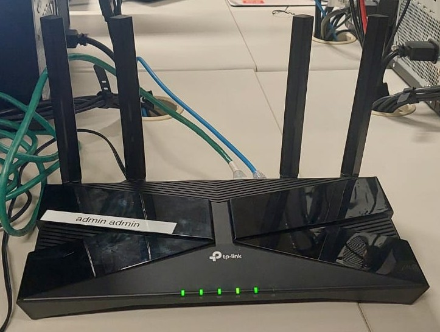
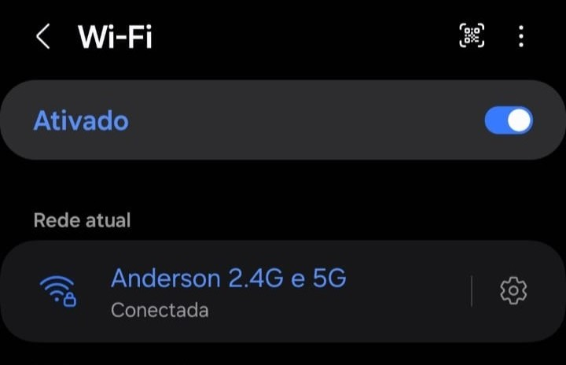
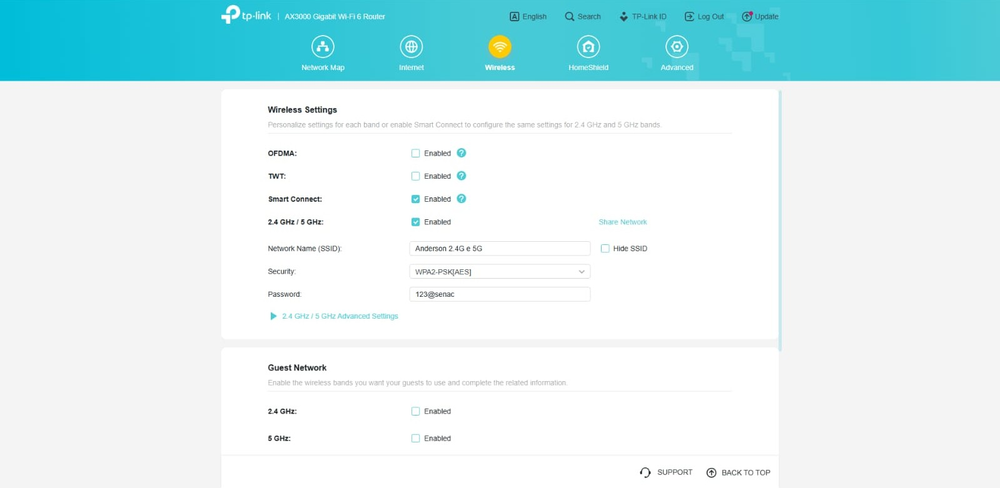
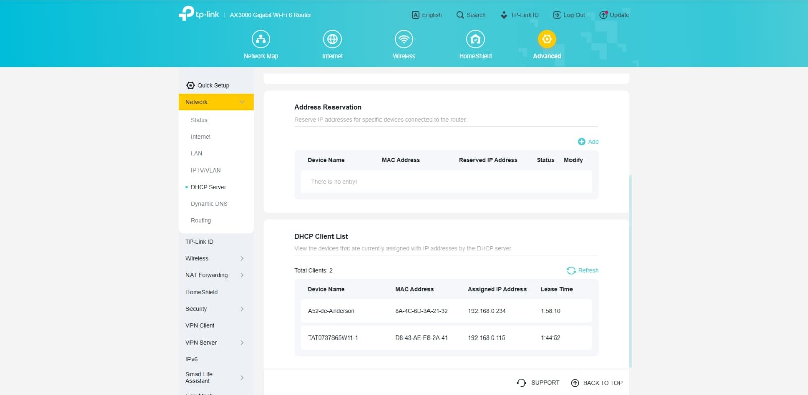
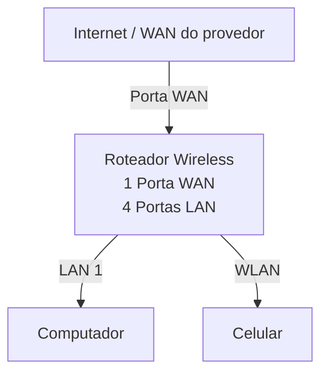
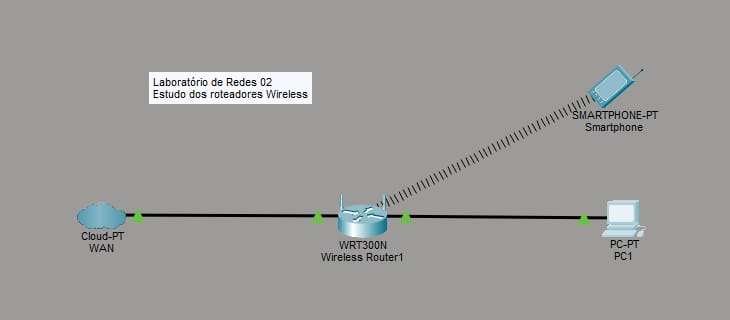

# Roteador Wireless

> **Data:** 10 de março de 2026

Conectamos um computador e um celular em um roteador sem fio.

---

## Instalação do Roteador

Modelo utilizado: **TP-Link AX3000 Gigabit WiFi 6**

### Instalação Física

- Primeiro conectamos ele na fonte
- Ligamos ele no botão Power ON/OFF
  - Esperamos ele fazer o reboot
- Realizar o Reset (clips de papel)
  - Segure por alguns segundos, até que TODAS as luzes acendam
- Após isso, deve-se conectar as portas WAN (na internet) e LAN (no PC)

### Acesso à Interface

- Entre na interface de configuração do roteador inserindo o seu respectivo IP **"192.168.0.1"**
- Colocamos a senha do roteador
- Definimos o SSID e a senha da rede
  - Esse modelo de roteador é Dual Band, logo transmite as redes 2.4 GHz e 5 GHz simultaneamente
- Em seguida testamos a conexão em nosso dispositivo móvel

- Em Wireless → Wireless Settings pode ver nossas alterações feitas

- Em Advanced na aba DHCP Server, podemos ver a lista de dispositivos conectados à rede

---

## Topologia da Rede

Diagrama lógico da rede usada neste laboratório.

### Imagem da topologia usada neste laboratório:

