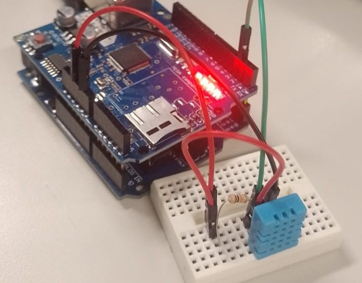

# Arduino com Sensor de Temperatura e Umidade

> **Data:** 24 de março de 2026

Configurando um arduino com sensor de temperatura e umidade e integrando eles na página web do arduino



---

## Código HTML

```html
<!DOCTYPE html>
<html lang="pt-br">
<head>
    <meta charset="UTF-8">
    <meta name="viewport" content="width=device-width, initial-scale=1.0">
    <title>Arduino IoT - sensor DHT11</title>
    <style>
        body {
            font-family: sans-serif;
            text-align: center;
        }
        h1 {
            font-size: 1.9rem;
            color:#0000ff;
        }

        #alerta {
            color: #ff0000;
            font-size: 1.5rem;
            margin-top: 30px;
        }
        
    </style>
</head>
<body>
    <h1>Monitor de Temperatura e Umidade</h1>
    <h2>Temperatura</h2>
    <div id="temp">--</div>
    <h2>Umidade</h2>
    <div id="umi">--</div>
    <div id="alerta"></div>

    <script>
        function atualizar() {
            fetch("/json")
            .then(res => res.json())
            .then(dados => {
                let t = dados.t
                let h = dados.h
                
                document.getElementById("temp").innerHTML =  t + " ºC"
                document.getElementById("umi").innerHTML =  h + " %"

                let alerta = document.getElementById("alerta")
                if (t > 26) {
                  alerta.innerHTML = "ALERTA:<br>Temperatura acima de 26 ºC"
                } else {
                  alerta.innerHTML = ""
                }
            })
        }
        setInterval(atualizar, 2000)
    </script>
</body>
</html>
```

---

## Arduino IDE

```ino
/**
  Arduino IoT - Leitura de sensores
  @author Anderson Wilmer
*/

#include <SPI.h>
#include <Ethernet.h>
#include <DHT.h>

#define PINO_DHT 2
#define TIPO_DHT DHT11

DHT dht(PINO_DHT, TIPO_DHT);

byte mac[6] = { 0x90, 0xA2, 0xDA, 0x86, 0xED, 0xE4 };
EthernetServer server(80);

const char pagina[] PROGMEM = R"HTML(
  <!DOCTYPE html>
<html lang="pt-br">
<head>
    <meta charset="UTF-8">
    <meta name="viewport" content="width=device-width, initial-scale=1.0">
    <title>Arduino IoT - sensor DHT11</title>
    <style>
        body {
            font-family: sans-serif;
            text-align: center;
        }
        h1 {
            font-size: 1.9rem;
            color:#0000ff;
        }
        #alerta {
            color: #ff0000;
            font-size: 1.5rem;
            margin-top: 30px;
        }
    </style>
</head>
<body>
    <h1>Monitor de Temperatura e Umidade</h1>
    <h2>Temperatura</h2>
    <div id="temp">--</div>
    <h2>Umidade</h2>
    <div id="umi">--</div>
    <div id="alerta"></div>

    <script>
        function atualizar() {
            fetch("/json")
            .then(res => res.json())
            .then(dados => {
                let t = dados.t
                let h = dados.h
                
                document.getElementById("temp").innerHTML =  t + " ºC"
                document.getElementById("umi").innerHTML =  h + " %"

                let alerta = document.getElementById("alerta")
                if (t > 26) {
                  alerta.innerHTML = "ALERTA:<br>Temperatura acima de 26 ºC"
                } else {
                  alerta.innerHTML = ""
                }
            })
        }
        setInterval(atualizar, 2000)
    </script>
</body>
</html>
)HTML";

void setup() {
  Serial.begin(9600);
  dht.begin();
  Ethernet.begin(mac);
  server.begin();
  Serial.print("IP do Servidor: ");
  Serial.println(Ethernet.localIP());
}

void loop() {
  EthernetClient client = server.available();

  if (client) {

    String request = "";

    while (client.available()) {
      char c = client.read();
      request += c;
    }

    // endpoint JSON
    if (request.indexOf("GET /json") >= 0) {

      float t = dht.readTemperature();
      float h = dht.readHumidity();

      client.println(F("HTTP/1.1 200 OK"));
      client.println(F("Content-Type: application/json"));
      client.println(F("Connection: close"));
      client.println();

      client.print("{\"t\":");
      client.print(t);
      client.print(",\"h\":");
      client.print(h);
      client.print("}");

      delay(1);
      client.stop();
      return;
    }

    // página principal
    client.println(F("HTTP/1.1 200 OK"));
    client.println(F("Content-Type: text/html"));
    client.println(F("Connection: close"));
    client.println();

    client.print((__FlashStringHelper*)pagina);

    delay(1);

    client.stop();
  }
}
```

---

## Conclusão

- Realização de código html e o arduino ide
- Montagem do arduino com sensor
  - DHT11, resistor e jumpers


- Integração do arduino na rede com o sensor
