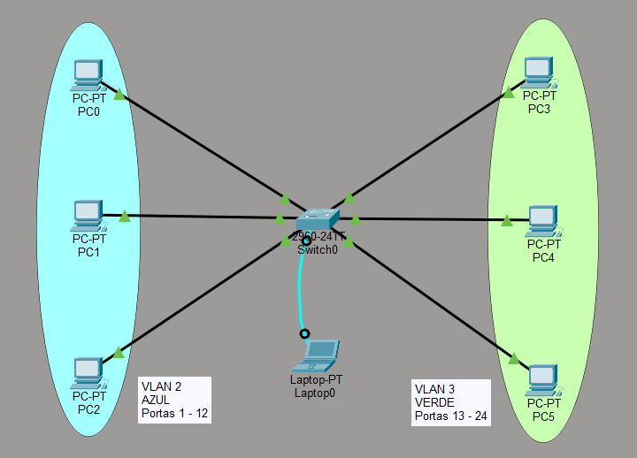
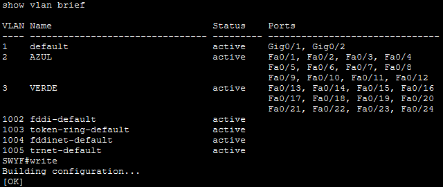

# Switch, VLAN e Configuração Inicial

> **Data:** 01 de abril de 2026

Comparação do antigo com atual, e configuração inicial de uma VLAN.

---

## HUB x Switch

São algumas das razões pelas quais usamos um switch ao invés de uma hub:

### HUB (antigo)
1. Envia dados para **todos os dispositivos**
2. Baixa segurança  
3. Pode ocorrer **colisão de dados**

**Problemas:**
- Todos recebem os dados (mesmo sem precisar)
- Colisões: dois envios ao mesmo tempo causam perda de dados

### Switch (atual)
1. Envia dados **diretamente ao destino**
2. Mais rápido e seguro  
3. Evita colisões  

**Buffer:**
- Funciona como uma **fila de espera**
- Organiza os dados antes de enviar

---

## 🌐 VLAN (Virtual LAN)

Divide um switch em várias redes virtuais, permitindo separar dispositivos por grupo.  

### Exemplo:
- VLAN 2 → Funcionários  
- VLAN 3 → Alunos  

### Vantagens:
- Mais segurança  
- Melhor organização  
- Menos tráfego desnecessário

---

## Configuração no Switch (CLI)

Para configurar um switch, deve-se se conectar apartir do cabo e entrada tipo Console.

### Modos do terminal

| Modo | Exemplo | Função |
|------|--------|-------|
| Usuário | `Switch>` | Acesso básico |
| Privilegiado | `Switch#` | Comandos avançados |
| Configuração | `Switch(config)#` | Alterar configurações |

---

## Comandos do Terminal

```
?
```
↳ Vê os comandos disponíveis.

```
enable
```
↳ **Modo Privilegiado**, usado para acessar acessar comandos avançados.

```
show vlan brief
```
↳ Vê quais portas estão em cada VLAN, só funciona no modo privilegiado.

```
configure terminal
```
↳ **Modo Configuração**, usado para configurar VLAN, portas, nome, etc.

```
hostname NOMEDOSWITCH
```
↳ Nomea o switch.

```
vlan NÚMERODAVLAN
```
↳ Cria uma VLAN.

```
name NOMEDAVLAN
```
↳ Dentro da vlan, ele nomea a VLAN. O nome aparece em `show vlan brief`

```
exit
```
↳ Sai do modo atual.

```
interface fa0/NÚMERODAPORTA
switchport access vlan NÚMERODAVLAN
exit
```
↳ Usado para definir a qual VLAN a porta pertence + o `exit`.

```
end
```
↳ Volta direto para o modo privilegiado.

```
write
```
↳ Salva as configurações feitas, se aparecer [OK] é porque ocorreu tudo certo. Só funciona no modo privilegiado.

---

## Topologia

Topologia feita no Cisco Packet Tracer:



As portas dentro da VLAN também:


