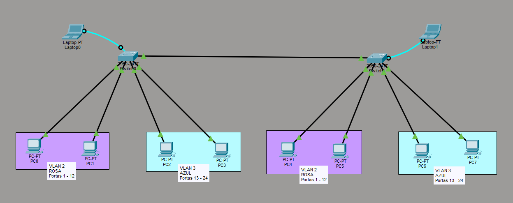

# Configurações VLAN

> **Data:** 02 de abril de 2026

Revendo redes virtuais e também atividades anteriores incluídas nesta.

---

## Password

Para segurança existe uma forma de colocar senha antes de entrar ao terminal, deve-se entrar no **modo de configuração** e digitar as seguintes linhas de comando:

```
line con 0
password SUASENHA
login
```

Também é possível colocar senha para entrar no modo privilegiado (estando no modo de configuração), são duas formas:

```
enable password SUASENHA
```

```
enable secret SUASENHA (mais recomendável)
```

O `enable secret` é mais recomendável por sua criptografia.

Exemplo: se algum intruso der um `show run`, ela não permitirá o usuário ver a senha.

---

## Comandos adicionais

```
reload
```
↳ Recarrega suas modificações até o último `write`.

```
erase star
```
↳ Volta às configurações inciais.

```
no ip domain lookup
```
↳ Para voltarmos à linha de comando podemos dar um CTRL + SHIFT + 6, porém com esse comando deixamos de sair.

```
interface range fast 0/NÚMERODAPORTA-NÚMERODAPORTA
switchport access vlan NÚMERODAVLAN
```
↳ O `range` é um intervalo, todas as portas dentro desse intervalo entrarão na vlan definida.

---

## 🔗 Cascateamento de Switch

Nesta etapa, foi realizado um cascatemanto de switch juntamente com redes virtuais.

**Topologia:**



Definimos cada porta em sua VLAN, e ao final também modificamos a porta entre os dois switches **(gigabitEthernet 0/1)**.

```
interface g0/1
switchport mode trunk
```
↳ O `mode trunk` funciona como um tráfego entre VLANs.

- Não é necessário colocar o mode trunk nos dois switches, apenas em um já basta.
- A porta g0/1 já não aparece em `show vlan brief`, busque ele em `show run`.
- Todos os dispositivos devem ter diferentes IPs.
