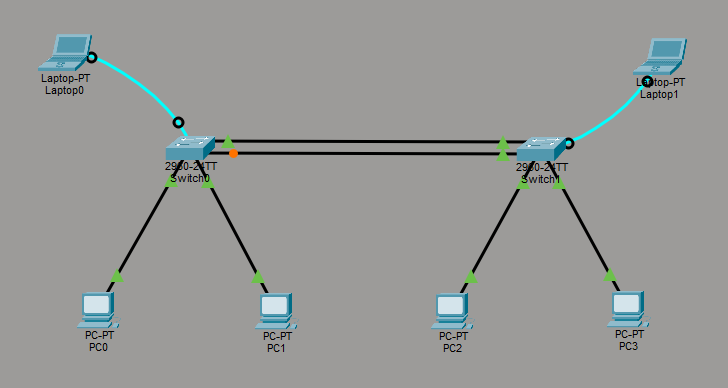
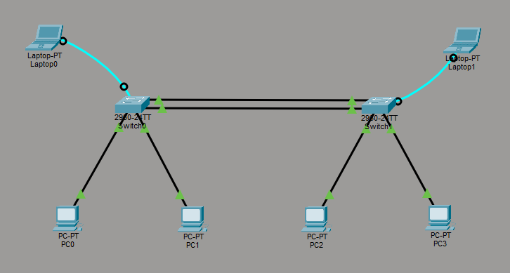

# Segurança entre Switches

> **Data:** 06 de abril de 2026

Um reforço na parte de segurança entre switches.

---

## No Password (aula passada)

No modo de configuração, para retirar as senhas:

```
line console 0
no password
no login
```

```
no enable password
```

```
no enable secret
```

---

## Prompt de Comando

Quando pingamos um IP ele nos dá 4 respostas, agora se dermos:

```
ping -t IPDOUSUÁRIO
```
↳ Temos respostas infinitamente.

Para forçar a parada dê CTRL + C.

---

## 🛡️ Reforço na Segurança de Switches

### STP (Spanning Tree Protocol)



É um protocolo de rede que permite criar **redundância** entre switches sem deixar a rede travar.

- Detecta dois ou mais cabos ligando os mesmos pontos, ele **bloqueia** os extras.
- Garante que, logicamente, só exista **um caminho ativo.**
- Evita o "loop de rede".
- Se o cabo principal falhar, o STP libera o reserva.

### LACP (Link Aggregation Control Protocol)



É um protocolo de controle de rede que permite agrupar várias conexões físicas entre switches para que elas funcionem como um único link.

Para realizar a configuração deve-se modificar os dois switches, um que dá o dados, o ativo:

```
int range gigabitEthernet 0/1-2
channel-group 1 mode active
```

E outro que recebe, o passivo:

```
int range gigabitEthernet 0/1-2
channel-group 1 mode passive
```

- Faz com que todos os cabos conectados trabalhem juntos ao mesmo tempo.
- Se um dos cabos falhar, a rede não cai, o tráfego continua passando pelo cabo que sobrou.
- O LACP faz o switch acreditar que aqueles 2 cabos são apenas um.
- Por isso, o STP não bloqueia nenhuma porta e deixa tudo fluir.
