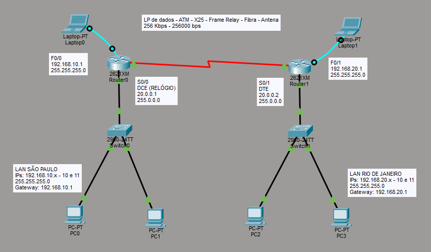

# Interligação de LANs com Roteadores

> **Data:** 08 de abril de 2026

Saímos da parte de configuação de LANs para começar WAN, apartir dos roteadores.

---

## Situação

Basicamente estamos simulando uma conexão entre empresas filiais de telecomunicação. 
Imaginando um cenário em que temos empresas em dois estados diferentes, de exemplo usaremos os estados de São Paulo e Rio de Janeiro.

---

## Estrutura

- 2 Switches
- 4 PCs: 2 computadores para cada switch

Para conexão colocamos os IPs em cada PC e usamos portas fastEthernet normalmente.

- 2 Roteadores: 1 para cada switch
- 2 Notebooks: 1 para cada roteador

Para conexão colocamos duas portas serial **WIC-1T** nos dois roteadores, também o cabo serial:

**DCE (ponta do cabo, que é do relógio):** que começa.  
**DTE (outra ponta do cabo):** que termina.

Nas portas seriais entre os dois roteadores (só é necessário um cabo).

Também acrescentamos os gateways nos PCs, as portas serial tem IPs, e para melhor organização conectamos os roteadores na última porta fastEthernet dos switches.

---

## Configuração do Terminal

Até agora fizemos apenas a conexão entre os componentes, agora iremos conseguir ligar essa estrutura.

```
hostname NOMEDOROTEADOR
```
↳ Aqui não muda, mesmo comando de nomear do switch, estando no modo e configuração.

```
int f0/NÚMERODAPORTA
ip add ENDEREÇOIP MÁSCARADESUB-REDE
no shutdown
description DESCRIÇÃODAINTERFACE
exit
```
↳ Todas essas configurações são da porta LAN do roteador:  
`ip add` - adiciona o endereço e o tamanho da rede da interface  
`no shutdown` - liga a interface  
`description` - adiciona uma descrição à interface (opcional, mas para deixá-lo mais organizado)

```
int serial0/NÚMERODAPORTA
ip add ENDEREÇOIP MÁSCARADESUB-REDE
no shutdown
description DESCRIÇÃODAINTERFACESERIAL
bandwidth VELOCIDADETEÓRICA
clock rate VELOCIDADEDETRANSMISSÃO (obrigatório apenas no roteador que atua como DCE)
exit
```
↳ Todas essas configurações são da porta WAN do roteador:  
`int serial` - para entrar na interface do serial  
`ip add` - adiciona o endereço e o tamanho da rede da interface serial  
`no shutdown` - liga a interface serial  
`description` - adiciona uma descrição à interface serial  
`bandwidth` - informa a largura da banda em Kbps  
`clock rate` - dita o ritmo da conexão em bits por segundo

```
router rip
netwrok INTERFACEDAREDESERIAL
network INTERFACEDAREDELOCAL
exit
```
↳ Todas essas configurações são do protocolo de roteamento:  
`router rip` - ativa o processo do protocolo RIP no roteador  
`network` - diz ao RIP para incluir a interface que pertence a essa rede no processo de roteamento

```
copy run star
```
↳ Serve para salvar permanentemente todas as configurações feitas no roteador

---

## Topologia

Feita no Cisco Packet Tracer:



Foram realizados os comandos do terminal nos dois roteadores, apenas com a diferença do clock rate.
