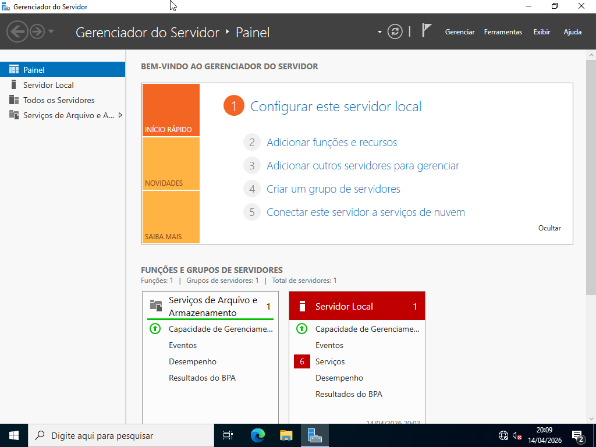
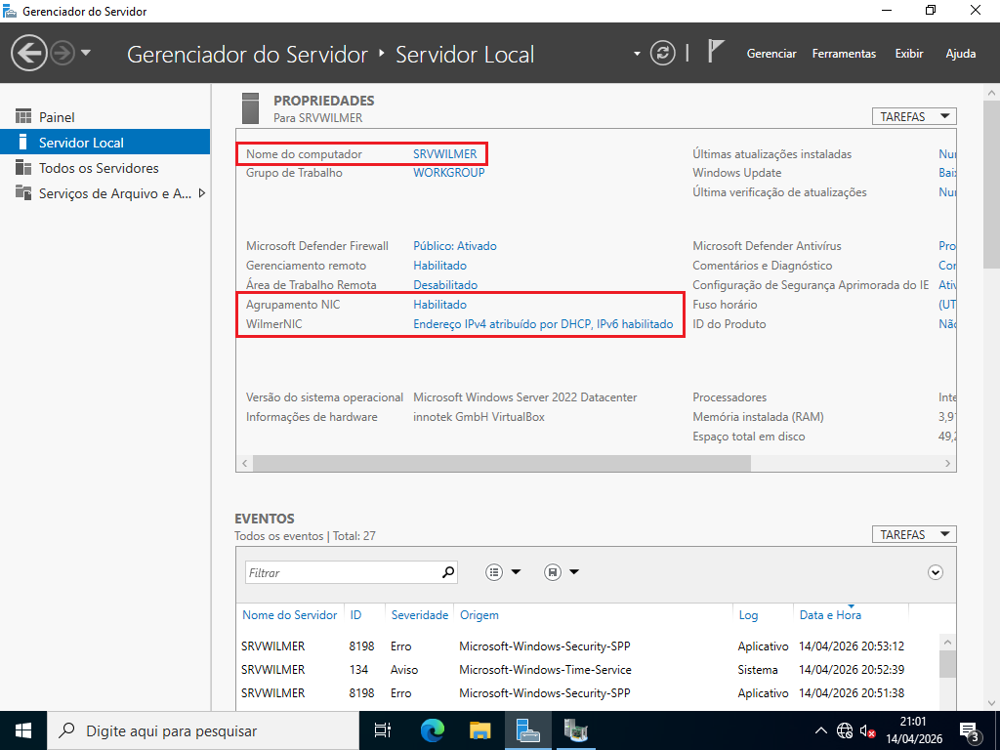
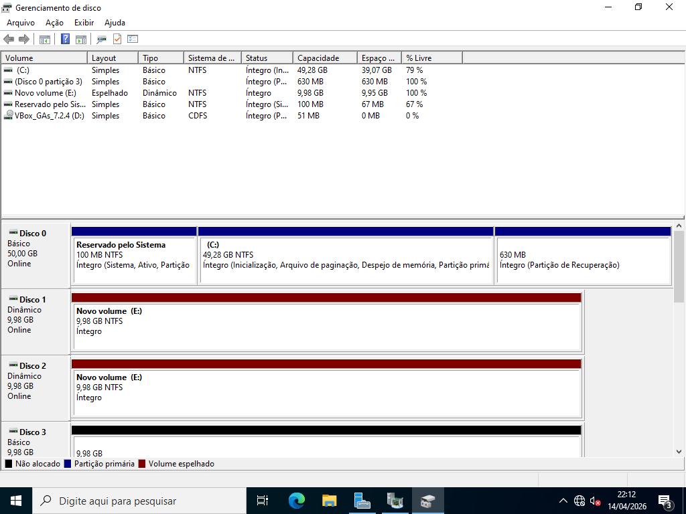
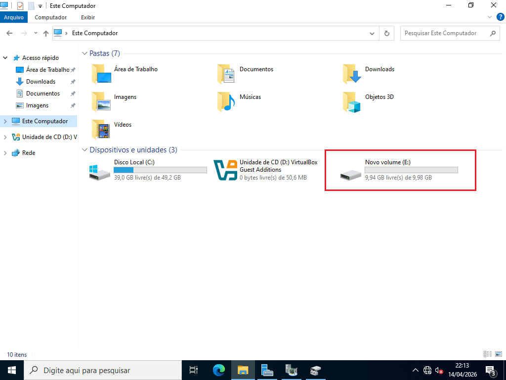
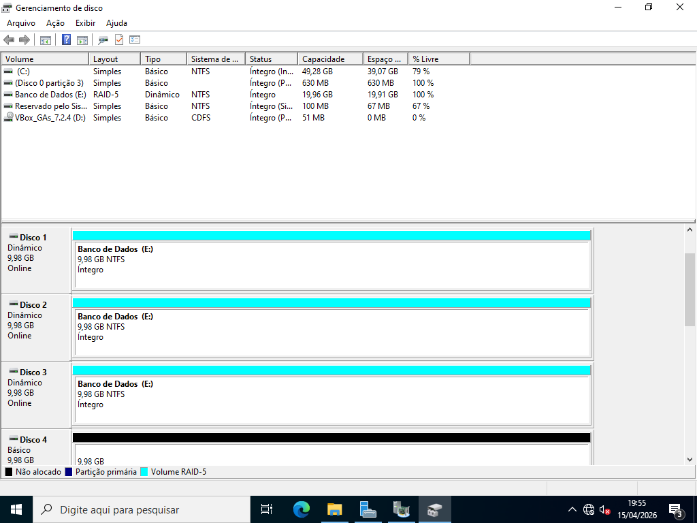

# Introdução ao Windows Server

> **Data:** 15 de abril de 2026

Começando com as configurações iniciais do windows server.

---

## VirtualBox

### Componentes

Com a máquina virtual estas são as configurações opcionais ou importantes para o windows:

- ISO Windows Server 2022
- 4 GB de memória RAM
- 4 núcleos para o processador
- **3 adaptadores do tipo Rede Interna**
- **9 discos com ~10 GB**

### Instalação

Já dentro do windows, na opção de instalação escolhemos **"Datacenter (Desktop Experience)"** por ter interface gráfica e ser mais fácil de usar.

| Característica | Server Core | Desktop Experience |
|----------------|----------------|------------------|
| Interface      | Sem GUI        | Com GUI          |
| Desempenho     | Alto           | Médio            |
| Uso            | Avançado       | Fácil            |
| Segurança      | Mais seguro    | Menos seguro     |

O nome aparecerá como **Administrador**, embaixo dele pode-se colocar a senha.

Após isso, para adentrar a máquina dê um CTRL + ALT + DEL.

### Drivers

Menu Superior do VirtualBox: 

1. Clique em Dispositivos
2. Selecione Inserir imagem de CD dos Adicionais para Convidado. 

Dentro do Windows Server:  

1. Explorador de Arquivos
2. Abra Este Computador
3. Entre na unidade de CD/DVD do VirtualBox
4. Execute o arquivo "VBoxWindowsAdditions.exe"
5. Dê Nexts e Install.

Ao final, reinicie a máquina virtual.

---

## Gerenciador do Servidor

Quando o PC liga, a primeira coisa que abre é o Gerenciador do Servidor.

### Painel

Além disso, outra coisa a perceber é estarmos sem internet por causa da Rede Interna.

### Servidor Local

Em servidor local realizamos a troca do nome do computador, algo que começasse com "SRV...".

A ativação do Agrupamento NIC

- Entramos em tarefas
- Demos nome
- Selecionamos as 3 placas de rede
- Modo Hash de Endereço

Identificamos a rede e juntamos três placas de rede em uma só.

---

## Espelhamento de Disco

Diferenças entre Raid 1 e Backup.

| Característica | RAID 1                    | Backup                        |
|----------------|---------------------------|-------------------------------|
| Funcionamento  | Tempo real (espelhamento) | Cópia em momentos específicos |
| Objetivo       | Falha de hardware         | Proteção de dados             |
| Local          | Mesmo sistema             | Local separado                |
| Recuperação    | Não recupera erros        | Recupera arquivos             |

**RAID 1** → protege contra falha de disco  
**Backup** → protege contra qualquer perda de dados  

Para o espelhamento é necessário no mínimo 2 discos estando no tipo Dinâmico (pode-se colocar ao início ou final), em Gerenciamento de Disco:

- Botão direito no disco
- Novo volume espelhado
- Adicione o outro disco
- Avançar e conclua.

Em "Este computador" se vê os dois discos espelhados estão como se fossem apenas um.

Em caso de falha de disco, é necessário remover o espelhamento do disco que está como “Faltando” e, em seguida, adicionar um novo disco para recriar o espelhamento.

**Dica:** mesmo se tiver uma partição criada do tipo Básico, ainda sim pode-se alterá-lo, clicando nele em "Adicionar Espelho".

---

## RAID 5

RAID 5 usa paridade, uma forma de proteger os dados sem precisar duplicar tudo.

- Requer no mínimo **3 discos**  
- Perde o equivalente a **1 disco de espaço**

**Regra de Paridade:**

| Disco A   | Disco B   | Paridade  |
|-----------|-----------|-----------|
|     0     |     0     |     0     |
|     1     |     1     |     0     |
|     1     |     0     |     1     |
|     0     |     1     |     1     |

É um “cálculo” baseado nos dados, serve para reconstruir informações se 1 disco falhar.

Quanto mais discos:
- Maior desempenho  
- Maior risco geral de falha
 
Botão direito no disco → "Novo Volume RAID-5"

