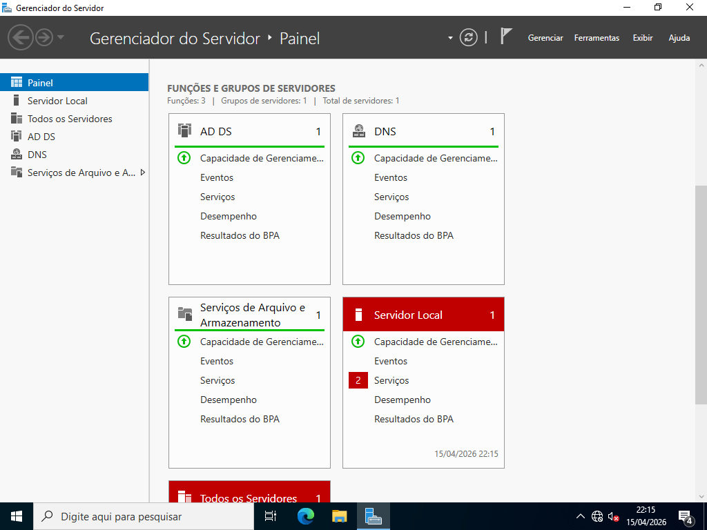

# Instalação do Serviço de Dominio AD

> **Data:** 15 de abril de 2026

Conceitos e instalação de AD DS.

---

## Controlador de Domínio (DC)

💻 Sem domínio (Workgroup / Grupo de Trabalho)

- Computadores independentes
- Usuários locais (criar em cada máquina)
- Sem gerenciamento central

🌐 Com domínio (usando DC - Domain Controller)

- Gerenciamento centralizado
- Usuário criado uma única vez
- Login em qualquer máquina do domínio

Função:
- Autenticar usuários
- Controlar acessos e permissões

---

## Conceitos Básicos

### Domínio
Onde ficam os recursos da rede:
- usuários
- computadores
- permissões

Exemplo: `senac.tec`

### Árvore
Conjunto de domínios ligados pelo mesmo nome base.  
Exemplo: `sp.senac.tec`  `rj.senac.tec`

### Floresta
Conjunto de todos os domínios (nível mais alto).  
Exemplo: `senac.tec` `sp.senac.tec` `rj.senac.tec` `mg.senac.tec`

### Filial (Site)
Representa a localização física da rede, exemplo: RJ e SP.  
**OBS:** define qual servidor será usado no login

### Login
- Funciona entre domínios da mesma floresta
- Utiliza o servidor mais próximo

---

## Serviço de Dominio: Active Directory

### 1. Instalar o serviço
Gerenciar → Adicionar funções e recursos → Serviços de Domínio Active Directory → Instalar  
↳ Apenas instala o AD (ainda não é um domínio)

### 2. Promover o servidor a DC
Bandeira → Promover este servidor a um controlador de domínio  
↳ Inicia a criação do domínio  
↳ Ele também aparece assim que se instala o AD

### 3. Criar nova floresta
Adicionar a uma nova floresta, definá o nome do domínio raiz (ex: `ramos.tec`)  
↳ Primeiro domínio = cria a floresta

### 4. Definir senha
Senha do modo de restauração (DSRM)  
↳ Usada para recuperação do servidor

### 5. NetBIOS
Nome gerado automaticamente  
↳ Versão curta do domínio

### 6. Revisão e instalação
Examinar opções > Verificar pré-requisitos > Instalar  
↳ Servidor será reiniciado

**Resultado:** Servidor se torna um **Controlador de Domínio (DC)**  

