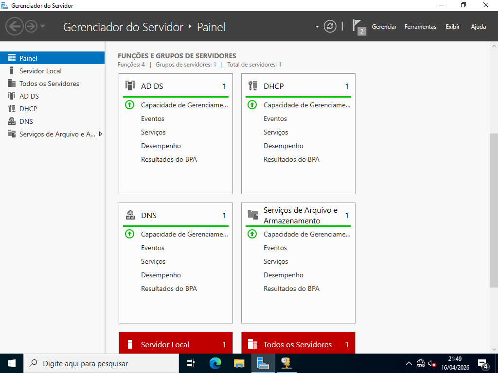
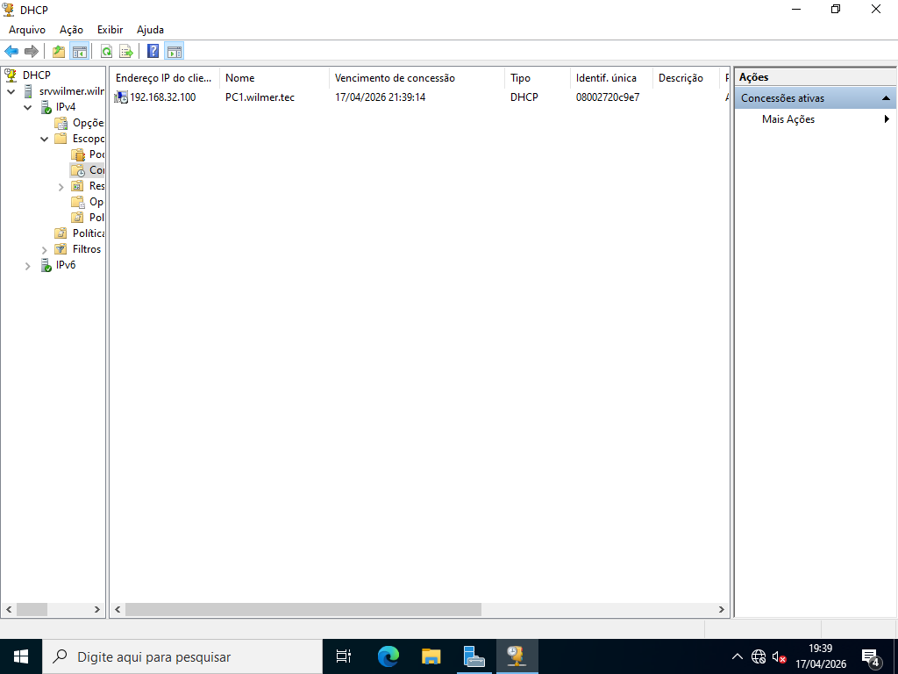

# Servidor DHCP

> **Data:** 16 de abril de 2026

Instalação e configurações do servidor DHCP.

---

## DORA

O DHCP usa o processo DORA para entregar IP automaticamente:

- **Discover (Descobrir)**  
  O cliente envia um pedido na rede procurando um servidor DHCP  

- **Offer (Oferta)**  
  O servidor responde oferecendo um IP disponível  

- **Request (Requisição)**  
  O cliente aceita a oferta e solicita aquele IP  

- **Acknowledge (Confirmação)**  
  O servidor confirma e libera o uso do IP

Processo automático de configuração de rede.

---

## Instalação

Para a instalação de servidores no Windows Server é o mesmo processo:

Caminho:  
Em Painel → Gerenciar → Adicionar Funções e Recursos → Servidor DHCP (da aula) → Configuração de DHCP concluída → Instala

---

## Configuração

Para a configuração de servidores no Windows Server vá em "Ferramentas", logo selecione o servidor a ser configurado.

Caminho:  
Em Painel → Ferramentas → DHCP (da aula)

### Ativação do Escopo DHCP

Dentro das configurações do servidor DHCP:

IPv4 → Dê um botão direito → Novo Escopo

**Processo:**

1. Coloque nome e descrição - algo relcionado ao DHCP
2. IP inicial e final - primeiro e último que podem ser distribuídos
3. Podemos adicionar exclusões e atrasos de sub-redes em milissegundos
4. Duração de concessão - tempo que a máquina poderá ficar com o DHCP
5. Confirmação das opções do escopo
6. Adicione o Gateway - do servidor DHCP
7. Aparecerá o domínio pai e o DNS
8. Conclua ativando o escopo

Pasta "Escopo" → Concessões ativas  
↳ aqui aparecem os usuários que estão no servidor.

No PC dos usuários, comandos na Rede Interna:  
`ipconfig /all` = ver se a rede interna funcionou  
`nslookup` = ver se o DNS do servidor funcionou
