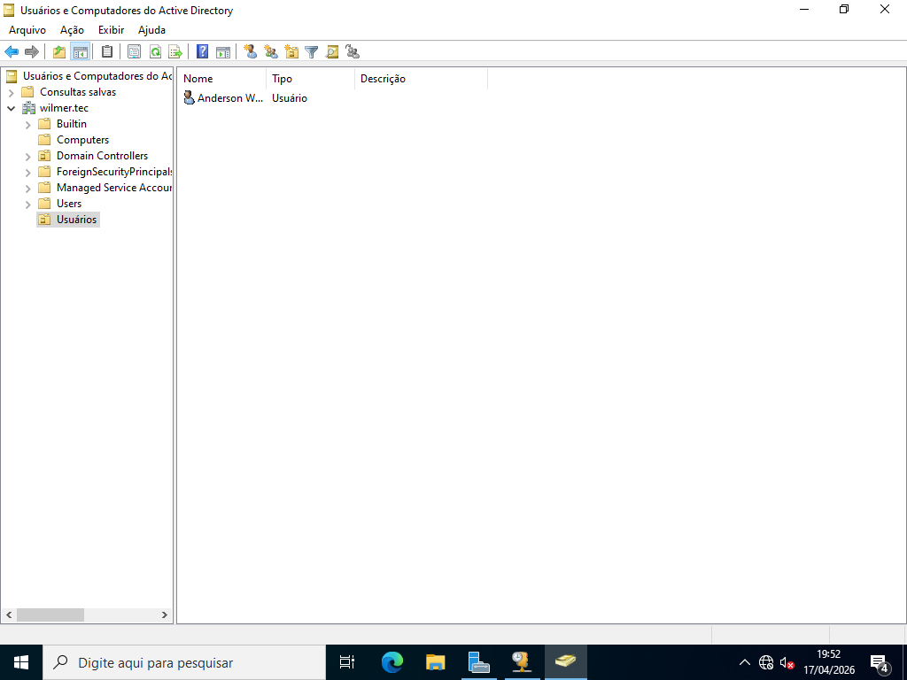
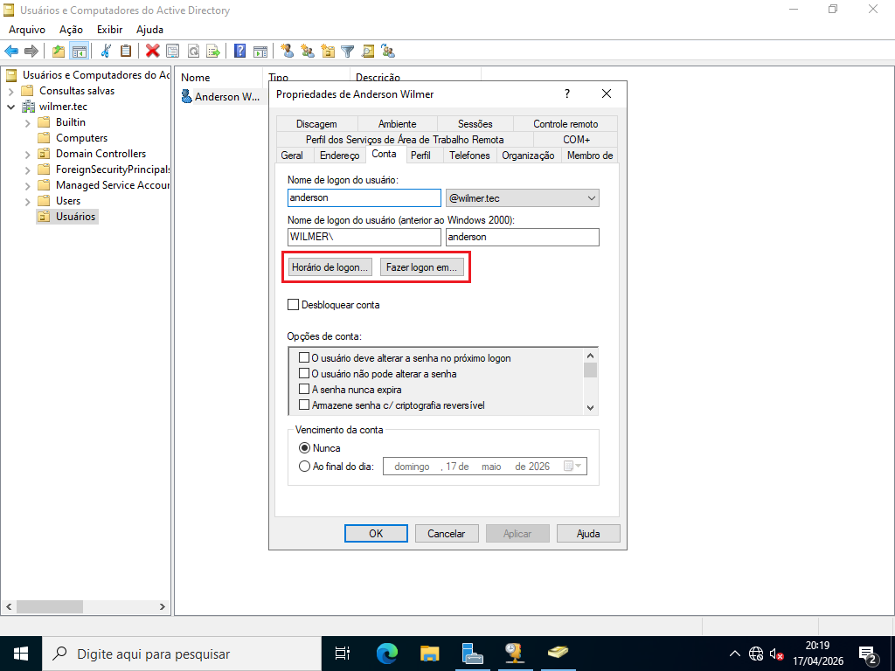

# Active Directory: Usuários, OUs e Políticas de Logon

> **Data:** 16 e 17 de abril de 2026

Gerenciamento de Unidade Organizacional e controle de acesso.

---

## Entrar no Domínio

Configuração da aula, o usuário deve estar na Rede Interna.

Também mudar o Grupo de Trabalho para Domínio:  
Configurações → Sistema → Sobre → Configurações avançadas do sistema → Nome do computador → Alterar

Marque a opção "Domínio"

1. Selecione o domínio (ex: wilmer.tec)
2. Nome do usuário de acesso (administrador)
3. Senha do usuário de acesso
4. Se funcionar deve aparecer a mensagem de boas-vindas

---

## Unidade Organizacional

Serviço importante para organização e aplicação de regras dentro do domínio.

### Criação

Caminho:  
Ferramentas → Usuarios e computadores do active directory → Seu domínio (ex: wilmer.tec) → Botão direito → Novo → Unidade Organizacional

Ao final dê um nome a UO.

### Usuário

Caminho:  
Unidade Organizacional → Botão direito → Novo → Usuário

Preencha com os dados, senha e conclua a criação.

---

## Controle

Em seguida, duas formas de controle da conta:

- Horário de logon
- Onde fazer o logon

Em Propriedades do Usuário, vá em Conta:

### Horário de logon...

Em caso de restrição de horário de logon.

### Fazer logon em...

Em caso de estação não autorizada para logon.

