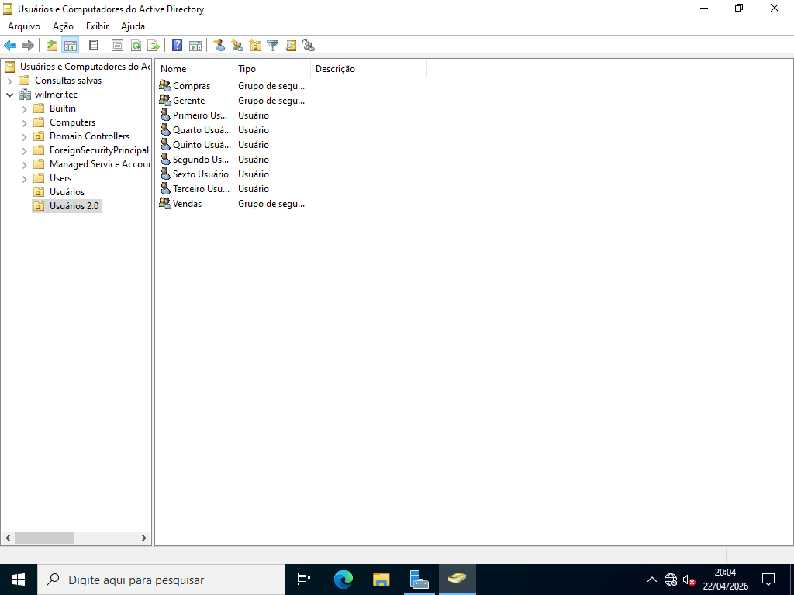
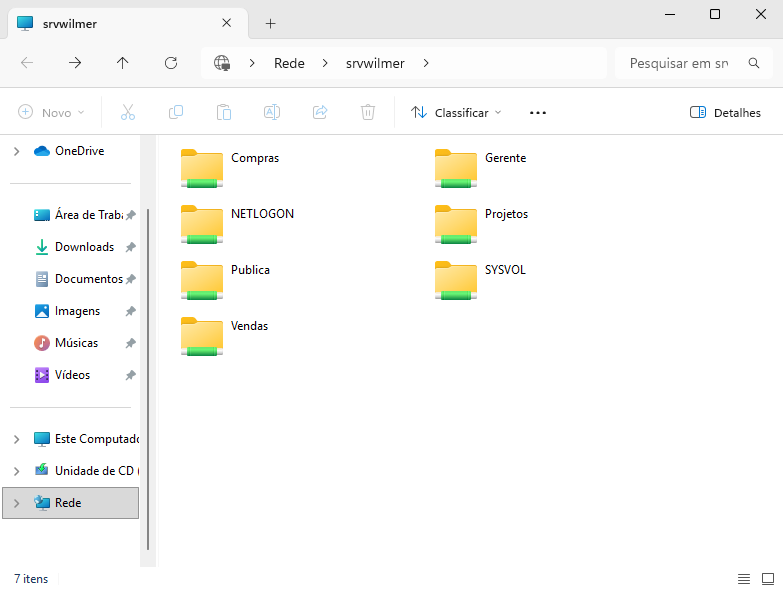
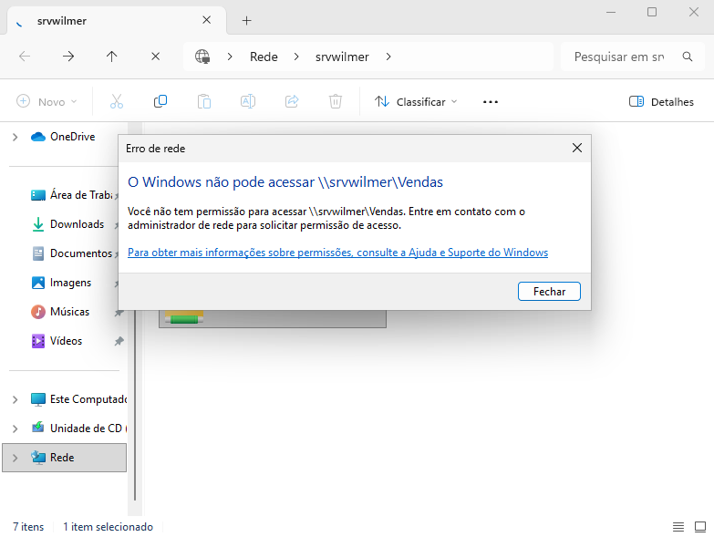
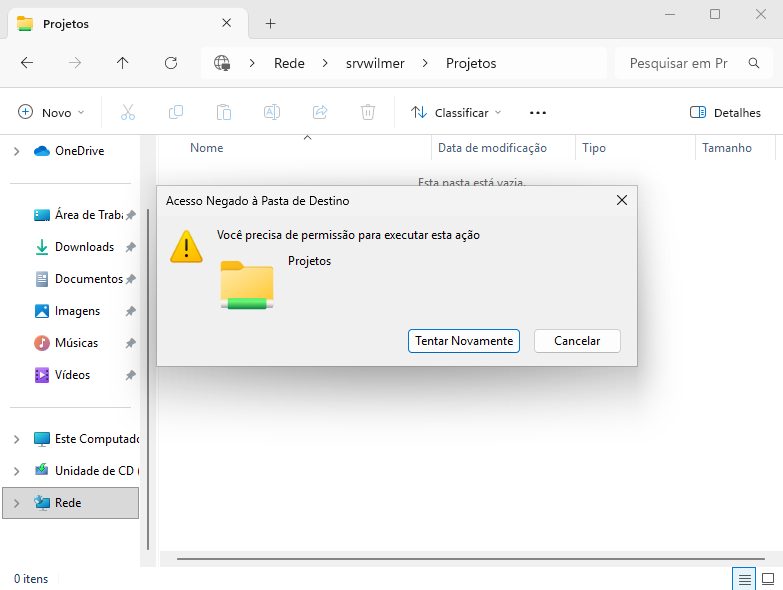

# Servidor de Arquivos e Permissões no Active Directory

> **Data:** 22 de abril de 2026

Pastas e grupos criados apartir do Windows Server e testes na máquina do usuário.

---

## Estrutura

Para está atividade:  
- 1 Unidade Organizacional
- 6 usuários
- 3 grupos - 2 usuários em cada grupo

### Grupo OU

Na área de configurações do grupo, temos "escopo" e "tipo":

**Escopo:** é o alcance do grupo

**Tipo:** é oque o grupo faz  
- Segurança (usado para permissões)
- Distribuição (não aparece para permissões)

---

## Pastas no Windows Server

Para a aula, escolhemos o disco onde íamos criar as pastas

Pastas:
- 1 pública
- 3 pastas referentes ao grupos criados
- 1 projeto (modificação de permissão)

OBS: o nome das pastas não deve ter nenhum tipo de acentuação.

### Pública

Está pasta é que todos podem entrar.

Caminho:  
Botão direito → Propriedades → Compartilhamento → Compartilhar → Todos → Leitura/Gravação

### Pastas dos Grupos

Aqui é o **diferencial de compartilhamento** de pastas do mesmo domínio.

Caminho:  
Botão direito → Propriedades → Compartilhamento → Compartilhamento Avançado → Habilitar compartilhamento

Definá o nome e comentário (o nome pode ser o mesmo).

**Permissões:**
1. Remover "Todos"
2. Adicionar "Usuários do Domínio"
3. Permitir "Leitura" e "Alteração"
4. Ok

Isso permite que todos os usuários vejam e alterem a pasta até aqui.

**Segurança:**
1. Vá em "Avançadas"
2. Desabilitar herança
3. logo, em Converter permissões herdadas...
4. Ok
5. entre em "Editar"
6. Remova "Usuários do Domínio"
7. Adicione o grupo específico
8. Permitir "Modificar" (inclui "Gravar" automaticamente)
9. Ok

Se não desabilitássemos a herança não conseguiriamos editar o grupo.

### Restrita

A pasta **Projetos** é uma pasta onde apenas grupos específicos tem acesso de modificação.

- Realizar o passo a passo
- Selecione um grupo específico
- Não marque "Modificar"
- Deixa apenas em "Leitura"

Esse será o grupo que não conseguirá editar a pasta.

---

## Usuário

Neste cenário pegamos um usuário do grupo **Compras**. Para encontrar as pastas criadas, na barra de pesquisa do windows busque pelo nome do servidor.

Exemplo: \\\srvwilmer

Se encontrar aparecerá assim:

### Pasta de Acesso

Se o usuário entrar na pasta referente ao grupo dele, ocorrerá tudo normal.

Agora se ele tentar entrar em um grupo que não é dele:

### Pasta de Permissões

Se o usuário editar a pasta referente ao grupo dele, ocorrerá tudo normal.

Agora se ele tentar editar uma pasta que não tem permissão:

