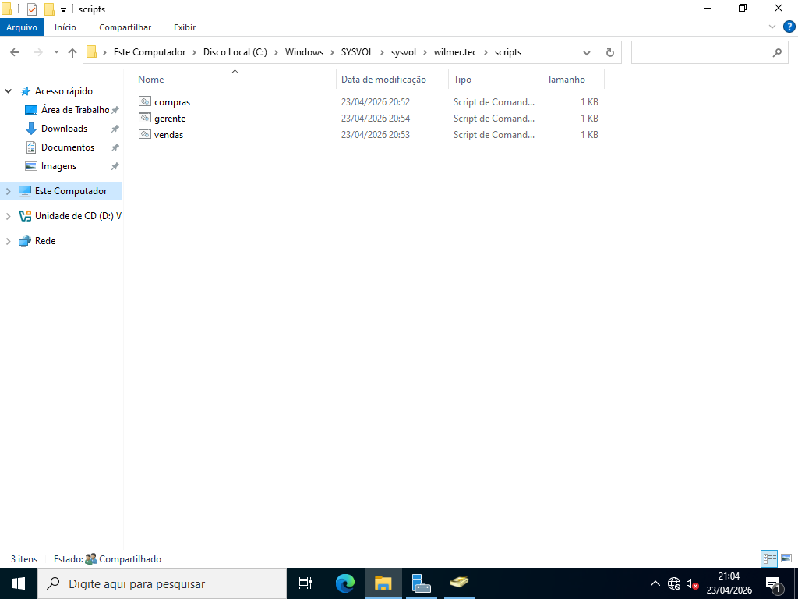
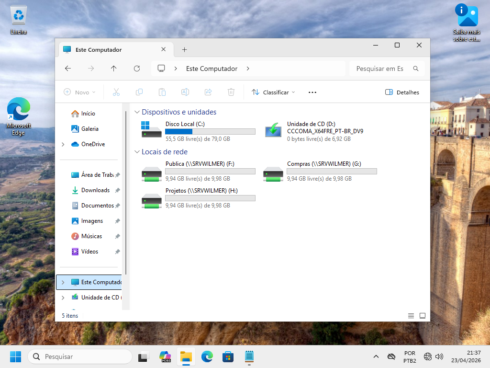
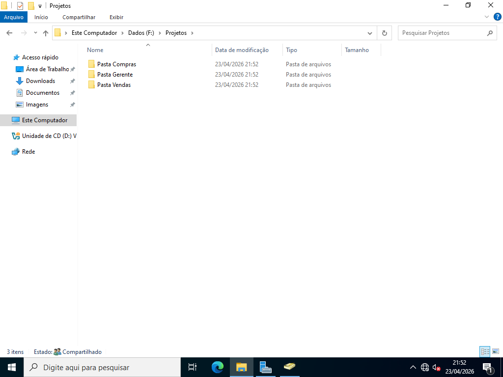
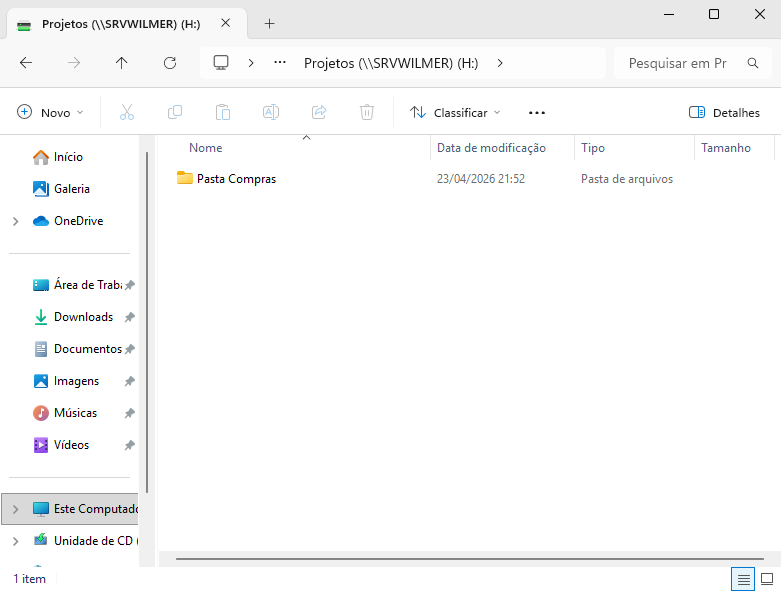

# Continuação do Servidor de Arquivos

> **Data:** 23 de abril de 2026

Configuramos automatização com scripts, além de enumeração de pastas (acessos).

---

## Scripts

Até aqui a função dele é criar unidades de rede e abrir programas automaticamente.

### Criação

Em um Bloco de Notas

Comandos:
```
net use F: \\SERVIDOR\PASTA
start PROGRAMA
```

Exemplo usado:  
net use F: \\\SRVWILMER\Publica - Aqui abrirá uma unidade de rede da pasta "Publica"  
net use G: \\\SRVWILMER\Compras - Aqui abrirá uma unidade de rede da pasta "Compras"  
net use H: \\\SRVWILMER\Projetos - Aqui abrirá uma unidade de rede da pasta "Projetos"  
start %windir%\system32\notepad.exe - Aqui abrirá o programa do Bloco de Notas

Salvar como:  
**Tipo:** Todos os arquivos  
**Extenção:** .cmd ou .bat

Local:  
Este computador → Disco Local (C:) → Windows → SYSVOL → sysvol → domínio (wilmer.tec) → scripts



### Usuário AD

Caminho:  
Selecionar os usuários → Botão direito → Propriedades → Perfil → Habilitar script e nome do arquivo script

Exemplo: compras.cmd


Neste exemplo eu colocaria no perfil dos usuários que estão no grupo "Compras".

### Estação do Usuário



- As 3 unidades de redes aparecem
- O Bloco de Notas também abriu (está minimizado)

---

## Habilitação de Pastas Enumeradas

Passo a passo:
1. Entre no Gerenciador de Servidor
2. Vá em "Serviços de Arquivo e Armazenamento"
3. Compartilhamentos
4. Botão direito nas pastas (que quer habilitar)
5. logo "Propriedades"
6. depois "Configurações"
7. Habilitar enumeração...
8. Ok

Com isso, agora o usuário só poderá ver as pastas que tem acesso.

### Pastas

A pasta "Projetos" é acessível para todos os grupos, então usaremos ela de exemplo. Dentro dela devemos criar cada pasta que será acessível para cada grupo:



Em cada pasta:
1. Dê um botão direito
2. Propriedades
3. entre em "Segurança"
4. Avançadas
5. depois "Desabilitar herança"
6. Converter as permissões herdadas...
7. Ok
8. entre em "Editar"
9. Remova os grupos que não poderão ver a pasta
10. Ok

O usuário de exemplo usado fazia parte do grupo "Compras":



- Pastas não autorizadas ficam ocultas.
