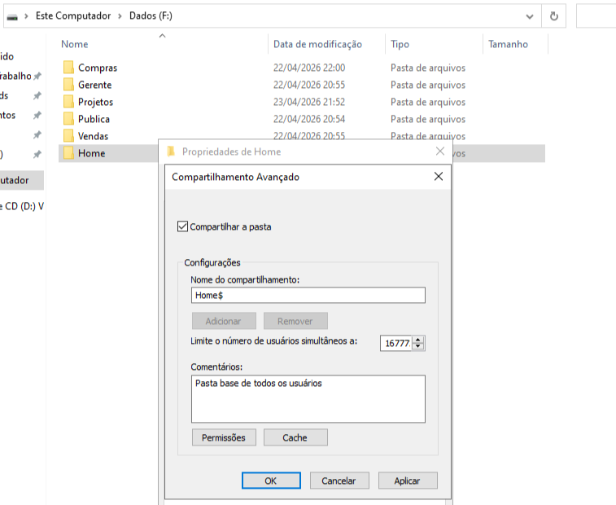
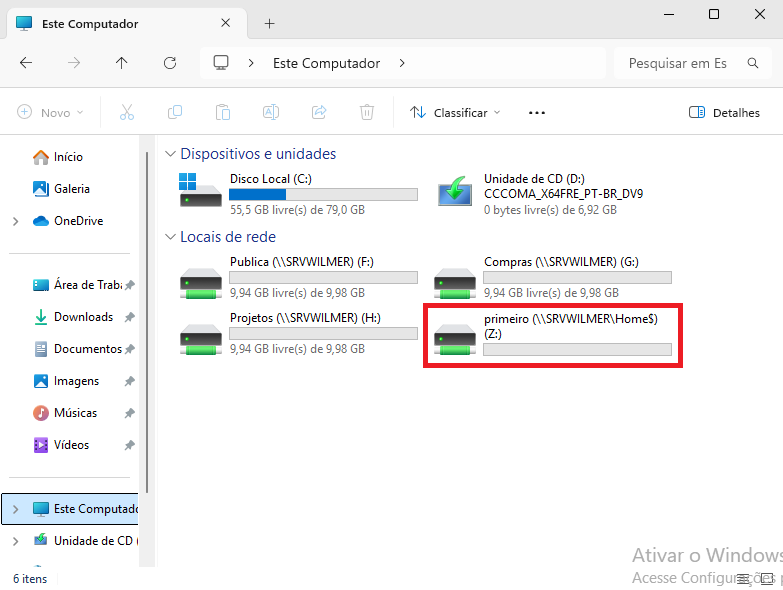
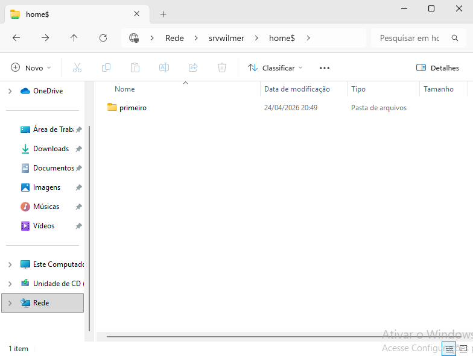

# Servidor de Arquivos: Pasta Base

> **Data:** 24 de abril de 2026

Pasta base dos usuários e segurança

---

## Criação

Criar uma pasta com nome "Home", porém na dentro do compartilhamento aumente com um **$**.

Exemplo: Home$

- Não esquecer de por permissões para os usuários do domínio

### Usuários AD

Selecionar todos os usuários → Propriedades → Perfil

1. Habilitar "Pasta base"  
2. Marcar "Conectar"  
3. Letra: Z (recomendado)  
4. Caminho: \\\SERVIDOR\Home$\%USERNAME% (ex:\\\SRVWILMER\Home$\%username%)

Resultado:
- Criou um caminho da pasta base em cada perfil dos usuários
  - ex: \\\SRVWILMER\Home$\primeiro
- Dentro da pasta "Home" foram criadas pastas automaticamente dos usuários

### Segurança

Vá novamente a pasta "Home".

Caminho:  
1. Propriedades → Segurança → Avançadas → Desabilitar herança → Converter as permissões herdadas → Ok → Editar → Remover os Usuários do domínio → Ok

Em "Avançadas" novamente:  

2. Avançadas → Adicionar → Selecionar uma entidade de segurança → Usuários → Está pasta somente → habilitar "Modificar" → Ok

↳ Cada usuário acessa apenas sua própria pasta.

No Gerencidor do Servidor:

3. Serviços de Arquivo e Armazenamento → Habilite a enumeração da pasta Home

↳ Oculta pastas que o usuário não tem acesso.

---

## Estação do Usuário

A pasta na unidade de rede do usuário criada:

### Acesso da pasta aceito

Se buscarmos o caminho da pasta referente ao usuário:

### Acesso da pasta negado

Se buscarmos o caminho da pasta de outro usuário:

