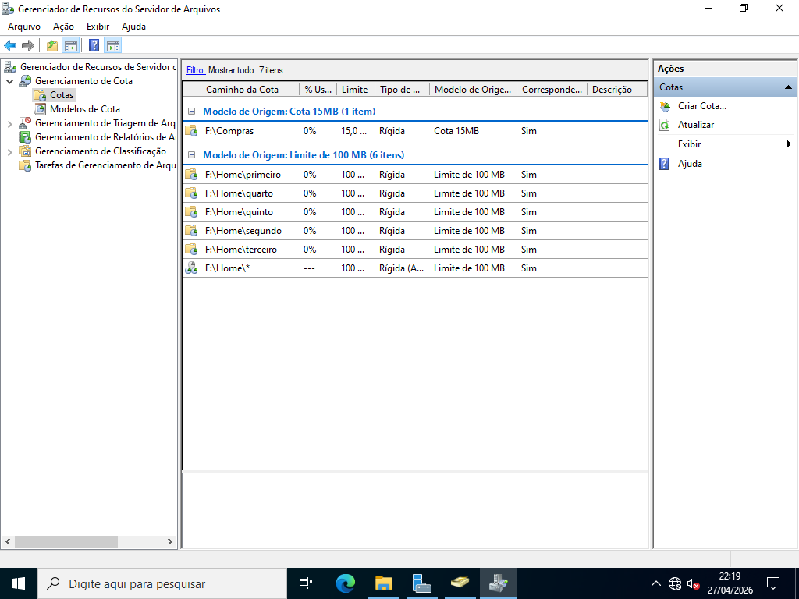
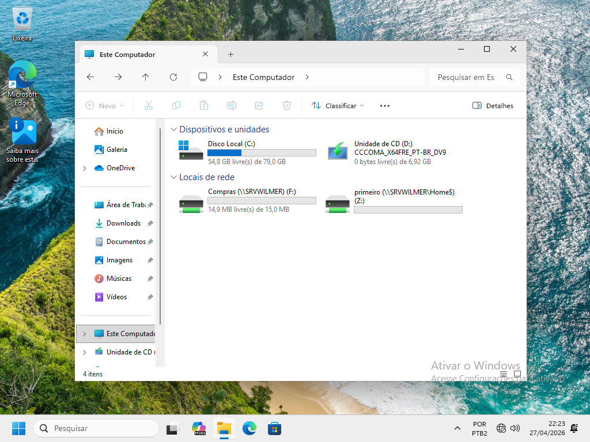

# Servidor de Arquivos: Cotas e Triagem

> **Data:** 27 e 28 de abril de 2026

Gerenciamento de Cotas e Triagem.

---

## Instalação do Recurso

Para instalação:  
Gerenciar → Serviços de Arquivo e Armazenamento → Gerenciador de Recursos de Servidor de Arquivos (FSRM)

Para o gerenciador:  
Ferramentas → Gerenciador de Recursos de Servidor de Arquivos

---

## Gerenciamento de Cotas

Controle de espaço por pasta/usuário e evita uso excessivo de armazenamento.

### Criação de Modelo

Caminho:  
Gerenciamento de Cotas → Modelos de Cota → Criar modelo

Configuração:
1. Nome (ex: Cota 15MB)
2. Descrição (opcional)
3. Limite (ex: 15 MB)
4. Tipo:
    - Cota fixa (bloqueia ao atingir limite)
    - Cota flexível (apenas alerta)

### Criação de Cota

Caminho:  
Gerenciamento de Cotas → Cotas → Criar cota

Existem 2 formas para a criação de cota.

Primeira:  
1. Caminho da cota (ex: F:\Compras)
2. **Criar cota no caminho**
3. Derivar propriedades deste modelo de cota (ex: Cota 15MB)
4. Criar

↳ Aplica limite apenas nessa pasta

Segunda:  
1. Caminho da cota (ex: F:\Home)
2. **Aplica modelo e criar cotas em subpastas novas e existentes automaticamente**
3. Derivar propriedades deste modelo de cota (ex: Limite 100 MB)
4. Criar

↳ Cada subpasta recebe sua própria cota automaticamente

### Resultado

---

## Estação do Usuário - Cotas

Neste exemplo usamos um usuário do grupo "Compras" que também tem a sua pasta base.

