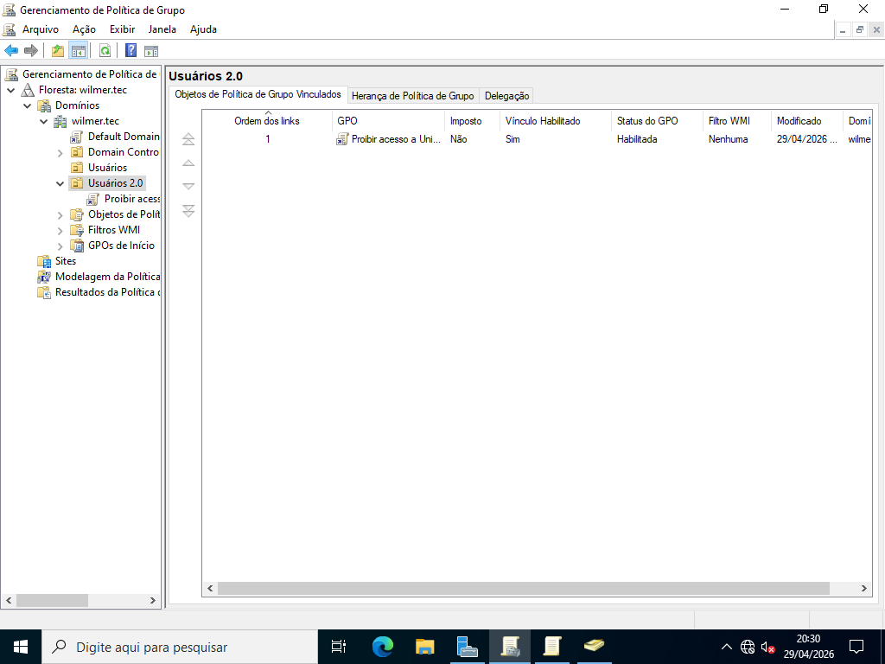
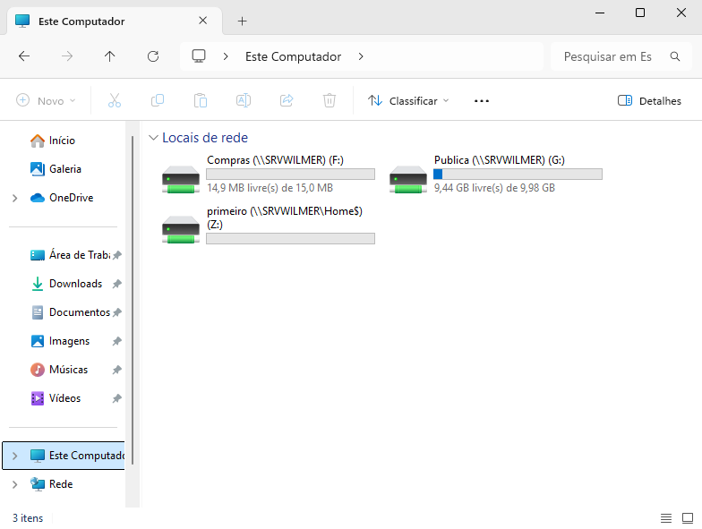

# Group Policy Object

> **Data:** 29 de abril de 2026

Atuação de uma GPO.

---

## GPO

Usada para gerenciar e controlar o que os usuários podem ou não fazer nos computadores em um domínio.

Caminho:  
Ferramentas → Gerenciamento de Política de Grupo → Floresta

Em Floresta, selecione a OU que quer aplicar as GPOs.

---

## "Proibir Acesso a Unidade de Disco Local"

Caminho:  
OU (que está usando) → Botão direito → "Crie um GPO neste domínio e vincule-o aqui..." → Nome (que tenha sentido com a GPO)

Botão direito (na GPO) → Editar

**OBS:** como o computador não está na OU usaremos a apenas "Configuração do Usuário".

Vamos:
- Ocultar o Disco Local
- Proibir a entrada no Disco Local

### Ocultar o Disco Local

Caminho:  
Configuração do Usuário → Política > Modelos Administrativos → Componentes do Windows → Explorador de Arquivos → Oculta estas unidades especificas em Meu Computador

Passo a passo:  
1. Botão direito
2. vá em "Editar"
3. marque "Habilitado"
4. Restringir apenas unidades A, B, C e D
5. Ok

### Proibir a entrada no Disco Local

Caminho:  
Configuração do Usuário → Política → Modelos Administrativos → Componentes do Windows → Explorador de Arquivos → Impedir o acesso a unidades do Meu Computador

Passo a passo:
1. Botão direito
2. vá em "Editar"
3. marque "Habilitado"
4. Restringir apenas unidades A, B, C e D
5. Ok

### Resultado

**OBS:** Em cada OU o que aparecem são os links e não as GPOs em si, as GPOs realmente estão em "Objetos de Política de Grupo".

---

## Estação do Usuário

### Prompt de Comando

`gpupdate /force` → Ele força o computador a se conectar ao servidor e baixar as GPOs mais recentes imediatamente.

`gpresult /r` → Ele mostra um resumo de quais GPOs foram aplicadas ao computador e ao usuário naquele momento.

### Usuário

Neste exemplo o usuário estava com a GPO aplicada.

