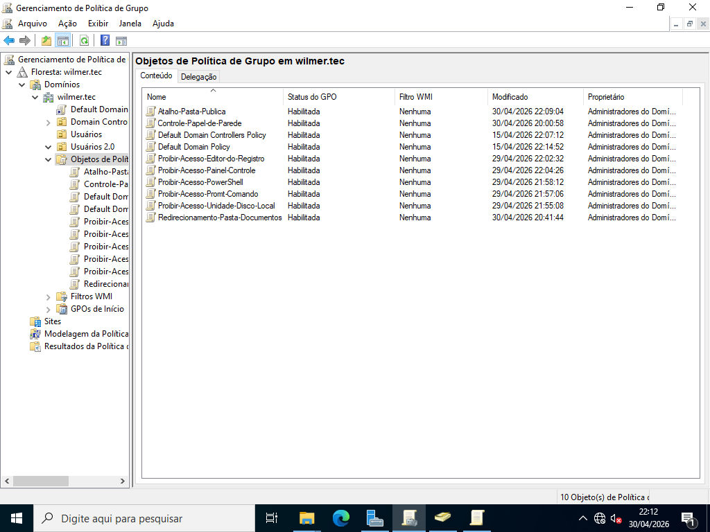

# Exemplos de GPOs

> **Data:** 29 e 30 de abril de 2026

São algumas GPOs e GPP que o professor mostrou durante as aulas.

---

## Política - Exemplos

### Promt de Comando

Caminho:  
Configuração do Usuário → Política → Modelos Administrativos → Sistema → Impedir acesso ao prompt de comando

Passo a passo:
1. Botão direito
2. Editar
3. marque "Habilitado"
4. Ok

### PowerShell

Caminho:  
Configuração do Usuário → Política → Modelos Administrativos → Sistema → Todas as configurações → Não executar aplicativos do Windows especificados

Passo a passo:
1. Botão direito
2. Editar
3. marque "Habilitado"
4. mostrar:
    - powershell.exe
    - pwsh.exe
    - powershell_ise.exe
5. Ok

### Editor do Registro

Caminho:  
Configuração do Usuário → Política → Modelos Administrativos → Sistema → Impedir acesso a ferramentas de edição de Registro

Passo a passo:
1. Botão direito
2. Editar
3. marque "Habilitado"
4. Ok

### Painel de Controle - Proibir acesso

Caminho:  
Configuração do Usuário → Política → Modelos Administrativos → Painel de Controle → Proibir acesso ao Painel de Controle e às configurações do PC

Passo a passo:
1. Botão direito
2. Editar
3. marque "Habilitado"
4. Ok

### Painel de Controle - Mostrar itens

Caminho:  
Configuração do Usuário → Política → Modelos Administrativos → Painel de Controle → Mostrar apenas itens do Painel de Controle especificados

Passo a passo:
1. Botão direito
2. Editar
3. marque "Habilitado"
4. mostrar:
    - (itens do painel de controle)
5. Ok

### Papel de parede

- Criar uma pasta (ex: Papel)
- Nome em Compartilhamento (ex: Papel$)
- em Segurança deixar os usuários do domínio com Leitura

Caminho:  
Configuração do Usuário → Política → Modelos administrativos → Área de trabalho → Active Desktop → Papel de parede da área de trabalho

Passo a passo:
1. Botão direito
2. Editar
3. marque "Habilitado"
4. caminho do arquivo (ex: \\SRVWILMER\Pasta$\papel-de-parede)
5. Estilo (ex: Ajustar)
6. Ok

Comando em estação do usuário:  
`slmgr -rearm` → No modo administrador, uso para destravar licença/personalização.

### Documentos

- Criar uma pasta (ex: Documentos)
- em Compartilhamento, usuários do domínio devem ter Controle Total

Caminho:  
Configuração do Usuário → Política → Configurações do Windows → Redirecionamento de pasta → Documentos

Passo a passo:
1. Botão direito
2. Propriedades
3. Configuração (ex: Básico, usado na aula)
4. Caminho raiz (ex: \\SRVWILMER\Documentos)
5. Ok

---

## Preferências - Exemplo

### Atalho

Caminho:  
Configuração do Usuário → Preferencias → Configurações do Windows → Atalho

Passo a passo:
1. Botão direito
2. vá em "Novo", logo "Atalho"
3. Ação (ex: Atualizar)
4. Nome (ex: Publica)
5. Tipo (ex: Objeto de Sistemas de Arquivos)
6. Local (ex: Área de Trabalho)
7. Caminho (ex: G:)
8. Executar (ex: Janela Normal)
9. Ok

---

## Objetos de Política de Grupo

Nessa aba estão todas as nossas políticas e preferência criadas.

