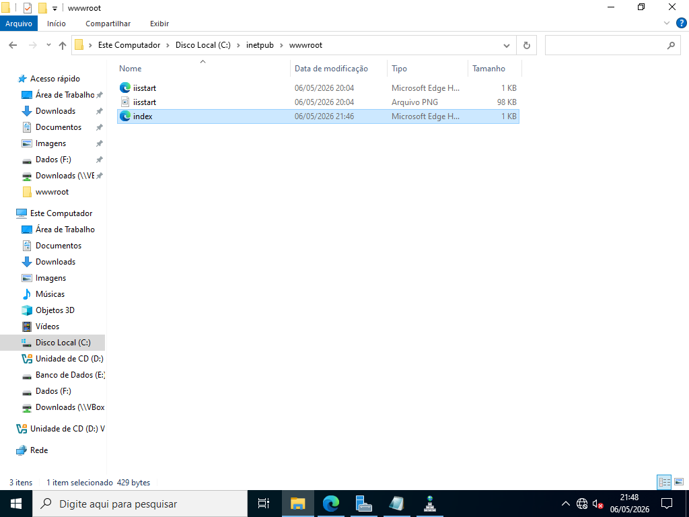
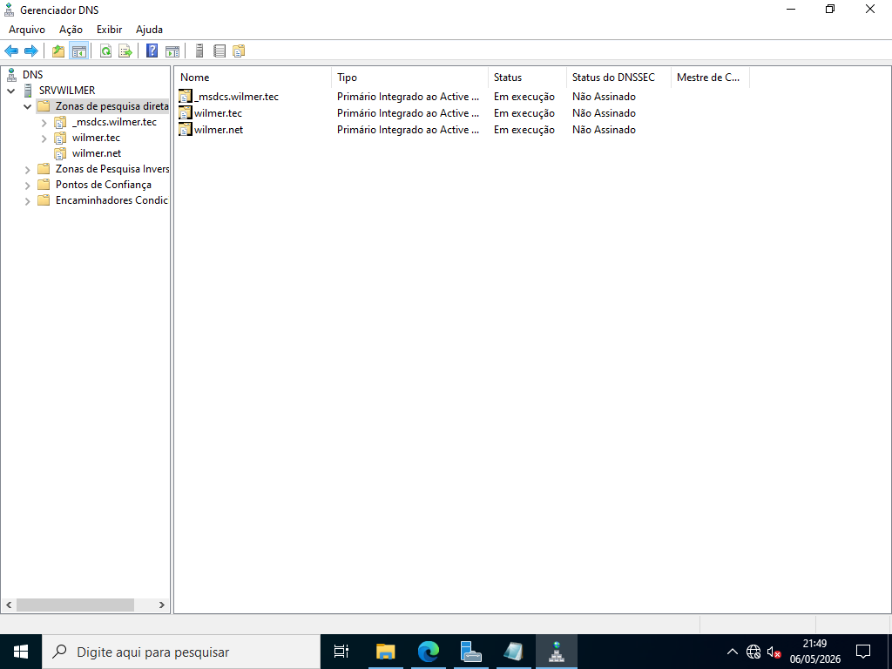
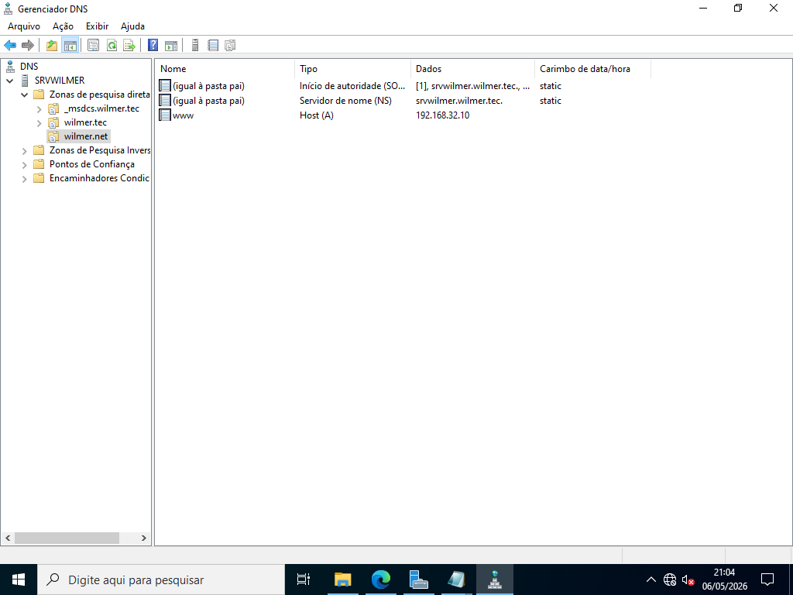
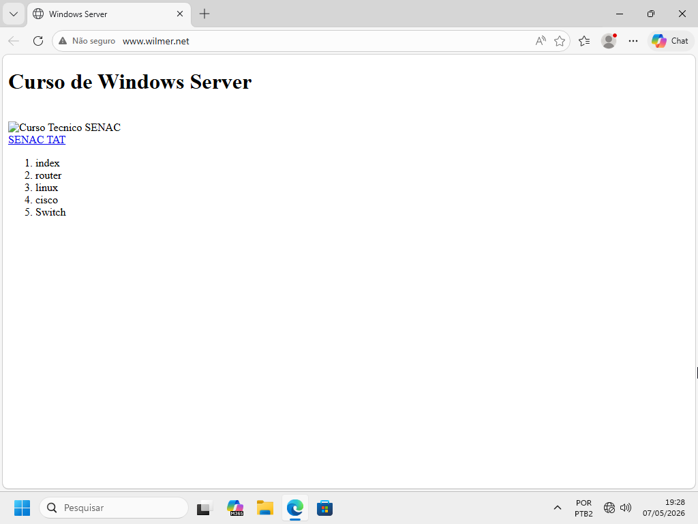
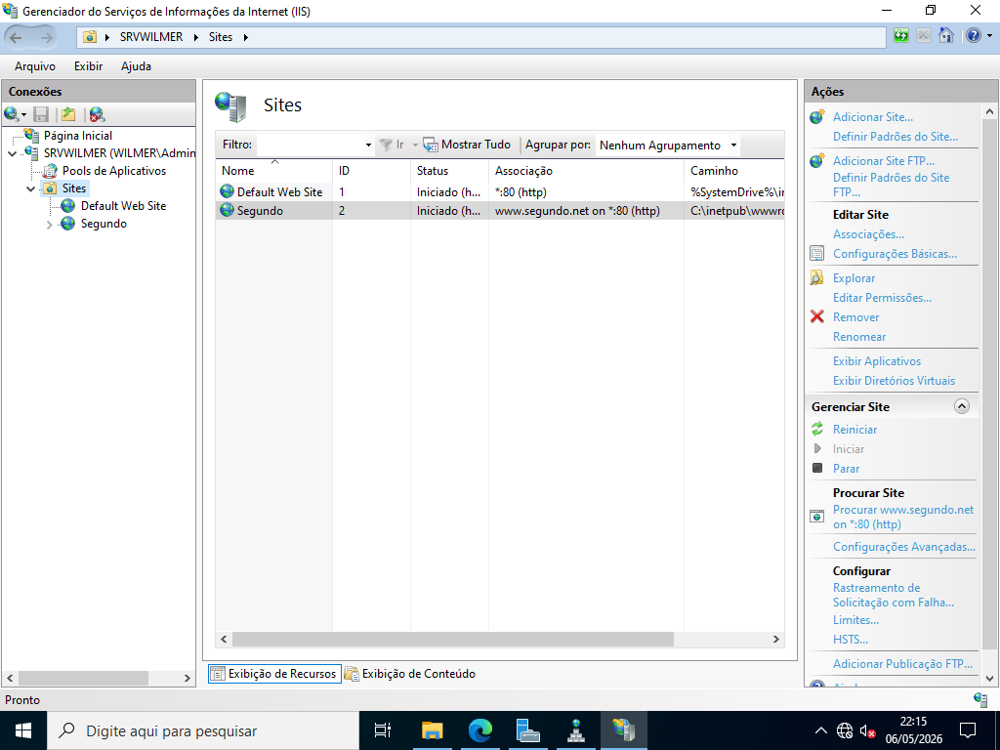
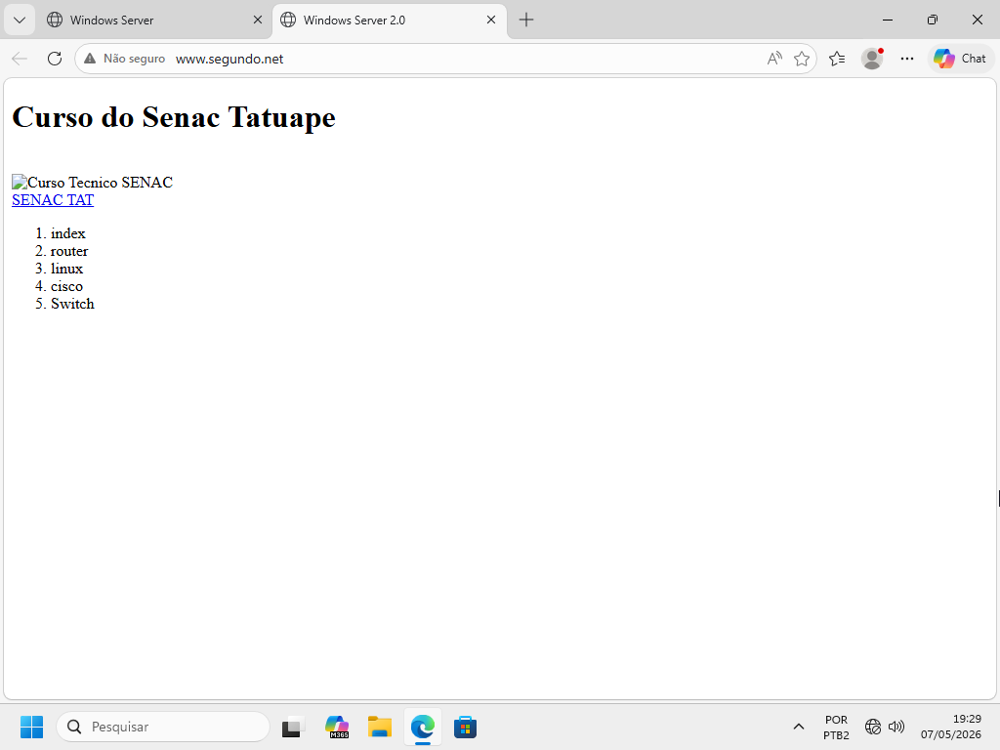

# Servidor WEB

> **Data:** 06 de maio de 2026

Instalação, gerenciamento e configuração do servidor DNS.

---

## Instalação

Para instalação:  
Gerenciar → Servidor Web (IIS) → Serviços de Função (selecionar todas)

Para gerenciamento:  
Ferramentas → Gerenciador do Serviços de Informações da Internet (IIS)

---

## Site Padrão

Para pesquisar o site padrão da máquina escreva "localhost" ou o IP.

### Pasta padrão dos sites

Para colocar algum arquivo deve-se encontrar a pasta onde é guardado a página web padrão.

Caminho:  
Explorador de Arquivos → Disco Local (C:) → inetpub → wwwroot

Neste exemplo colocamos um arquivo **index.html** dentro da pasta wwwroot:

---

## Servidor DNS

Daremos um nome à nossa página web, para isso usaremos o servidor DNS.

Caminho:  
Ferramentas → DNS

### Zona

Criação da zona:  
DNS → domínio → Zonas de Pesquisa Direta → Botão direito → Nova zona (ex: wilmer.net)

### Host

Criação do host:  
Entre na zona criada → Novo Host (A ou AAAA)

- Nome: `www`
- IP do servidor (ex: 192.168.32.10)
- Exemplo: `www.wilmer.net`

---

## Estação do Usuário

---

## 🌐 Criação de site usando o mesmo DNS

Para isso, deve ser realizado as seguintes etapas:

1. Criação de uma pasta dentro de inetpub (ex: wwwroot-2)
2. Dentro dela colocar outro arquivo HTML deve ser "index.html"
3. O IIS procura automaticamente por esse nome
4. Configurar o servidor DNS para este site

Logo, entre:  
Ferramentas → Gerenciador dos Serviços de Informações da Internet (IIS)

### Gerenciador dos Serviços de Informações da Internet (IIS)

Botão direito em "Sites" → Adicionar Site

Configuração:  
1. Nome do site (ex: Segundo)
2. Caminho físico (ex: C:\inetpub\wwwroot-2)
3. Nome do Host (ex: `www.segundo.net`)
4. Ok

### Estação do Usuário - Segundo site

