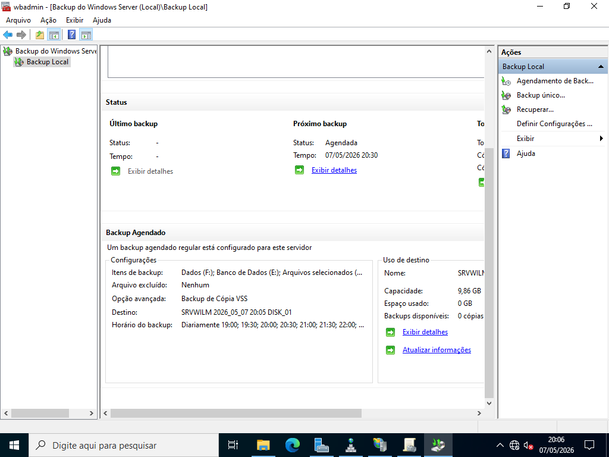
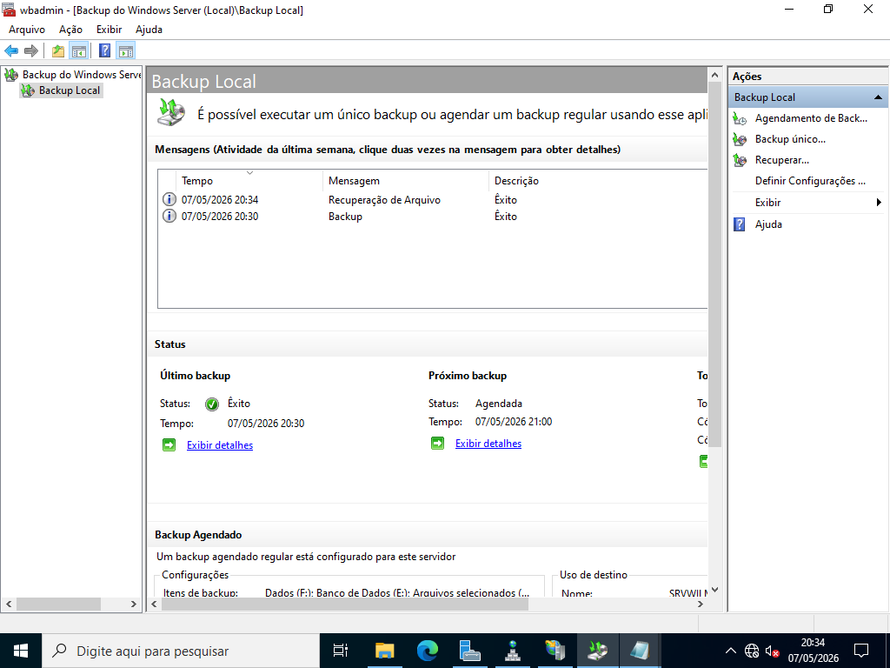
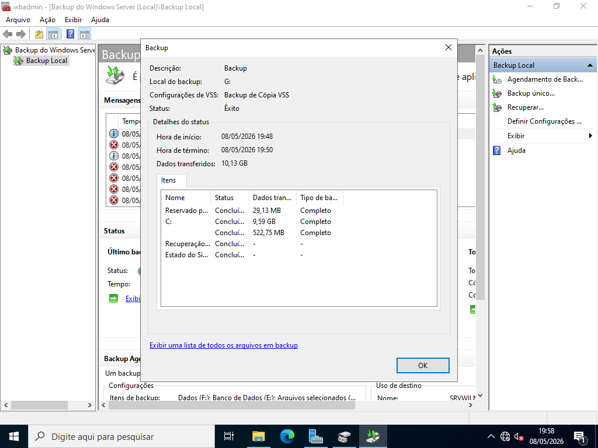

# Backup do Windows Server

> **Data:** 07 de maio de 2026

Instalação e gerenciamento do recurso.

---

## Instalação do recurso

Para instalação:  
Gerenciar → Backup do Windows Server

Para gerenciamento:  
Ferramentas → Backup do Windows Server

OBS: **O backup é um recurso do Windows Server, então não aparece no Painel do Gerenciador do Servidor.**

---

## Backup Agendado

Caminho:  
Backup Local → Agendamento de Backup

Configuração:  
1. Personalização  
↳ evita misturar backups
2. Adicionar itens  
Selecionar (para a aula):
    - Discos de dados
    - Pasta inetpub
(servidor web)  
3. Mais de uma vez por dia
4. Definir horários
5. Selecionar um disco dedicado para o backup
6. Concluir

---

## Recuperação de Arquivos

Caminho:  
Backup Local → Recuperar...

- Aparecerá as opções de backups para a recuperação
- Arquivos que quer recuperar a disposição

---

## Mensagens

Mensagens de backups realizados e de recuperação de arquivos aparecerão como atividades em Backup Local.

---

## 💽 Backup Bare Metal

Cópia de segurança completa que permite **restaurar** um computador ou servidor do zero.

- Ter um disco com capacidade para realização do backup

Caminho:  
Backup Local → Backup único...

Configuração:  
1. Opções diferentes
2. Personalizar
3. Marcar:
    - Recuperação Bare Metal
4. Selecionar disco (ex: Backup (G:))
5. Concluir

### Teste de recuperação Bare Metal

Iniciar com o dispositivo do boot (ex: na aula era a ISO do Windows Server).

Passos:  
1. Reiniciar
2. Apertar tecla no boot
3. Avançar (parte do teclado)
4. Reparar computador
4. Solução de problemas
5. Recuperação de imagem do sistema
6. Selecionar Windows Server
7. Next → Finish
9. Reiniciar agora

### Observações do Backup

Sempre criar backup Bare Metal antes de alterações importantes no servidor.

Após o Bare Metal:
- backup some do sistema
- mas continua salvo no disco dedicado
