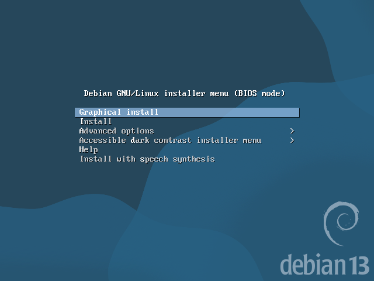
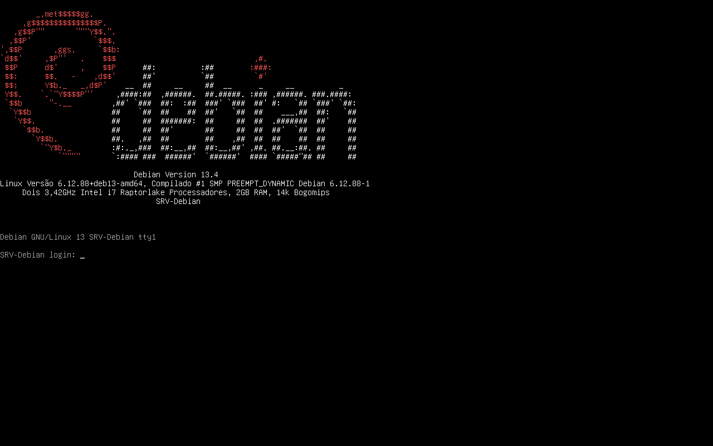

# Introdução ao Servidor Linux - Debian

> **Data:** 15 de maio de 2026

Instalação e alguns comandos iniciais do Debian.

---

## Apresentação

### O que é Linux?

Linux é um kernel de código aberto (open source).

O kernel é o núcleo do sistema operacional, responsável pela comunicação entre hardware e software. Grande parte do Linux foi desenvolvida utilizando a linguagem C. Sozinho, o kernel Linux não forma um sistema operacional completo. 

Para funcionar como sistema utilizável, são necessários:
- interface gráfica
- programas
- bibliotecas
- gerenciadores de pacotes
- ferramentas do sistema

### Linux + Windows

Em muitos ambientes corporativos, Linux e Windows são utilizados juntos para unir segurança, compatibilidade, gerenciamento e estabilidade.

### Distribuição Debian

O Debian é uma distribuição Linux, recebe atualizações constantemente, porém costuma evitar mudanças radicais, mantendo um sistema mais conservador e estável.

Por isso, é muito utilizado em servidores.

↳ **Outras distribuições:** Ubuntu, Red Hat, Fedora, Arch Linux.

---

## Instalação do Servidor

### Configurações da VM

Configurações utilizadas na VM:

- 2 GB de memória RAM
- 2 CPUs
- PAE/NX habilitado
- Áudio desabilitado
- 2 Adaptadores de rede:
  - NAT
  - Não conectado

Iniciar a máquina.

### Passo a passo

Passo a passo da instalação do Debian durante a aula.



1. Selecionar Graphical Install
2. Escolher a linguagem
3. Localidade
4. Teclado
5. Exibirá duas placas de rede (escolher a primeira)
6. Nome da máquina (ex: `SRV-Debian`)
7. Nome do domínio, deixado em branco
8. Senha do usuário root
9. Nome do usuário
10. Senha do usuário
11. Fuso horário
12. Particionamento de Disco: escolher `Assistido - usar o disco inteiro e configurar LVM`
13. HD, selecionar `Partições /home, /var e /tmp separadas`
14. Permitir gravar
15. Permitir escrever as mudanças nos discos
16. Não permitir leitura de mídia de instalação adicional (para aula)
17. Escolher país de espelho do repositório
18. Primeiro repositório disponível
19. Não utilizar proxy
20. Não permitir participação de concurso
21. Desmarcar `Ambiente gráfico`, `Ambiente de área..` e `GNOME`, marcar `servidor SSH`
22. Permitir instalação do GRUB (providencial)
23. Selecionar o HD principal
24. Finalizar a instalação

Após isso, a máquina exibirá a tela para os comandos.


Primeiro pedindo o login, podendo ser do root ou do usuário.

---

## Comandos

```
root
SENHADOROOT
```
↳ Entra no modo administrador.

```
shutdown -h now
```
↳ Desliga o sistema imediatamente.

```
clear
```
↳ Limpa a tela do terminal.

```
pwd
```
↳ Mostra o diretório atual.

```
exit
```
↳ Sai da sessão.

```
cd /
```
↳ Vai para o diretório raiz.

```
ls
```
↳ Lista os arquivos e diretórios.

```
cd /etc
```
↳ Acessa o diretório de configurações do sistema.

```
cd ..
```
↳ Volta um nível no diretório.

```
cd
```
↳ Vai para o diretório padrão.

```
history
```
↳ Lista os últimos comandos digitados.

```
date
```
↳ Exibe a data e hora atual do sistema.

```
cd /proc
```
↳ Acessa o diretório com informações do sistema e hardware.

```
cat cpuinfo
```
↳ Exibe informações detalhadas da CPU, dentro de `/proc`.

**Dicas**
- TAB - Completa automaticamente comandos e diretórios
- ↑ (seta para cima) - Recupera comandos utilizados anteriormente

---

## Logo Debian

Primeiro, será instalado o pacote `linuxlogo` para testar a conexão com a internet. 

### Adicionando logo

Dentro de `cd /etc`, executar o comando:

```
apt install linuxlogo
```

Dê um `ls` para localizar `issue` e `issue.logo`, em seguida executar:

```
cat issue.linuxlogo > issue
```

O símbolo ">" redireciona a saída de um arquivo para outro, ao final saia da sessão.

### Resultado


