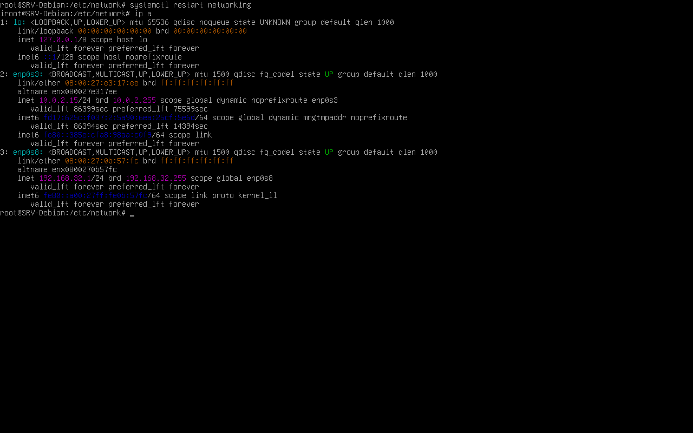
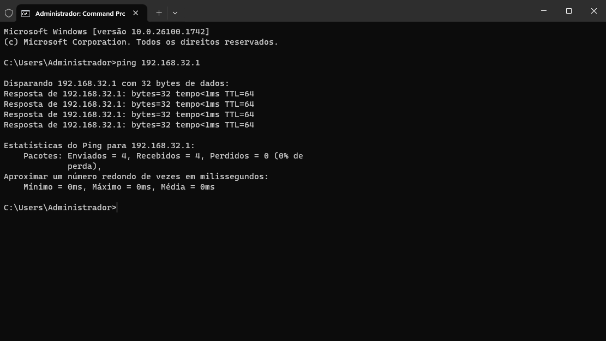
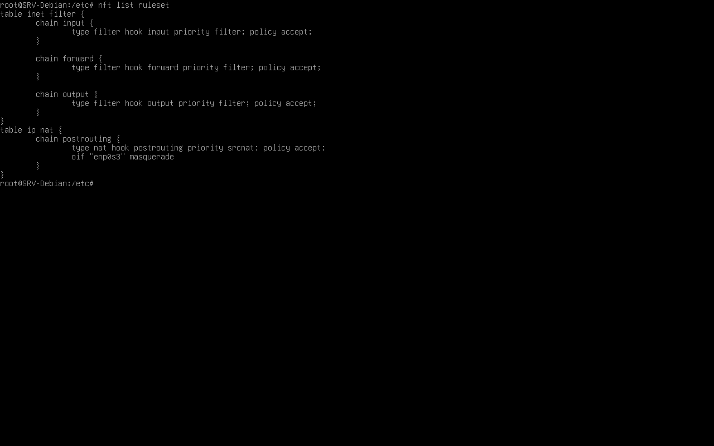
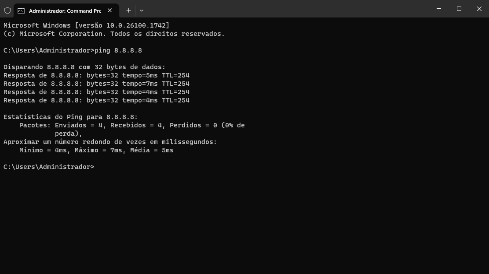

# Compartilhamento de Internet com o Debian

> **Data:** 18 e 19 de maio de 2026

Compartilhamento de Internet usando os comandos no Debian.

---

## Segurança de Redes

### Principais problemas

- Falta de backup
- Infraestrutura
- Usuário

### Firewall

É a divisão entre a rede privada e o exterior (a internet).

- Principal linha de defesa

---

## Configuração de Rede Interna entre Debian e Windows Server

### Passo a passo

1. Dê um `cd /etc`
2. Com `ls`, busque por `network`

```
network
```
↳ É um diretório dentro de `/etc` responsável pelas configurações de rede.

3. Entre em `cd network/`

```
interfaces
```
↳ É o arquivo onde ficam configuradas as placas de rede.

4. Crie uma cópia de segurança com comando `cp interfaces interfaces.bkp`

```
cat NOMEDOARQUIVO
```
↳ **Principalmente** para exibir o conteúdo de arquivos.

5. Dentro de `interfaces`, busque por `enp0s3 inet dhcp`, reponsável por fornecer internet

```
ip a
```
↳ Exibe informações das interfaces de rede.

```
nano NOMEDOARQUIVO
```
↳ **Pode** ser usado para editar arquivos.

6. Dentro de `nano interfaces` escreva no script:

```
# LAN (Gateway)
allow-hotplug enp0s8
iface enp0s8 inet static
address 192.168.32.1/24
```
↳ `#` realiza apenas comentários.

7. Salve o script e saia dele
8. O adaptador que estava em "Não conectado", troque por "Rede interna"

```
systemctl restart networking
```
↳ Reinicia o serviço.

Outros comandos:  
`systemctl start networking` - inicia serviço de rede.  
`systemctl status networking` -  vê status da rede.  
`systemctl stop networking` - para serviço de rede.  
`systemctl status ssh` - verifica status do SSH.

**SSH:** permite acessar o servidor remotamente.

9. Logo, reinicie o servidor
10. Confira se as interfaces de rede estão ligadas



11. Saia com o comando `q`
12. Entre no Windows Server
13. Realize o teste do ping do Gateway



---

## Configuração do NAT

- Ativar o módulo NAT no Netfilter
- Configurar nftables (ferramenta de firewall)

### Passo a passo

**Ativar o módulo NAT no Netfilter**

```
sysctl --system
```
↳ Aplica e exibe configurações do kernel e rede do sistema.

1. Entre no diretório `cd /etc/sysctl.d`

```
sysctl.conf
```
↳ É um arquivo de configuração usado para alterar parâmetros do kernel.

2. Edite com `nano sysctl.conf`
3. No script, escreva:

```
# NAT
net.ipv4.ip_forward = 1
```
↳ `net.ipv4.ip_forward = 1` habilita o encaminhamento de pacotes IPv4 entre redes.

4. Salve a alteração e confira nas configurações do sistema


**Dica:** o comando `mv NOMEERRADO NOMECERTO` renomeia o arquivo.

**Configurar nftables (ferramenta de firewall)**

```
systemctl status nftables
```
↳ Verifica o status do serviço do nftables.

```
systemctl start nftables
```
↳ Inicia o serviço do nftables.

```
systemctl enable nftables
```
↳ Inicia o serviço nftables automaticamente junto com o Debian.

5. Entre em `/etc`
6. Inicie o serviço do nftables
7. Logo depois, faça iniciar automaticamente junto com o sistema operacional
8. Confira nos status

```
nft list ruleset
```
↳ Exibe todas as regras configuradas no nftables.

```
nftables.conf
```
↳ Arquivo de configuração do firewall nftables.

9. Crie um backup de `nftables.conf`
10. Edite com `nano nftables.conf`
11. Ao final do script, crie a tabela:

```
table ip nat {
	chain postrouting {
		type nat hook postrouting priority 100;
		policy accept;
		oif "enp0s3" masquerade;
	}
}
```
↳ `enp0s3` é a interface que irá fornecer.

12. Salve a alteração e saia
13. Reinicie o serviço com `systemctl restart nftables`
14. Verifique as regras do firewall



15. Vá ao Windows Server
16. Realize o teste de um ping NAT, (ex: ping 8.8.8.8)




**Dica:** se der algum erro na linha de comando, volte com CTRL + C.

---

## Configuração do DNS com dnsmasq

### Passo a passo

```
dnsmasq
```
↳ Ferramenta usada para fornecer serviços de rede, principalmente: DNS, DHCP, cache DNS.

1. Se não houver, instale com `apt install dnsmasq`
2. Busque em `/etc`
3. Faça o comando `mv dnsmasq.conf dnsmasq.conf.bkp` para backup
4. Logo, edite no arquivo de configuração do dnsmasq `nano dnsmasq.conf`
5. No script, escreva:

```
# LAN
interface=enp0s8
bind-interfaces

# DNS
listen-address=192.168.32.1
server=8.8.8.8
server=8.8.4.4
cache-size=1000
```
↳ `enp0s8` é a interface de rede que irá receber.  
↳ Em `listen-address` é o Gateway.

6. Salve a alteração e saia
7. Reinicie o serviço
8. Entre no Windows Server
9. Vá em DNS
10. Gerenciador DNS
11. Dê um botão direito e Propriedades
12. Na aba "Encaminhadores"
13. Editar, logo coloque o ip do Gateway
14. Desmcarcar "usar dicas de raiz..."
15. Ok
16. Confira se o servidor e as estações tem internet


**OBS:** o Debian está fornecendo internet para as estações do Windows Server.
