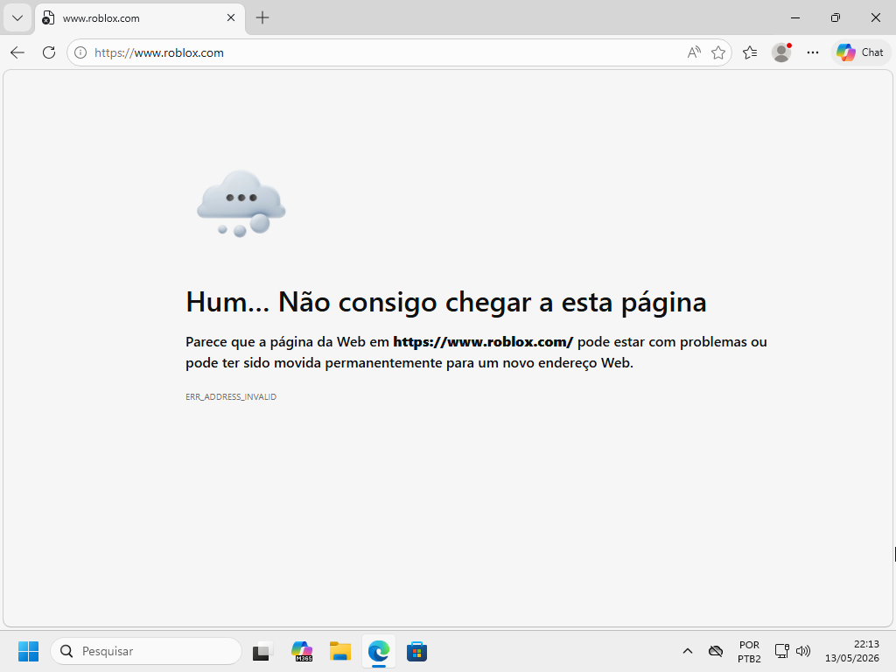

# Lista Negra do Debian

> **Data:** 20 de maio de 2026

Realização de uma lista negra para bloqueio de sites.

---

## Black List

A Lista Negra é um método de controle de acesso utilizado para bloquear sites, serviços ou endereços específicos dentro da rede. Tudo o que estiver na lista terá o acesso negado pelas estações da rede.

Esse tipo de configuração é muito utilizado em:

- empresas
- escolas
- laboratórios
- redes corporativas
- controle parental

A Lista Negra faz parte do controle de acesso e segurança de redes, permitindo que o administrador da rede filtre conteúdos considerados indesejados ou inadequados.

---

## Passo a passo

1. Em `/etc`
2. Entre em `dnsmasq.d`
3. Logo edite com `nano blacklist.conf`
4. No script, escreva:

```
# Lista negra (proibidos)
address=/netflix.com/0.0.0.0
address=/facebook.com/0.0.0.0
address=/roblox.com/0.0.0.0
address=/minecraft.net/0.0.0.0
```
↳ Nessa configuração os domínios foram bloqueados através do DNS.

Ou seja, essa regra faz com que os domínios `/site.com` sejam redirecionados ao endereço `/0.0.0.0`, que é inválido.

5. Salve a alteração e saia
6. Volte com `cd ..`
7. Edite em `nano dnsmasq.conf`
8. No final do script, escreva:

```
# Blacklist
domain-needed
conf-file=/etc/dnsmasq.d/blacklist.conf
```
↳ `domain-needed` impede consultas sem domínio válido.  
↳ `conf-file` carrega o arquivo blacklist.conf no dnsmasq.

9. Salve a alteração e saia
10. Reinicie o serviço com `systemctl restart dnsmasq`

---

## Estação do Usuário

Neste exemplo, foi realizado uma tentativa de entrar em um dos sites bloqueados:


