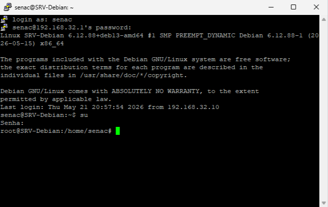
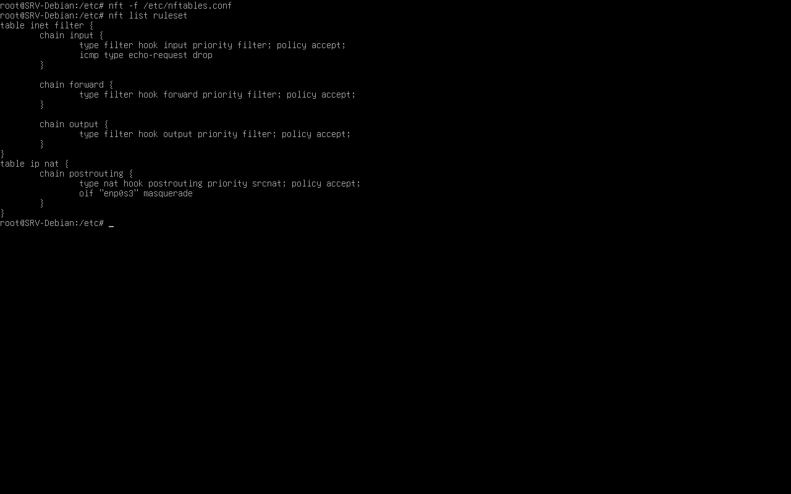
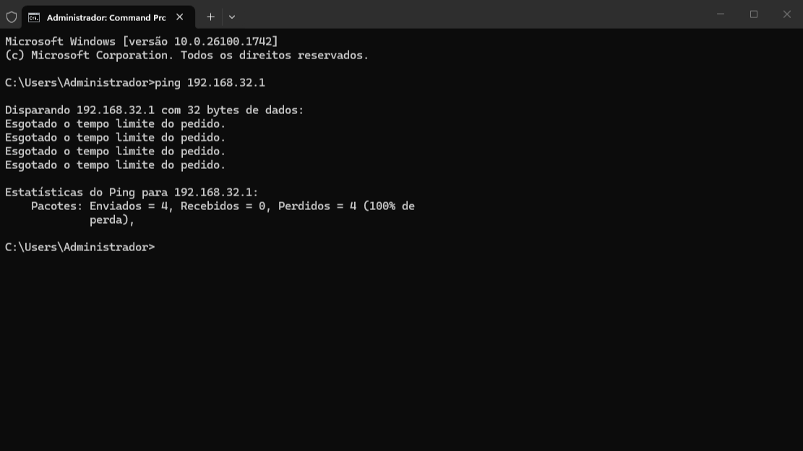

# Putty e Teste de Regra do Firewall

> **Data:** 21 de maio de 2026

Donwload do programa putty e teste de bloqueio de ping através de uma regra do firewall.

---

## Putty

PuTTY é um programa usado para acessar servidores remotamente. O PuTTY usa principalmente o SSH, que permite abrir um terminal remoto do Linux.

Então:  
`Windows → PuTTY → Debian`

### Donwload

Abrimos um navegador do Windows Server, pesquisamos pelo programa e efetuamos o donwload.

Link: **https://putty.org/index.html**

Para entrar no putty, deve-se colocar o gateway, logo para logar entre como usuário e depois como root:

```
su
SENHADOROOT
```



Portanto, é possível acessar o servidor remotamente como administrador.

---

## 📡 Bloqueio de Ping

Configuração de uma regra do firewall.

### Passo a passo

1. Em `/etc`
2. Logo, editar `nano nftables.conf`
3. Dentro de `chain input`, escreva o script

```
icmp type echo-request drop;
```
↳ `icmp` - protocolo usado pelo ping  
↳ `echo-request` - pedido de ping  
↳ `drop` - descarta/bloqueia

4. Salve a alteração e saia

```
nft -f /etc/nftables.conf
```
↳ Recarrega regras do arquivo.

5. Aplique a nova regra do firewall
6. Confira as regras do firewall



7. Realize o teste do ping



**OBS:** regra do firewall efetuada apenas para demonstração.
