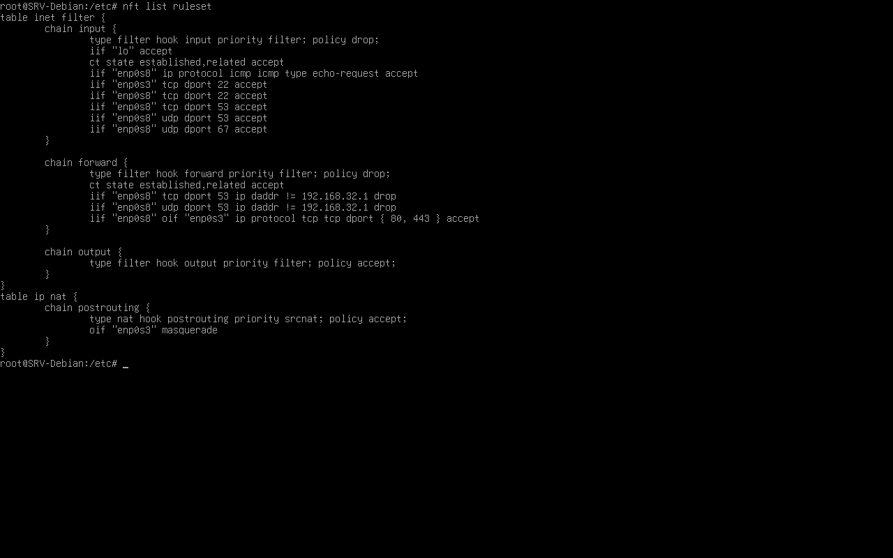

# Configuração de Portas no Firewall

> **Data:** 22 de maio de 2026

Configuração das tabelas do firewall.

---

## Principais protocolos e portas utilizadas

| Protocolo | Porta | Serviço |
|---|---|---|
| ICMP | - | Ping |
| TCP | 22 | SSH |
| TCP/UDP | 53 | DNS |
| UDP | 67 | DHCP |
| TCP | 80 | HTTP |
| TCP | 443 | HTTPS |

---

## Melhor Firewall

- Bloqueio de tudo
- Liberar portas específicas

**"O melhor firewall libera apenas o que é necessário"**

---

## Configuração do nftables

Em `/etc`, editamos com `nano nftables.conf`.

### Input

Essas regras ficaram responsáveis pelo tráfego que ENTRA no Debian.

```
policy drop;
iif "lo" accept;
ct state established,related accept;
iif "enp0s8" ip protocol icmp icmp type echo-request accept;
iif "enp0s3" tcp dport 22 accept;
iif "enp0s8" tcp dport 22 accept;
iif "enp0s8" tcp dport 53 accept;
iif "enp0s8" udp dport 53 accept;
iif "enp0s8" udp dport 67 accept;
```

**O que cada regra faz:**

`policy drop;`  
↳ Bloqueia todo tráfego de entrada por padrão.

`iif "lo" accept;`  
↳ Libera o loopback (localhost).

`ct state established,related accept;`  
↳ Permite conexões já estabelecidas e relacionadas.

`iif "enp0s8" ip protocol icmp icmp type echo-request accept;`  
↳ Permite ping vindo da rede interna.

`iif "enp0s3" tcp dport 22 accept;`  
`iif "enp0s8" tcp dport 22 accept;`  
↳ Libera SSH (porta 22) nas interfaces de rede.

`iif "enp0s8" tcp dport 53 accept;`  
`iif "enp0s8" udp dport 53 accept;`  
↳ Libera DNS TCP e UDP.

`iif "enp0s8" udp dport 67 accept;`  
↳ Libera DHCP (porta 67 UDP).

### Forward

Essas regras controlam o tráfego que PASSA pelo servidor. Ou seja, máquinas da rede interna acessando outras redes/internet.

```
policy drop;
ct state established,related accept;
iif "enp0s8" tcp dport 53 ip daddr != 192.168.32.1 drop;
iif "enp0s8" udp dport 53 ip daddr != 192.168.32.1 drop;
iif "enp0s8" oif "enp0s3" ip protocol tcp tcp dport {80, 443} accept;
```

**O que cada regra faz:**

`policy drop;`  
↳ Bloqueia todo encaminhamento de tráfego por padrão.

`ct state established,related accept;`  
↳ Permite conexões já estabelecidas e relacionadas.

`iif "enp0s8" tcp dport 53 ip daddr != 192.168.32.1 drop;`  
`iif "enp0s8" udp dport 53 ip daddr != 192.168.32.1 drop;`  
↳ Impede que as estações utilizem DNS externos diretamente. Ou seja, obriga o uso do DNS do Debian.

`iif "enp0s8" oif "enp0s3" ip protocol tcp tcp dport {80, 443} accept;`  
↳ Permite acesso web HTTP e HTTPS da rede interna para internet.

---

## Regras no Firewall

Regras aplicadas nas tabelas filtradas:


