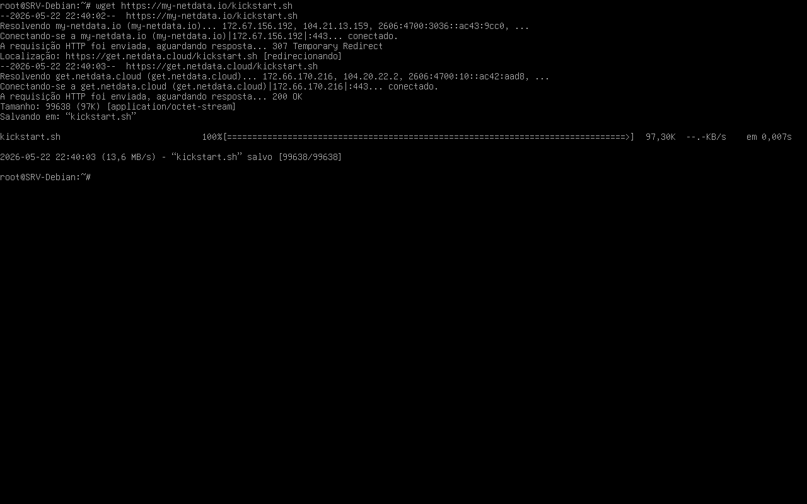
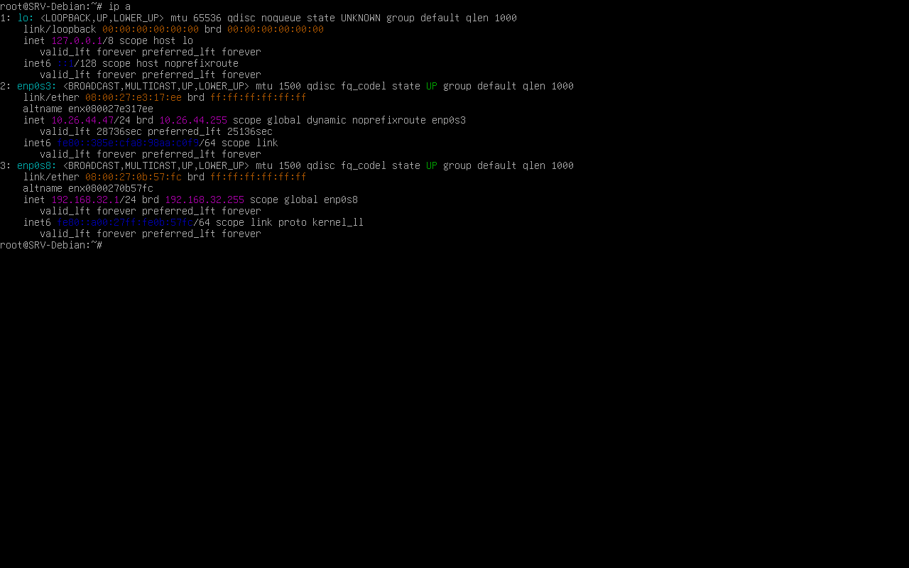
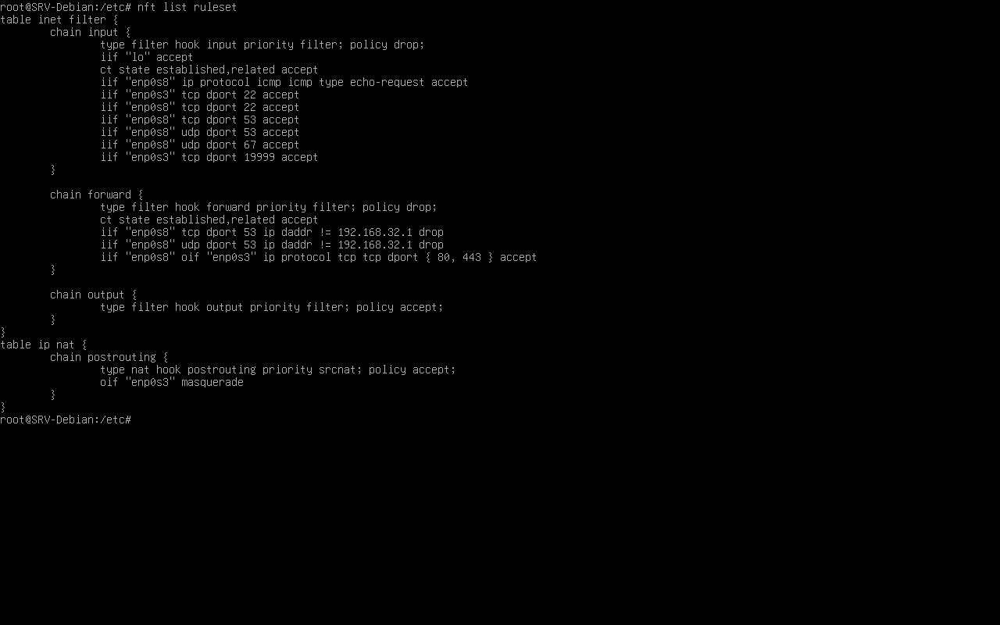
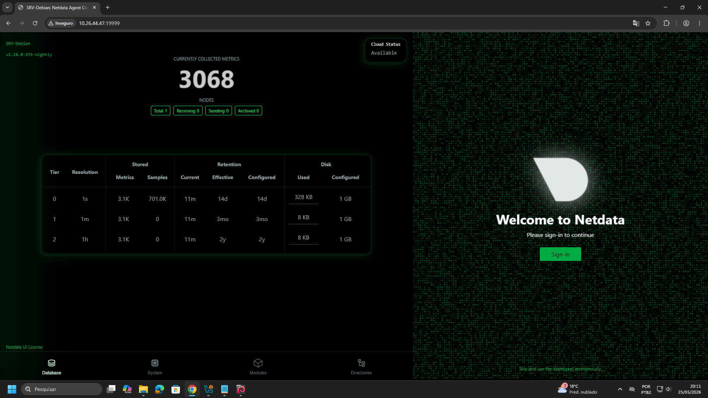

# Ferramenta de Monitoramento do Servidor

> **Data:** 25 de maio de 2026

Instalação da ferramenta e criação de uma nova VM.

---

## 📊 Netdata

- Ferramenta de monitoramento via web em tempo real
- Plano gratuito para monitoramento de um servidor

O comando:
```
top
```
Também realiza o monitoramento, bem básico.

---

## Instalação

### Passo a passo

1. Download do script
2. Na linha de comando `wget https://my-netdata.io/kickstart.sh`



```
ls -l ARQUIVOOUDIRETÓRIO
```
↳ Lista arquivos e diretórios com informações detalhadas.

3. Volte ao diretório raiz
4. Execute o comando `ls -l kickstart.sh` para ver as permissões

```
chmod +x ARQUIVO
```
↳ Adiciona permissão de execução ao arquivo.

5. Em seguida, o comando `chmod +x kickstart.sh`

```
./ARQUIVO
```
↳ Muito usado para executar arquivos.

6. Execute o arquivo com `./kickstart.sh`
7. Troque a "NAT" por "Placa em modo Bridge"
8. Reinicie o serviço de rede
9. Confira em `ip a`



10. Acesse o diretório de configurações do sistema `cd /etc`
11. Edite com `nano nftables.conf`
12. Em Input:

```
iif "enp0s3" tcp dport 19999 accept;
```
↳ Liberou acesso à porta `19999` vindo da interface `enp0s3`.

13. Recarregue o firewall com `nft -f /etc/nftables.conf`
14. Confira em `nft list ruleset`



15. Na máquina real pesquise por `IPDAINTERFACE:19999`



16. Clique em "Skip and use the dashboard anonymously" para entrar localmente

---

## Criação de uma VM com Java

### O que é VPS?

VPS (Virtual Private Server) é um servidor virtual que funciona como uma máquina independente dentro de um servidor físico.

### Máquina Virtual

Configurações utilizadas na máquina virtual:

- 4 GB de memória RAM
- 2 CPUs
- Áudio desabilitado
- 1 Adaptador de rede em modo Bridge

Para a instalação, siga o procedimento padrão, alterando apenas as seguintes etapas:

1. Nome do servidor (ex: `Debian-Wilmer`)

**OBS:** utilizar um nome único para a máquina em modo bridge, diferente dos demais da sala.

2. Domínio: `domain.com`
3. Nome completo do usuário: `Administrador-dba`
4. Nome do usuário: `dba`

Confira o IP da interface de rede do servidor criado:


### Máquina Real

Realize o teste do IP do Debian:


