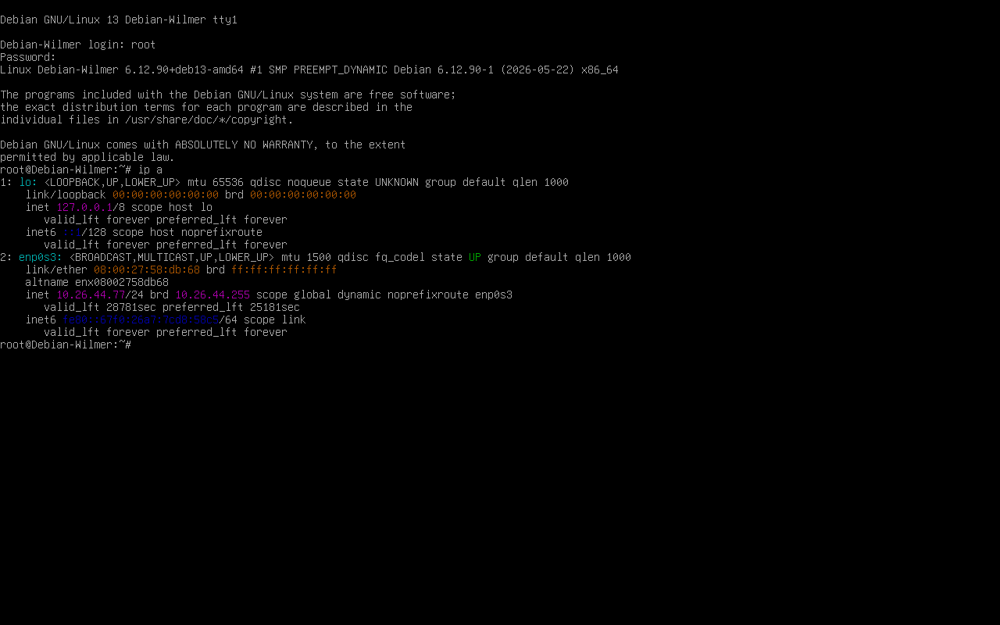
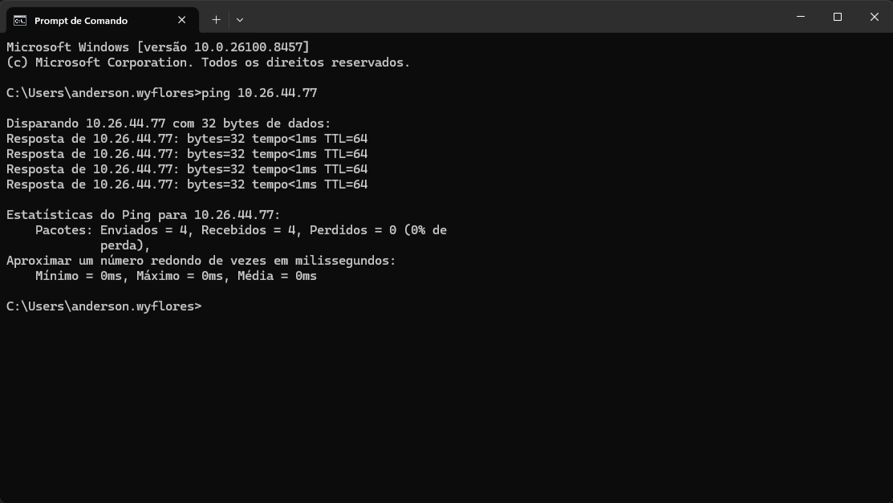
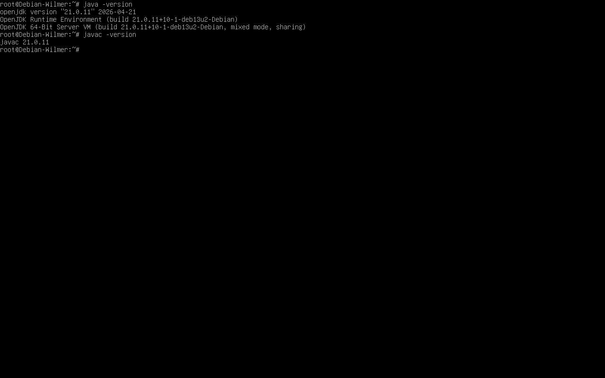
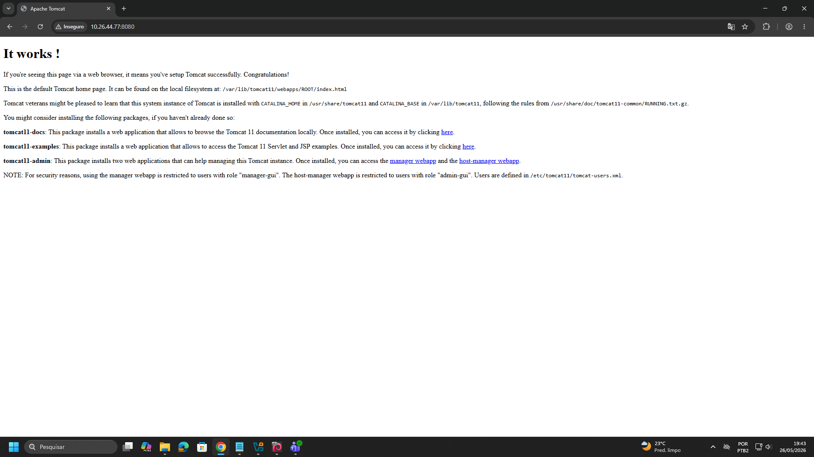
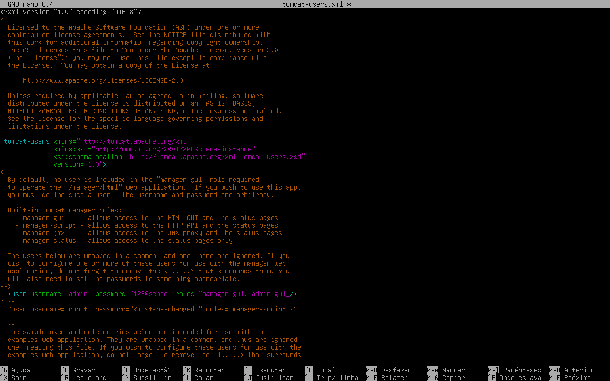
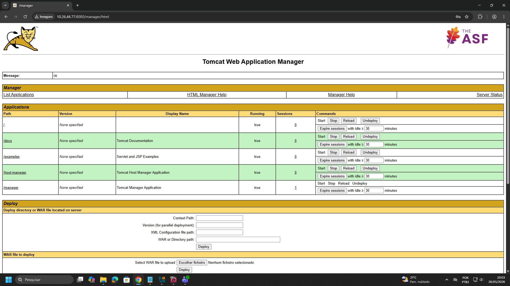
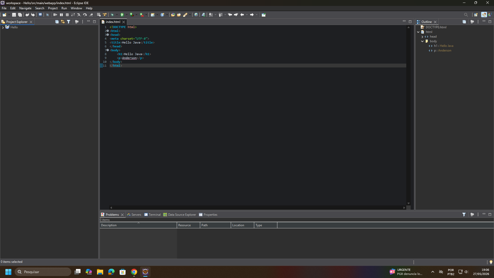
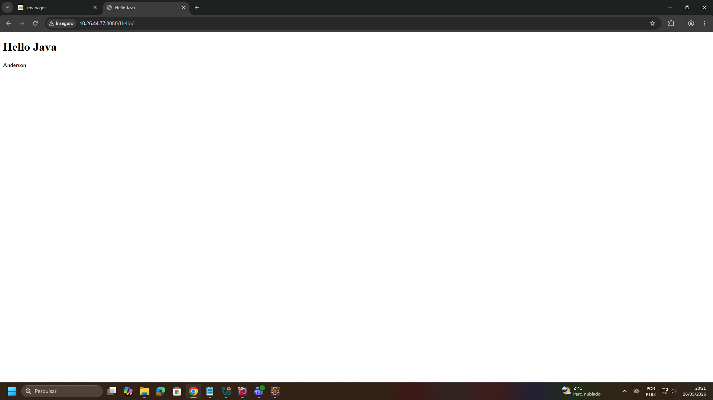
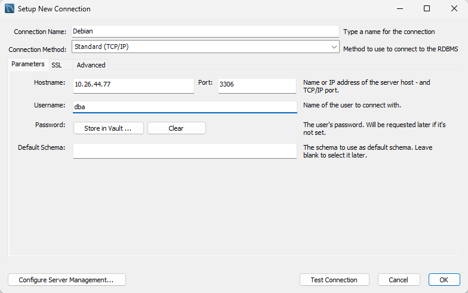

# Servidor de Aplicação Java - Desenvolvimento Web Fullstack

> **Data:** 25 e 26 de maio de 2026

Configuração de um ambiente Java Web Fullstack em VPS Linux, utilizando Java, Apache Tomcat e MySQL para hospedagem, deploy e gerenciamento de aplicações web.

---

## Criação da VM para ambiente Java Web

### O que é VPS?

VPS (Virtual Private Server) é um servidor virtual que funciona como uma máquina independente dentro de um servidor físico.

### Criação e Teste

Configurações utilizadas na máquina virtual:

- 4 GB de memória RAM
- 2 CPUs
- Áudio desabilitado
- 1 Adaptador de rede em modo Bridge

Para a instalação, siga o procedimento padrão, alterando apenas as seguintes etapas:

1. Nome do servidor (ex: `Debian-Wilmer`)

**OBS:** utilizar um nome único para a máquina em modo Bridge, diferente dos demais da sala.

2. Domínio: `domain.com`
3. Nome completo do usuário: `Administrador-dba`
4. Nome do usuário: `dba`

Confira o IP da interface de rede do servidor criado:



Na máquina real, realize o teste do IP do Debian:



---

## Instalação do Java

Para a instalar o java, primeiro dê `apt update` para atualizar a lista de pacotes disponíveis, logo:

```
apt install default jdk
```



`java -version` - mostra a versão do **Java Runtime**, ou seja, o ambiente que executa aplicações Java  
`javac -version` - mostra a versão do compilador Java

---

## Instalação do Apache Tomcat

Servidor web Java livre, popular e amplamente utilizado para hospedagem e execução de aplicações web.

Execute:
```
apt install tomcat11 tomcat11-admin tomcat11-examples tomcat11-docs
```

Confira os status desse serviço `systemctl status tomcat11`.

Teste o acesso ao Apache Tomcat na máquina real através do navegador: `IPDOSERVIDOR:8080`



### Passo a passo - Usuário do Tomcat

1. Vá ao diretório `cd /etc/tomcat11`
2. Dê um `ls`, e identique o arquivo `tomcat-users.xml`

```
tomcat-users.xml
```
↳ Arquivo de configuração de usuários do Apache Tomcat.

3. Realize o backup desse arquivo com o `cp`
4. Entre para editar o arquivo `nano tomcat-users.xml`
5. Tire do comentário e faça a seguinte mudança:

```
<user username="admin" password="123@senac" roles="manager-gui, admin-gui">
```



6. Reinicie o serviço com `systemctl restart tomcat11`
7. Confira os status desse serviço

Após a ativação do usuário administrador, acesse o painel de gerenciamento utilizando: `IPDOSERVIDOR:8080/manager/html`, realize o login com o usuário e senha.



---

## Software Eclipse IDE

### Caminhos

1. Window → Perspective → Open Perspective → Other... → Java EE
2. File → New → Dynamic Web Project → Crie o arquivo (Hello)
3. Hello → src → main → webapp → New → HTML File (HTML5)

Após isso faça alguma alteração demonstrativa



Salve e exporte o arquivo.

### Arquivo no Tomcat

Volte ao Apache Tomcat e busque por **WAR file to deploy**, logo **Select WAR to file upload**

Clique no botão "Escolher ficheiro" → Coloque o arquivo criado → Clique no botão "Deploy"

Aparecerá na aba Applications e pesquisando por `IPDOSERVIDOR:8080/Hello`, estará o arquivo



---

## MySQL

No navegador pesquise por **mysql.com**, na aba Downloads entre em **MySQL Community Edition** (gratuito), logo em **MySQL APT Repository.**

Dê um botão direito em "No thanks, just start my donwload", e pegue o endereço de link para instalação no Debian.

### Debian

1. Comando: `wget https://dev.mysql.com/get/mysql-apt-config_0.8.39-1_all.deb`
2. Logo, instale o GNUPG `apt install gnupg`
3. Instale manualmente com `dpkg -i mysql-apt-config_0.8.39-1_all.deb`
4. No menu de configuração do pacote, mantenha a configuração padrão
5. Atualize a lista de pacotes disponíveis
6. Instale o mysql `apt install mysql-server`
7. Defina a senha do usuário root do banco de dados

```
mysql -V
```
↳ Mostra a versão do MySQL instalada no sistema.

8. Veja a versão e execute script de reforço de segurança `mysql_secure_installation`
9. Perguntas de segurança conforme solicitado:  
**Confirmar alterações:** y  
**Nível de validação de senha:** 2  
**Confirmar novamente:** y  
**Definir nova senha do root:** (ex: 123@Senac)  
**Nas demais opções, responder “y” para aplicar todas as recomendações de segurança**

```
mysql -u root -p
```
↳ Usado para acessar o banco de dados MySQL como administrador.

10. Entre com `mysql -u root -p` e a senha
11. Dê os seguintes comandos:  
`create user 'dba'@'%' identified by '123@Senac';`  
`grant all privileges on *.* to 'dba'@'%';`  
`flush privileges;`
12. Dê um CTRL + D para sair do mysql

### MySQL Workbench

Instalar o MySQL Workbench no Windows para gerenciar remotamente o banco de dados MySQL instalado no Debian.

Caminho:  
MySQL Community Edition → MySQL Workbench

1. Entre no software
2. Clique no simbolo +
3. Crie a conexão entre o MySQL Workbench e o servidor Debian



**Nome da conexão:** Debian  
**Hostname:** IP do servidor (Debian)  
**Usuário:** dba (foi o que criamos)  

4. Dê ok para criar a conexão
5. Será exibida uma janela de autenticação
6. Para acessar a conexão, é necessário inserir a senha do usuário criado anteriormente.
