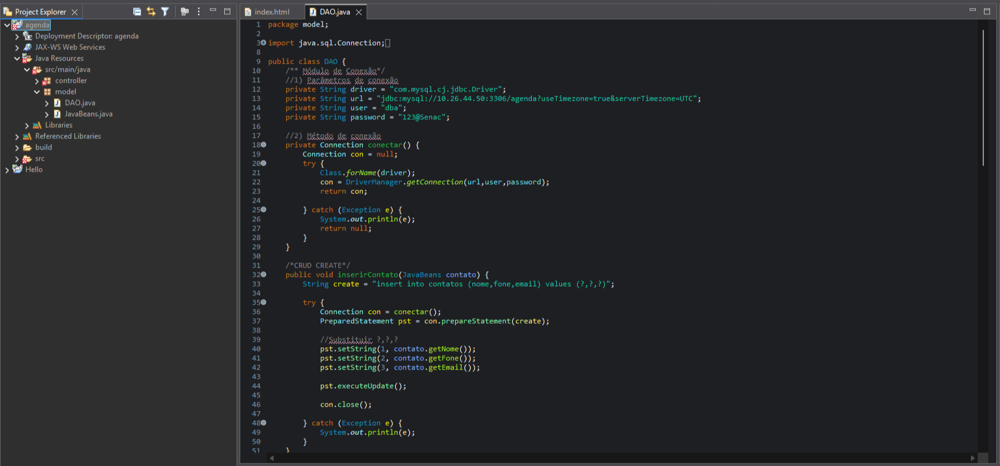
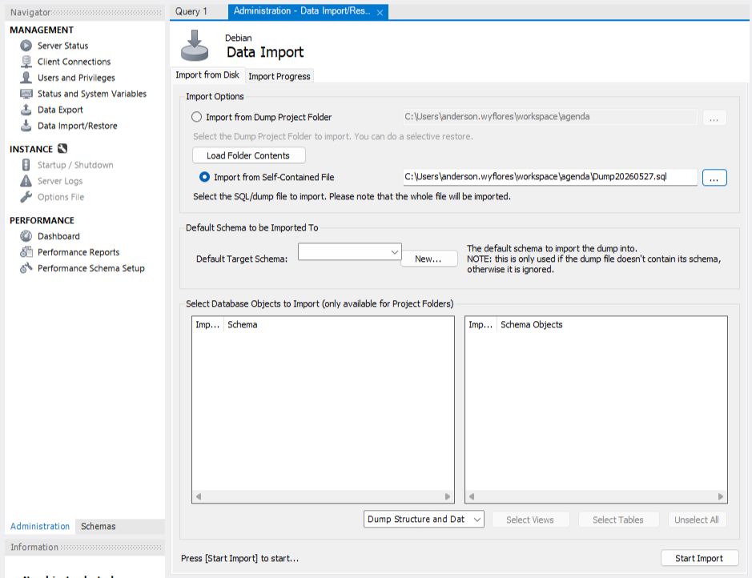
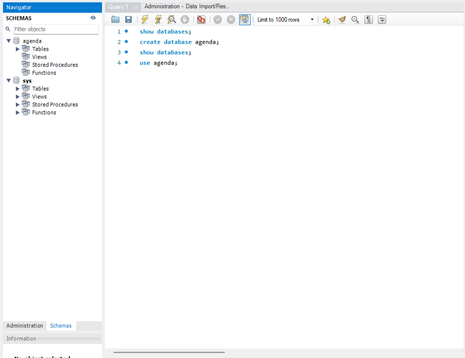

# Publicação de Aplicação Java Web

> **Data:** 27 de maio de 2026

Importação, configuração e publicação de uma aplicação Java Web integrada ao MySQL utilizando Apache Tomcat.

---

## Software Eclipse IDE

O projeto Agenda será adicionado ao workspace e importado no Eclipse em ambiente Java EE.

### Explorador de Arquivos

Disco Local (C:) → Usuários → seu usuário → workspace

Cole a pasta Agenda dentro do diretório workspace.

### Eclipse IDE

Window → Perspective → Open Perspective → Other → Java EE

Importação do projeto:  
File → Import → Browse → selecionar pasta "workspace" → Finish

### Projeto Agenda

No projeto Agenda, acesse: Java Resources → model → DAO.java

logo, no arquivo DAO.java configure IP do servidor, usuário do banco (dba), senha (123@Senac)

Dê um Save All, para salvar tudo.

Exporte o projeto como arquivo WAR:  
Botão direito no projeto Agenda → Export → WAR file → agenda.war (nome do arquivo criado)

---

## Publicação da aplicação Java (Deploy) - MySQL Workbench

Arquivos necessários para a publicação da aplicação:

- Pacote `.war` → aplicação Java Web
- Script/Dump do banco de dados → estrutura e dados da aplicação

**OBS:** sempre que IP não fixado, dê um botão direito na janela e clique em "Edit Connection" para alterá-lo.

### Restore

Criação um banco de dados da aplicação e seus papéis.

`show databases;` - viu bancos existentes antes  
`create database agenda;` - criou o banco  
`show databases;` - confirmou que o banco agenda apareceu  
`use agenda;` - selecionou o banco para uso

Depois em Administration vá para "Data Import/Restore", logo selecione "Import from Self-Contained File". Em seguida nos três pontos (...) e selecione o arquivo de backup (Dump20260527.sql), localizado dentro da pasta agenda.

Após isso, clique em “Start Import” para iniciar o restore do banco de dados. Ao finalizar, atualize os "Schemas" para visualizar o banco restaurado.

No Tomcat faça o deploy do arquivo "agenda.war". Pesquisando pelo `IPDOSERVIDOR:8080/agenda` estará a interface web da publicação.

### Em construção...
