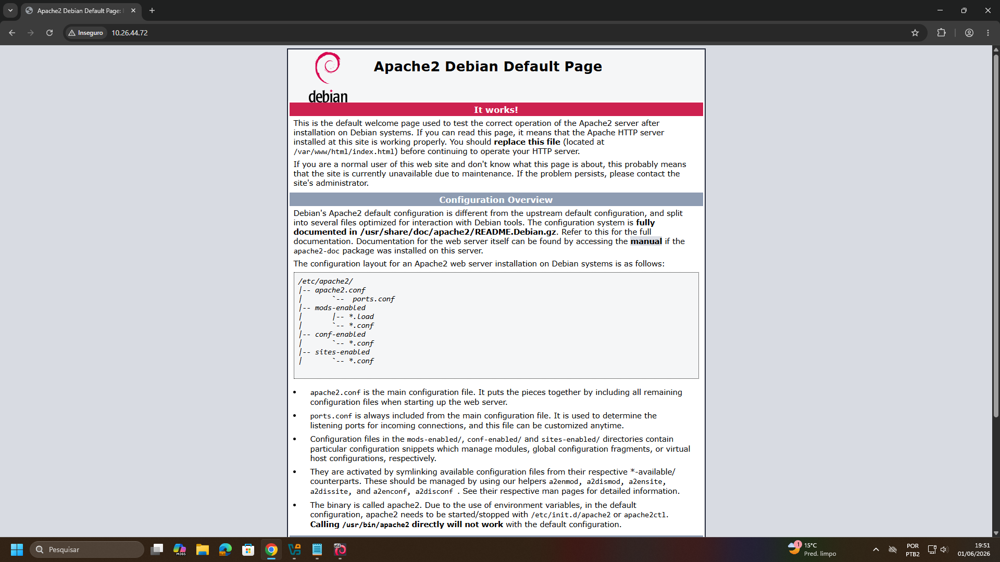
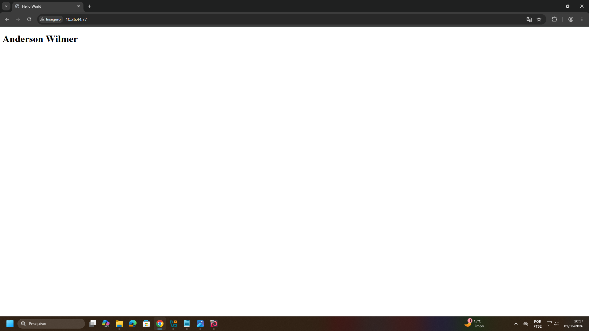

# Servidor WEB com Debian

> **Data:** 01 de junho de 2026

Criação de um servidor web Debian utilizando Apache, hospedagem de páginas HTML, publicação de sites via Git e introdução ao WordPress.

---

## Criação da VM com servidor WEB

Configurações utilizadas na máquina virtual:

- 4 GB de memória RAM
- 2 CPUs
- PAE/NX habilitado
- 1 Adaptador de rede em modo Bridge
- Áudio desabilitado

Para a instalação, siga o procedimento padrão, alterando apenas as seguintes etapas:

1. Nome do servidor (ex: `Debian-Wilmer`)

OBS: utilizar um nome único para a máquina em modo Bridge, diferente dos demais da sala.

2. Domínio: `domain.com`
3. Nome completo do usuário: `administrador`
4. Nome do usuário: `senac` (para aula)
5. Desmarcar `Ambiente gráfico` e `GNOME`, marcar `servidor SSH` e `servidor WEB`

Na máquina real, coloque o IP do Debian no navegador:



### Snapshot da Instalação

Após a validação do funcionamento do servidor web, desligar a máquina virtual e criar um snapshot com o nome: `Instalação`.

---

## Hospedagem de sites (Front-End)

### Estrutura raiz da hospedagem

Diretório padrão de hospedagem do Apache:

```
/var/www/html/
```

Dentro desse diretório é possível:

- Hospedar um único site, copiando os arquivos diretamente para o diretório.
- Criar Virtual Hosts (hospedagem compartilhada), permitindo hospedar vários sites no mesmo servidor.

### Transferência de arquivos

Os arquivos do site podem ser enviados para o servidor utilizando:

- **FTP (File Transfer Protocol)** - protocolo de transferência de arquivos.  
- **Git** - método mais prático e seguro para publicação e atualização de projetos.

### Demonstração de hospedagem manual

1. Acesse o diretório `cd /var/www/html`
2. Dê um `ls`


3. Remova o arquivo padrão `rm index.html`
4. Dentro de `nano index.html`, escreva:

```html
<!DOCTYPE html>
<html lang="pt-br">
<head>
    <title>Hello World</title>
</head>
<body>
    <h1>Anderson Wilmer</h1>
</body>
</html>
```

5. Salve e saia

**OBS:** Não é necessário reiniciar ou atualizar o serviço Apache.

6. Confira a exibição da página criada



### Demonstração de hospedagem utilizando Git

Primeiramente instale o git: `apt install git`

```
git clone URLDOREPOSITÓRIO
```
↳ Realiza uma cópia completa de um repositório Git para a máquina.

Clone o repositório para o servidor: `git clone https://github.com/professorjosedeassis/professorramos`

Para visualizar o site hospedado, acesse no navegador da máquina real: `IPDOSERVIDOR/professorramos`

### Snapshot do Servidor Web Simples

Após a hospedagem do site utilizando Git, criar um novo snapshot com o nome: `Servidor WEB simples`

---

## Restauração de Snapshot

Contudo, volte ao estado inicial da máquina.

Para retornar ao estado inicial da máquina, selecionar o snapshot `Instalação` e utilizar a opção **Restaurar**.

---

## Introdução ao WordPress

### Servidor Web Dinâmico com uso de CMS

CMS (Content Management System) é um Sistema de Gestão de Conteúdo. Trata-se de uma plataforma que permite criar, editar, organizar e publicar sites ou blogs sem a necessidade de programar diretamente em HTML, CSS ou JavaScript.

Características do WordPress:

- Plataforma de código aberto para criação e gerenciamento de conteúdo web.
- Muito popular no mercado.
- Utilizada por aproximadamente 42% a 43% dos sites da internet.
