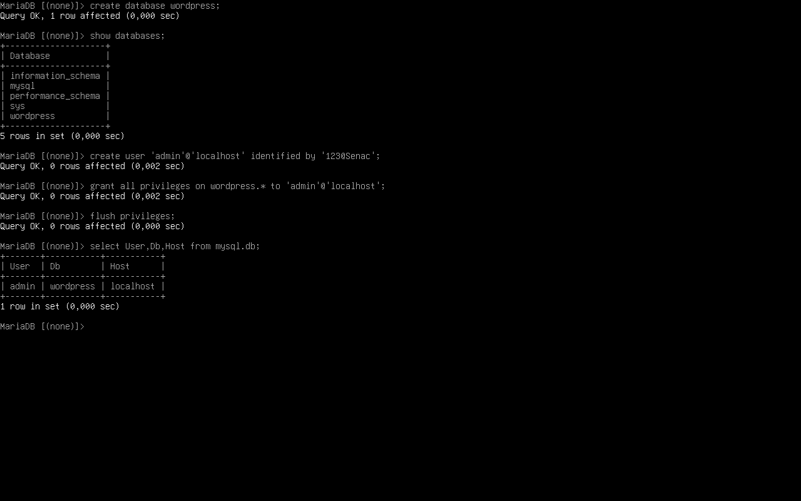
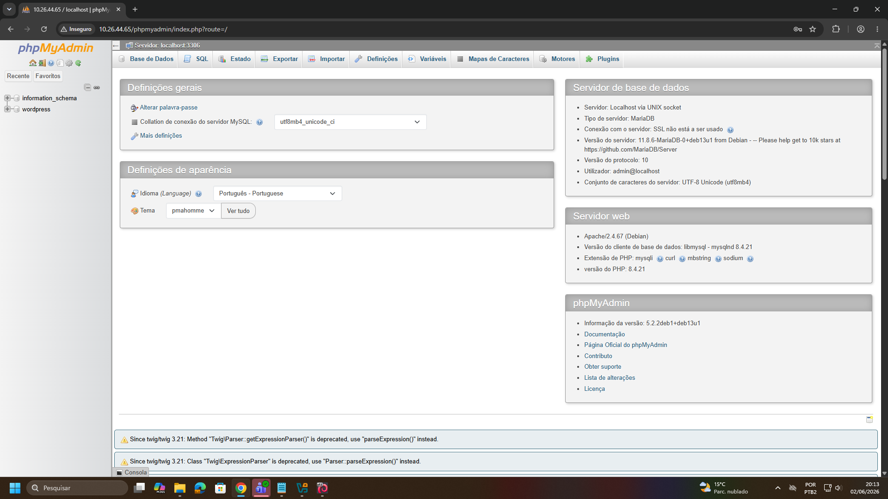
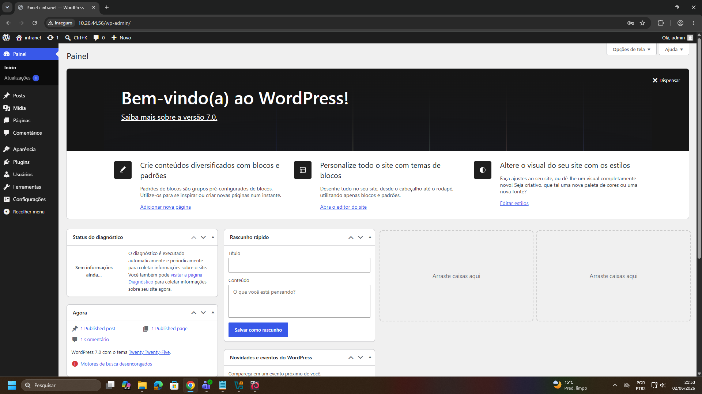

# WordPress

> **Data:** 02 de junho de 2026

Configuração de um ambiente LAMP e instalação do WordPress para hospedagem de sites dinâmicos no Debian.

---

## Pré-Requisitos

Para a instalação do WordPress é necessário o "LAMP".

LAMP: Linux - Apache - MariaDB - PhP

---

## Instalação do MariaDB

Faça o comando `apt install mariadb-server`, logo confira os status. Após isso, em `mariadb-secure-installation`, para segurança aceite tudo (Y) e troque a senha (ex: 123@Senac).

Acesse o `mariadb`:

CTRL + L - Limpa o terminal no mariadb.  
CTRL + D - Sai do console do mariadb.

### Banco de Dados

Crie o banco de dados que será utilizado pelo WordPress:

1. `create database wordpress;`  
2. `show databases;`  

### Usuário

Crie um usuário e associe-o ao banco de dados do WordPress:

1. `create user 'admin'@'localhost' identified by '123@Senac';`  
2. `grant all privileges on wordpress.* to 'admin'@'localhost';`  
3. `flush privileges;`

Verifique as permissões concedidas com `select User,Db,Host from mysql.db;`

Resultados esperados:



---

## Instalação do PhP

Comando: `apt install php phpmyadmin`

Durante a instalação:

1. Selecione "Apache2" utilizando a tecla SPACE.
2. Confirme a configuração automática do banco de dados (Yes).
3. Defina uma senha para o phpMyAdmin.
4. Confirme a senha informada.

Após a instalação, reinicie o apache: `systemctl restart apache2`

`php -V` - verifica a versão instalada do php.

### phpMyAdmin

No navegador da máquina real, acesse por `IPDOSERVIDOR/phpmyadmin` logando com seu usuário e senha.



**OBS:** phpMyAdmin é uma interface web utilizada para administração de bancos de dados MariaDB/MySQL.

### Snapshot do PhP

Após a conclusão da instalação do PhP, desligar a máquina e criar um snapshot com nome `PhP` e descrição `Finalização do LAMP`.

---

## Instalação do WordPress

### Passo 1 - Download

1. Entre no diretório `cd /var/www`
2. Comando `wget https://wordpress.org/latest.tar.gz`
3. Confira o arquivo criado com `ls`

### Passo 2 - Descompactação

4. Comando `tar -xzvf latest.tar.gz`
5. Confira o arquivo descompactado

### Passo 3 - Limpeza do Diretório de Hospedagem

6. Entre no diretório `cd html`
7. Logo, `rm index.html`
8. Volte ao diretório `var/www/` com `cd ..`

### Passo 4 - Sincronização dos Arquivos

9. Comando `rsync -avP wordpress/ /var/www/html`
10. Confira entrando em `cd html` e dê `ls`

### Passo 5 - Ajuste de Permissões

11. Liste os arquivos com permissões atuais `ls -l`
12. Altere o proprietário com `chown -R www-data:www-data /var/www/html`
13. Confira as permissões

### Ajuste de Memória do PhP

O aumento do limite de memória ajuda a evitar erros durante a instalação de temas, plugins e importação de conteúdos no WordPress, especialmente em projetos de e-commerce.

1. Acesse o diretório de configuração do PHP: `cd /etc/php` e veja a lista
2. Entre na pasta da versão instalada: `cd 8.4` e veja a lista
3. Acesse as configurações do apache: `cd apache2` e veja a lista
4. Busque por `php.ini`
5. Realize o backup `cp php.ini php.ini.bkp`
6. Logo edite com `nano php.ini`
7. Procure por `memory_limit` e faça a seguinte alteração:

```
memory_limit = 512M
```

**Dica:** Com CTRL + F pode buscar pelo nome mais facilmente.

8. Salve e saia
9. Reinicie o apache `systemctl restart apache2`

---

## WordPress no Navegador

Entre com `IPDOSERVIDOR`

### Dados do banco de dados

Informar os dados do banco de dados criado anteriormente.

**Nome do banco de dados:** wordpress  
**Nome do usuário:** admin  
**Senha:** 123@Senac  
**Servidor do banco de dados:** localhost  
**Prefixo da tabela:** wp_ (padrão)  
**Enviar**

### Instalação

Configurar o site e criar usuário administrador.

**Título do site:** infranet  
**Nome do usuário:** admin  
**Senha:** 123@Senac  
**O seu email**  
**Visibilidade para mecanismos de busca** Habilitado (para a aula)  
**Instalar WordPress**

Após a conclusão da instalação do WordPress, realizar a autenticação para o painel administrativo.



O acesso também pode ser realizado posteriormente através do endereço: `IPDOSERVIDOR/wp-admin`

---

## Nota

Durante a instalação final do WordPress ocorreram conflitos relacionados ao ambiente de laboratório, principalmente devido ao uso do modo Bridge, alterações de IP e restauração de snapshots.

Apesar disso, foi possível concluir a instalação básica da plataforma e acessar o painel administrativo do WordPress.

A partir deste ponto, o professor realizou uma demonstração de personalização utilizando temas e modelos prontos.

Foi realizada uma demonstração utilizando:

- Tema Astra
- Elementor
- Modelo de e-commerce

Objetivo foi demonstrar a criação rápida de sites dinâmicos utilizando recursos e modelos prontos do WordPress.
